@## Description

**ProjectSelect** is a module that is usually placed in the project header and helps you:

- switch between saved projects in the product;
- create new projects;
- see projects shared with you and customize them.

> See more information in the [inner Figma project](https://www.figma.com/file/EWdX1ly5KsoNu8sywYJdKk/?node-id=134%3A123098).

@## Placement and styles

- The ProjectSelect is placed after the product name.
- For the title and select label use text with 32px size (`--fs-600; --lh-600;`).
- The dropdown has a fixed width of 280px.

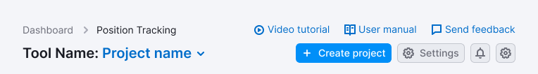

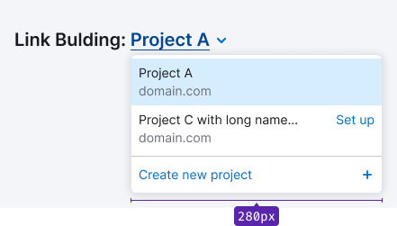

### Margins and paddings

@## Loading states

Show [Skeleton](/components/skeleton/), when the dropdown with projects is loading.

When the project data is loaded immediately, show [Spin](/components/spin/) next to it in these cases.

@## Long project name

In the case when the project name is too long, collapse it to `ellipsis`. And make sure there is a 24px margin between the project name and the following element.

Show the full name in the tooltip while hovering over the collapsed into `ellipsis` project name.

@## One project

If there is only one project, we show a select with one project and the "Create new project" option. This button opens the [project creation modal window](/patterns/project-create/).

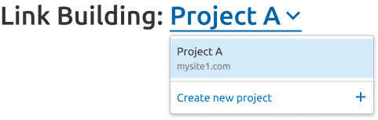

@## Search and scroll

> In dropdown with projects, search appears when there are more than 10 projects, and scroll in dropdown — when there are > 5 projects.

In an open dropdown, put the focus immediately in the search field. The search input itself must be pinned when scrolling through the list.

The project name that doesn't fit in one line is wrapped in `ellipsis`. We show the full name in the hover tooltip on the line with the project.

> You don't need to show such a tooltip with the full name if the project name is not hidden in `ellipsis`.

@## Projects order

> Show the projects that have been saved in alphabetical order, and display the projects that have not been saved in a separate list below (also in alphabetical order).

When you click on the entire line, open the wizard on the list of projects for this domain (in the same window).

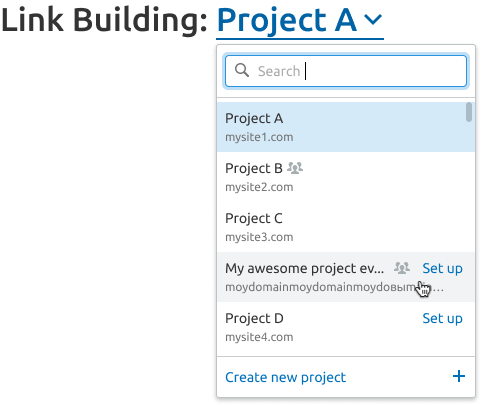

By clicking on the button for creating a new project, we open the [modal window for creating a project](/patterns/project-create/) (in the same window). Always push the button to the bottom of the dropdown.

@## Tooltips of shared projects

If the email or project name in the tooltip is too long, they are moved to the second line.

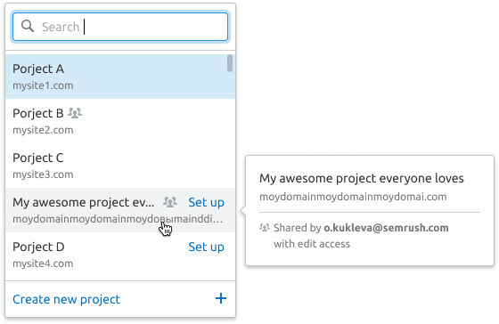

Example of a tooltip for a project that is shared only as `Readonly`. We use the [tag](/components/tag/) to indicate this in the tooltip.

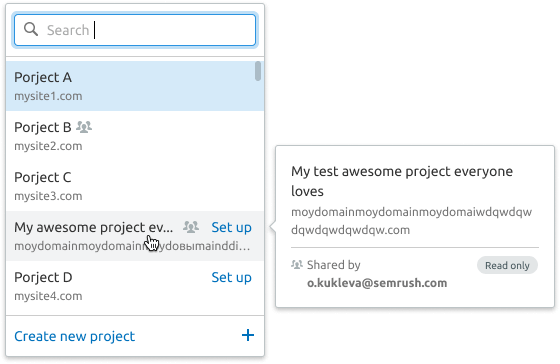

An example when the project owner has not yet set up a project, or it is under a downgrade. And the user who was rummaged through the project has a paid subscription.

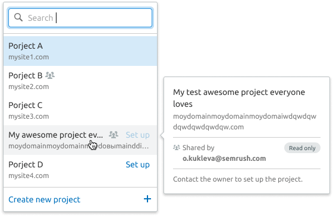

An example where the project owner has a project set up, but both the owner and the project are under a downgrade. And the user who was rummaged through the project has a paid subscription.

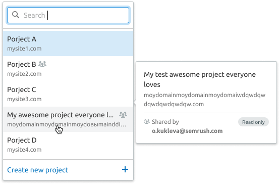

Example, when the project owner is under a downgrade along with a shared project. And the user who was given it has a free subscription.

> You can click on `option`, but you can't click on it.

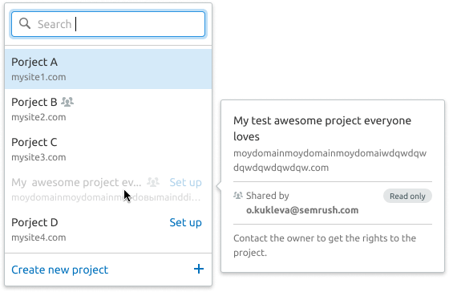
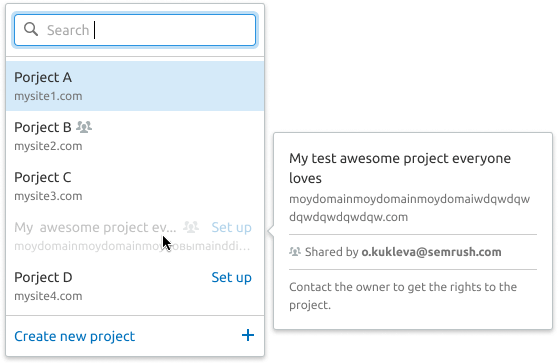

@## Dropdown states

### Skeleton

When the page is first loaded, the project selector can be loaded via [Skeleton](/components/skeleton/).

### Loading

If for some reason the list takes a long time to load when opened, or the results are filtered out for a long time (for example, due to a very slow connection), we show the `Loading` message in the dropdown.

### Nothing found

It may be that the value entered by the user will not match the existing projects. In this case, show the user a message that nothing was found and the `Create new project` button.

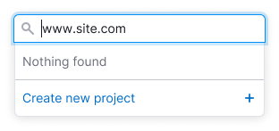

### Error

This condition may occur if something went wrong during the search.

@## Limits

| Plan               | Free (1 project)                                                   | Pro/Guru                                                           | Business                                                                                    |
| ------------------ | ------------------------------------------------------------------ | ------------------------------------------------------------------ | ------------------------------------------------------------------------------------------- |
| Description        | The `See plans and pricing` opens a modal window with mini-prices. | The `See plans and pricing` opens a modal window with mini-prices. | The `Buy projects` button opens the purchase modal window (”quick purchase widget" in SM2). |
| Appearance example | 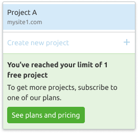                                    | 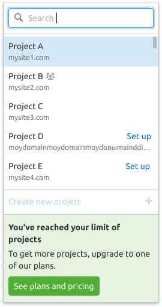                                |                                                          |

When you hover over a preset item to create a project for a free user, show a tooltip with an explanation of why the item is disabled.

