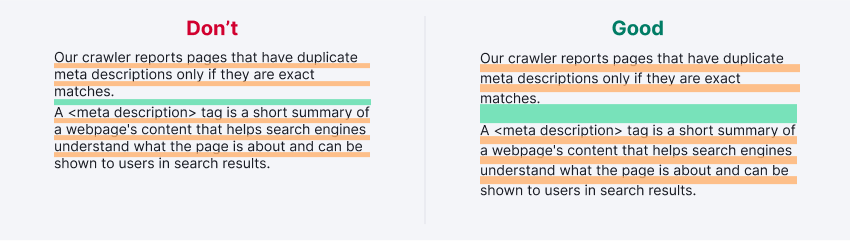
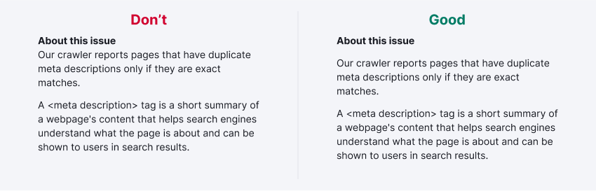
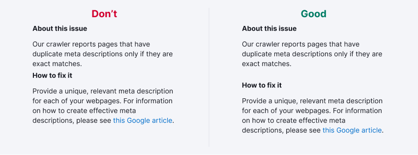
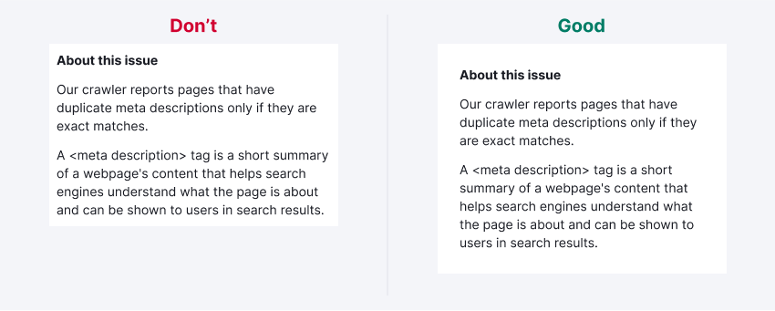
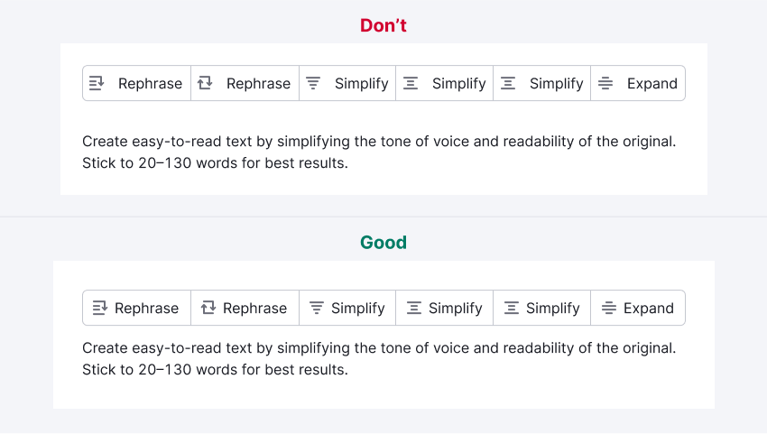

@## Description

The proximity is one of the gestalt principles of graphic design and it's used for positioning the content on a page or another layout. Continue on reading to learn more about this principle with our examples and understand how to apply it in your tasks.

Gestalt principles are an important set of rules for any designer to learn. Their implementation improve the design aesthetics, as well as its functionality and user-friendliness.

### Proximity

Elements that grouped together perceive as more related than elements that are far apart.

### Closure

If an image is missing parts, your brain will fill in the blanks and perceive a complete picture. 

### Similarity

Similar elements are visually grouped and perceived as having the same functions. They can be grouped by color, shape, or size.

### Simplicity

Elements grouped together tend to be perceived as a single figure. People perceive and interpret ambiguous or complex images in the simplest form.

### Continuation

When there is an intersection between two or more objects, people tend to perceive them as a single uninterrupted object.

In a text block, the distance between words is internal and between lines is external. Hence, according to the proximity principle, the interline spacing should be greater than the distance between words.

If a text block has a title, the distance between the title and the block should be greater than the line spacing. This rule is really easy. The external distance is always bigger than the internal.

To avoid the title of a paragraph being visually connected to the previous text block, the distance between text blocks should be greater than the distance between the paragraph and its title. 

Additionally, if the title has the same distance as two text blocks, it can be difficult for the user to understand which text block it refers to. This rule applies to all visual elements.

If you place text in a box, the distance from the text block to the border of the box should be greater than the distance from the paragraph to the title, because the box margins are external.

The proximity principle works with all elements: characters, words, paragraphs, or any other component in your layouts. If you don't follow this principle, elements can form random unwanted connections and make the content difficult to read.

If you put two elements close together, you show the user a direct connection between them, which explains a structure or an idea. If two groups of elements are separated a design, it shows that there is no connection between them.

