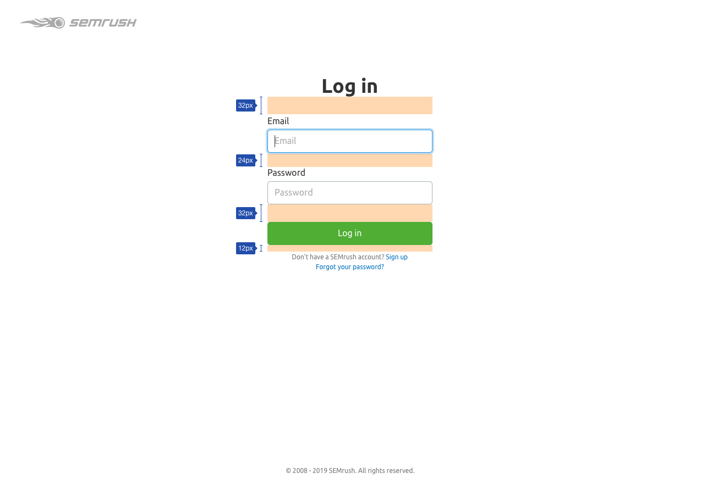
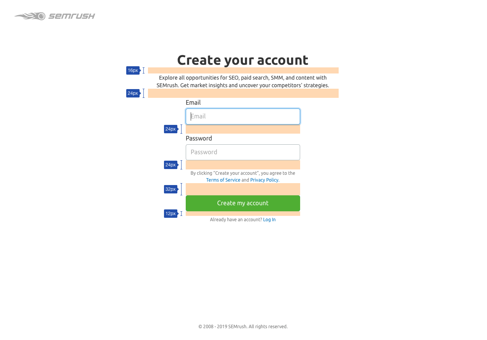
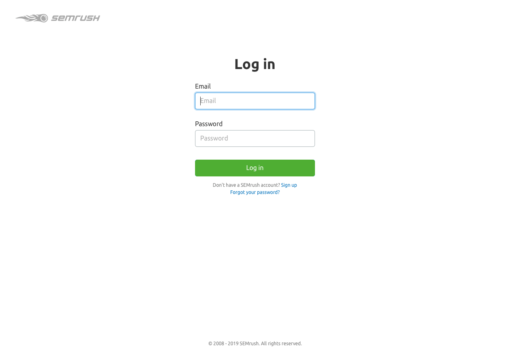
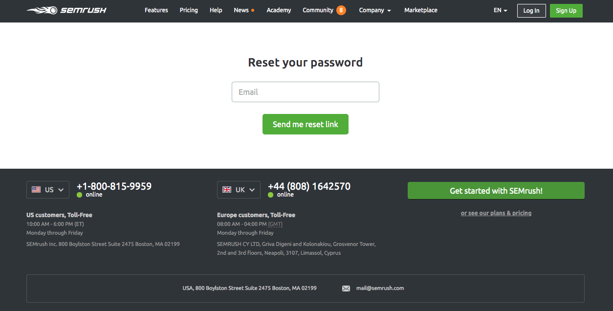
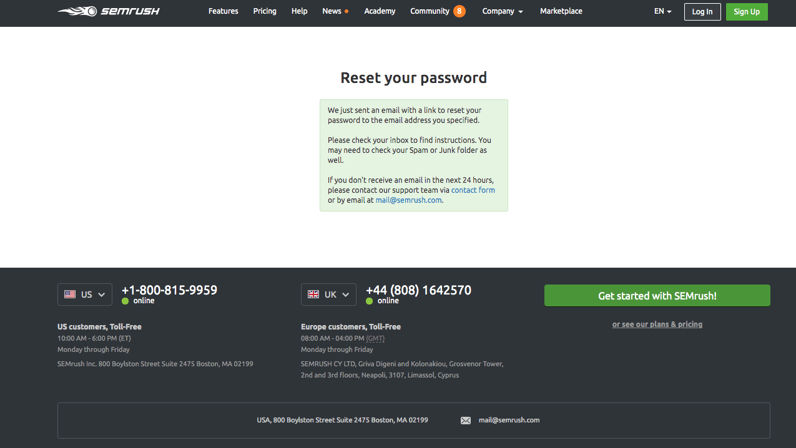
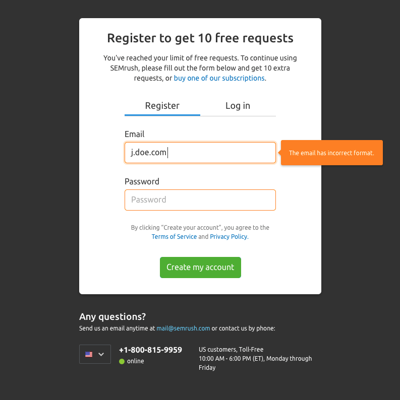
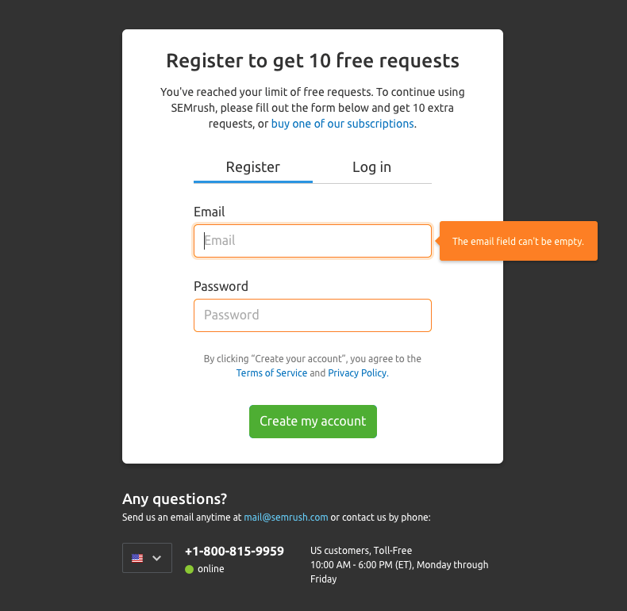
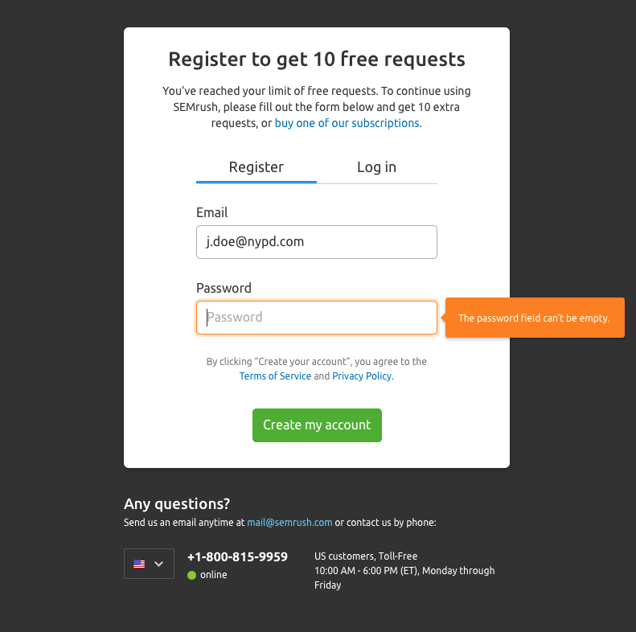
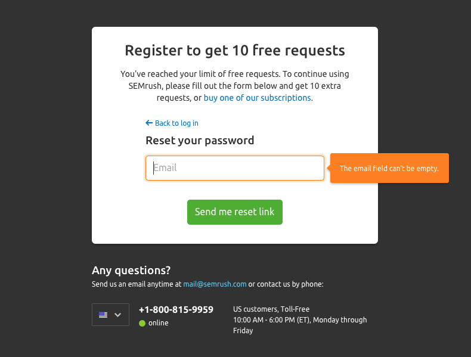
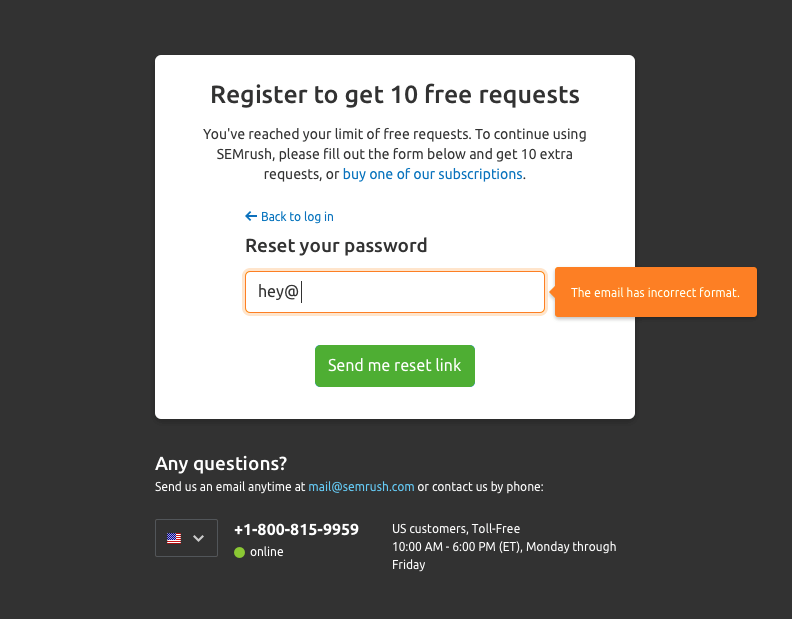

@## Description

**SSO (Single Sign-On)** is a login and registration form that the user gets to when:

- the user visited the site/page of the tool for the first time and wants to create an account;
- the user was logged out or he left the account;
- free-the user has reached the limit of using the tool.

@## Appearance

SSO from the design point of view consists of:

- forms for user authorization/registration;
- optional block with contact information.

@## The main recommendations on styles

> 💡 All variables are taken from a common file with variables in `semcore` 😏

- `XL` size inputs (pills, input fields, checkboxes, buttons, links).
- Modal window has H4 heading (25px, `--fs-500`). Page with a form has H2 heading (36px, `--fs-700`).
- Additional text under the heading — 14px (`--fs-200`).
- Size of the hint text — 12px (`--fs-100`).
- The color of the main text (both the title and the text below it) is always #333333 (`--gray-800`).
- The color of the tooltips at the bottom of the form - #757575 (`--gray-500`).

@## Spacing

All margins should always be a [multiple of our common denominator — 4](/style/variables/).

### Login form margins

### Registration form margins

@## Main login/registration form

### Login form

### Registration form

### Password recovery form

Now the form looks like this 😰

We show the form on a separate page with a white background, the Semrush logo, and text about copyright. This form must have:

- The header — is `Create your account`.
- Explanatory text — `Explore all opportunities for SEO, paid search, SMM, and content with Semrush. Get market insights and uncover your competitors' strategies`.
- Text and a link that switches to the login form.

@## Limit registration/login form

As soon as the free user reaches the limit for using the tool, a limit window appears on top of the Semrush interface with a registration/authorization form without the possibility of closing it.

@## States of the login/registration form

When you open a modal window, the first empty input must get the `focus` state.

You can read more about the behavior of forms in [Form](/components/form/).

### Data processing

If the system processes data with a delay, then we hang a [SpinContainer](/components/spin-container) with a `XXL`.

### Error

If the email that the user entered matches a user that already exists in the system, you will see a message about this: `This user is already registered`.

> For some reason, all Semrush forms now use the danger notification. Although, following the logic of using notifications, there should be a warning notification 🤷🏻‍♀️

### Validation

If the user tries to submit the form without the entered email or password, the inputs will get the `invalid` state.

For more information about form validation, see [Validation](/patterns/validation-form/).

@## Reset password

### Password validation

If the user clicks the `Send me reset link` button with an empty input, the input will get the `invalid` state and show a tooltip with the text: `The email field can't be empty`.

### Message about successful completion of the action

If the data was sent successfully, we show the user a text prompt to check their email.

> We just sent an email with a link to reset your password to the email address you specified.
>
> Please check your inbox to find instructions. You may need to check your Spam or Junk folder as well.
>
> If you don't receive an email in the next 24 hours, please contact our support team via contact form or by email at [[email]@semrush.com](mailto:[email]@semrush.com)
