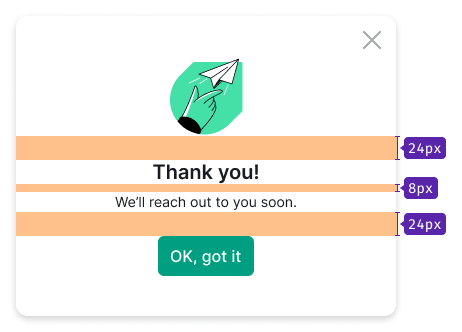
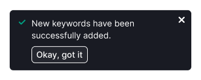

## Description

A success state is a message from the system confirming that an action has been completed.
When a user interacts with a product, they want to achieve a specific goal, and success states help them understand that they have achieved it.

## Appearance

When designing a success message, keep the following principles in mind:

* All content must be centered.
* The image must be in the SVG format and have a height and width of `80px`.
* The title text must have a font size of `20px` (`--fs-400`, `--lh-400;`), the `--text-primary` color, and the bottom margin of `8px`.
* The message text must have the font size of `14px` (`--fs-200`, `--lh-200`) and the `--text-primary` color.
* CTA buttons are optional, and they should have L size.

## When to use

A success state can appear in these scenarios:

* A user's manual input such as submitting a form.
* An action that is triggered automatically such as auto-saving.
* A process that the user initiated such as exporting data.

The positioning of a success state depends on the context it's used in.
Here are some general recommendations that can help you:

* Position the success state in the component that the user is currently engaged with, so that it's easy to notice and understand what it's referring to.
* Show the success state at an appropriate time to ensure that the user understands what action has led to it.
* Ensure that the success message or feedback is clear, so that users can easily understand what they need to do next.
* Users should be able to close the success modal window or notice at any time – for example, with a close button or by pressing the `Escape` key.

For example, if a [Feedback form](/components/feedback-form/feedback-form) has been sent successfully, show the success message in the same place next to the form's trigger.

A user can close a success state by clicking on:

* "OK, got it" button
* Close icon
* Outside the modal window

You can also close the success state automatically after 3—5 seconds, but be sure to test that it doesn't make the user experience worse.

## Other methods

You can use [NoticeBubble](/components/notice-bubble/notice-bubble) to notify a user about successfully completing a small part of a scenario.

You can also use [Notice](/components/notice/notice) in a similar way to provide a user with some feedback.

