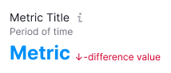
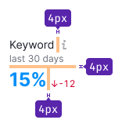
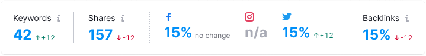
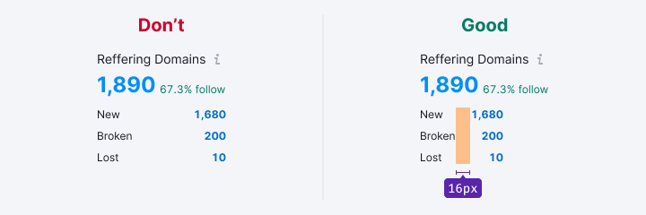
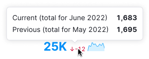
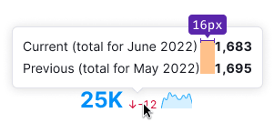
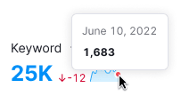

## Description

**Summary** is a pattern for displaying summary metrics and trends within reports or products.

**Use it to:**

- Display key metrics of the report.
- Showcase primary metric(s) for data within widgets, tables, or other formats.

### Basic principles of using Summary

- Ensure the metric's meaning is evident from its title and/or nearby supplementary information. Whenever possible, provide details about the metric's calculation method.
- Limit the display to 5-6 metrics per report or widget to prevent overwhelming users' cognitive capacity.

## Pattern composition

The pattern includes the following components:

- Metric's title
- Additional information such as date, period, location, or database of the data
- Metric value
- Supplementary information linked to the metric (for example, value differences over a specific period, trends, optional content)

## Styles, margins and paddings

### Margins and paddings

The recommended styles for the summary pattern:

For metrics composed of multiple values, use these margins:

### Styles

Table: Summary recommended styles

|                                     | Styles     |
| ----------------------------------- | ---------- |
| **Title**                           | Text size: 14px (`--fs-200`, `--lh-200`), color uses `--text-primary`. Accompanied by an `Info` icon of M size. Alternatively, use a medium-sized icon for displaying brand metrics (for example, for social media).       |
| **Date/period/location/database**   | Text size: 12px (`--fs-100`, `--lh-100`), color uses `--text-secondary`. |
| **Metric**                          | Text size: 24px (`--fs-500`, `--lh-500`), color uses `--text-primary`, link color, or another relevant color for indicating specific metrics in your product. You may adjust text size to 20px or 32px as needed. Refer to the  [Typography scale](/style/typography/typography). |
| **Metric's additional information** | Text size: 12px (`--fs-100`, `--lh-100`), color uses `--text-secondary`. |
| **Other information**               | Text size: 12px (`--fs-100`, `--lh-100`), color uses `--text-secondary`. |

## Dividers

Separate metrics with 24px spacing and [Divider](/components/divider/divider). The last metric (`last-child` element) shouldn't have a divider after it.

### Dividers between one-group metrics

When metrics need to be grouped, avoid using dividers to separate metrics belonging to the same group.

## Horizontal & vertical layout

Main report/widget metrics can be arranged either horizontally or vertically, depending on the layout requirement. The vertical layout is more space-efficient and compact.

Table: Summary layouts

| Case                 | Layout type                    | Appearance example    |
| -------------------- | ------------------------------ | --------------------- |
| If there are more than 3 metrics in the interface --> | use horizontal layout                         |  |
| If there are 3 or less metrics in the frontend -->    | vertical layout                               |      |
| If there is one metric in the interface, than -->     | show the values of which this metric consists |  |

## Alignment

Metrics can be placed not only within separate widgets but also within table cells and other components. As such, metric alignment and its supplementary information can be either left or right-aligned.

## Title

- When there's an abundance of metrics causing them to exceed page width, truncate titles with [Ellipsis](../../components/ellipsis/ellipsis.md), showing the full name on hover.
- Alternatively, include the title within an [Informer](/patterns/informer/informer).

## Difference value

- Avoid displaying the metric's title in the tooltip, as it's already present in the summary.
- Upon hovering over the difference value, present a tooltip showcasing the previous and current values adjacent to the metric. Avoid abbreviating values in the tooltip.
- If necessary, include both absolute and relative values within the tooltip.

 

## Summary with minitrends

Minitrends serve as simplified chart versions for displaying trends or comparing metrics across different days.

Table: Summary with minitrens

| Case   | Appearance example                  |
| ------ | ----------------------------------- |
| Metrics exceed maximum page width --> arrange in columns. |  |
| Metrics with the same minitrend type --> ensure equal width. |  |

### Tooltip

When required, show tooltips displaying values while hovering over minitrends.

### Clickable minitrend

Make minitrends clickable to provide the detailed information (for example, complete widget with a full chart). This approach is useful when users don't need simultaneous chart analysis and the user flow doesn't involve frequent chart scrutiny.

#### Important considerations

- Ensure the default minitrend period aligns with the detailed chart.
- Visual changes in the chart period won't affect the minitrend within the metric.

#### Mechanics

- Clickable minitrend charts are initially visible upon opening the report.
- Expanding the detailed chart occurs in an accordion-like manner, shifting page content.
- Upon expanding the [Accordion](/components/accordion/accordion), selecting another minitrend replaces its content with the chosen value.

Table: Clickable minitrend states

| State   | Appearance example                   |
| ------- | ------------------------------------ |
| Default |  |
| Hover   |  |
| Active  |  |

## Edge cases

Table: Summary edge cases

| State     | Appearance example                         |
| --------- | ------------------------------------------ |
| Display [Skeleton](/components/skeleton/skeleton) on initial load. |    |
| Show [Spin](/components/spin/spin) post data reload or filtering. |                    |
| Indicate missing data with "n/a" message. |  |
| In case of metric display error, show `Warning` icon with a "Something went wrong" [Hint](../../components/tooltip/tooltip.md). |                 |
| Show `Something went wrong` message for metrics with errors. _The entire widget or individual metrics are covered by a white overlay with 80% transparency._                        |                  |

## Adaptivity

The Summary widget can have maximum and minimum widths at various resolutions.

- The maximum width depends on the widget's content.
- Avoid stretching the metrics widget to the full page width.

