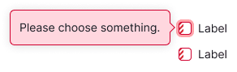
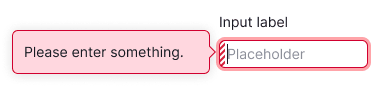
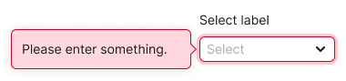

@## Description

**Validation** is the system's verification of values entered by the user.

@## How validation works

- Validation in forms and filters can be performed simultaneously by `unFocus` and `Submit`. _This does not apply to forms with limits — there is only Submit._
- Empty fields where the user has not entered a value are not validated by `unFocus`.

> 💡 Since form validation can be performed by clicking on a button, it is not recommended to set the main buttons to `disabled` state. This creates a false impression that the form or filter doesn't work at all.

- After `unFocus` validation, the component with the error is highlighted. When you focus on it, a tooltip appears with a hint that you need to fix it.
- After validation by `Submit`, all components with errors get the `invalid` state, and `focus` with the error tooltip is passed to the first component.
- The `focus` on the first component with an error should scroll the page to it, if the page is long, and show a tooltip with a hint of what to fix.

> 💡 The tooltip tells you why the field is filled in incorrectly or what to do to send the data. If possible, it should be placed so that important content is also visible next to the input or control. Put a dot at the end of the text in the tooltip 🤓

### How the invalid state is removed from the component

- If validation is performed in the browser, you can reset the `invalid` state as soon as the field becomes valid.
- If validation is performed on the server, you can reset the `invalid` state whenever the data in the field changes.

If the user corrects inputs with errors out of order, all uncorrected fields are highlighted if no changes were made to them.

@## UnFocus validation (instant)

You can validate the fields immediately, as the user fills out the form, if there are no deductions of paid limits and additional difficulties on the backend.

Use this validation to make it easier for the user to fill out forms and filters. We recommend that you immediately show the user what needs to be corrected before submitting the form.

@## Appearance

All form elements have the same `invalid` state: a `var(--orange)` border and a tooltip with the `warning` theme when focused.

@## Error message

Find more about the placement of the notice with an error message in the [Notice guide](/components/notice/).

@## Validation texts

The General pattern for the text: `Please enter something`.

| Condition                                                        | Text                                                                                                     |
| ---------------------------------------------------------------- | -------------------------------------------------------------------------------------------------------- |
| If the field is empty                                            | If we mean that the user enters their data in the form, then we write: `Please enter your [field name]`. |
| If the user enters someone else's data                           | Simply write: `Please enter a/an [field name]`.                                                          |
| If the field is filled in with an error                          | For example, the field with email: `Please enter a valid email`.                                         |
| Standard error in the checkbox when accepting Terms & Conditions | `Please confirm that you agree to our Terms and Conditions and Privacy Policy`.                          |

@page validation-form-code
