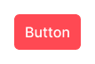
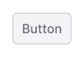
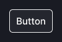
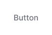
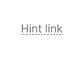

@## Description

We want our interfaces to help users solve their problems, so we must think over and use visual hierarchy correctly.

You can check it with [visual loudness guide by Tom Osborne](https://www.viget.com/articles/visual-loudness/). All our main controls are described below according to this useful guide.

@## Our controls on the visual loudness scale

The table lists the main styles of our controls, arranged according to the scale of visual loudness.

| Appearance                                 | Type (`use`) and theme  | Loudness                                                                                                                                                                                                    | Frequency of use          | When to use                                                                                                                                      |
| ------------------------------------------ | ----------------------- | ----------------------------------------------------------------------------------------------------------------------------------------------------------------------------------------------------------- | ------------------------- | ------------------------------------------------------------------------------------------------------------------------------------------------ |
|       | Primary danger button   | **Screech, loud roar.** The dovahkin button, every time it appears on the page, it yells at you: `"Fus Ro Dah!"` — and it takes you to the forefathers for a while, all life flashes before your eyes, etc. | Rare                      | The action is dangerous for the user: destructive, irreversible. We need to stir him up so that he does not accidentally hurt himself.           |
|      | Primary success button  | **Shout of approval.** The button winks at the user: `"Everything is great, do not be afraid, press and you will come to success!"`.                                                                        | Often                     | Good, important accent action to take, CTA. _Subscribe or upgrade your Semrush subscription, for example._                                       |
|         | Primary info button     | **One-time cry.** The button does not reach you, but as if slightly reminds that it is ready to do a useful action for you. `"Hey, hello, I'm here, look what you can do!"`.                                | Often                     | A common accent action in this world of dullness.                                                                                                |
|  | Primary invert button   |                                                                                                                                                                                                             |                           | It is an invert version of primary buttons for using on a dark background.                                                                       |
|    | Secondary muted button  | **Conversation nearby.** This is a bro button. She will always support you, always with you, but her presence does not bother you. `"If you need anything, I'm here."`                                      | Often                     | A common action button.                                                                                                                          |
|    | Secondary invert button |                                                                                                                                                                                                             |                           | It is an invert version of secondary button for using on a dark background.                                                                      |
|     | Tertiary info button    | **Quiet request.** `"You know what to do with it, bro. I'm just reminding you."`                                                                                                                            | Often                     | Accent, but not stressful visual control. Use `tertiary` button when there is enough space and you want to make the click zone larger and wider. |
|            | Link                    |                                                                                                                                                                                                             |                           | Accent, but not stressful visual control. Use it in the opposite to `tertiary` button case — when there is not enough space.                     |
|     | Tertiary muted button   | **Whisper.** `"Psst, wanna a little more information?"`                                                                                                                                                     | Neither often nor rarely. | Non-accent control.                                                                                                                              |
|  | Hint link               |                                                                                                                                                                                                             |                           | Non-accent control for additional information.                                                                                                   |
