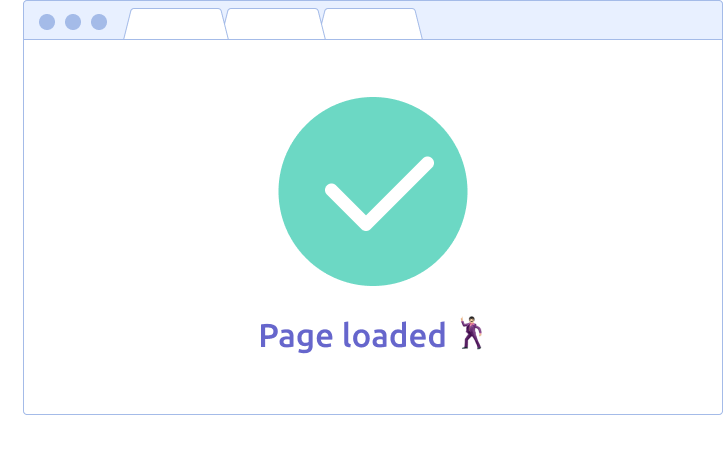
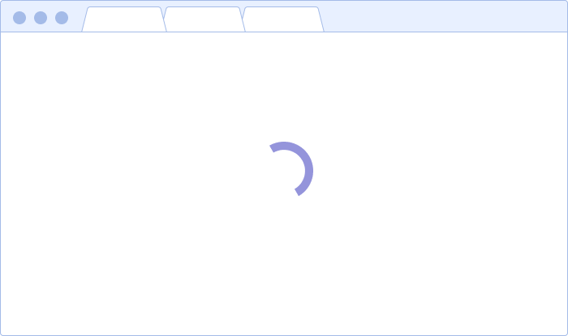
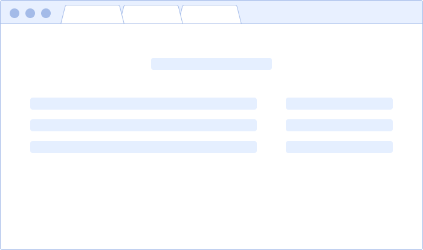
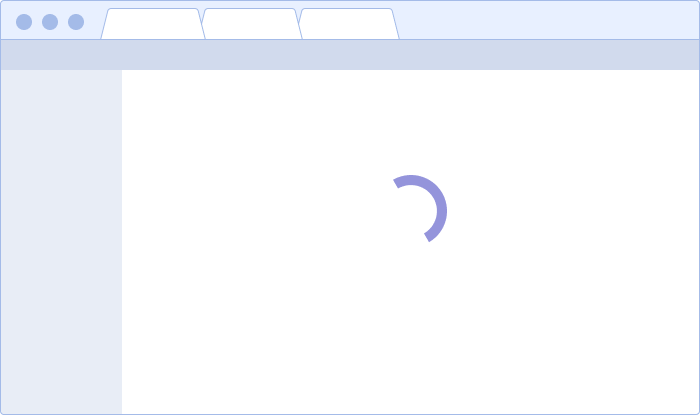

@## General

> 💡 Diagrams with a detailed loading process are also available in inner [Figma file](https://www.figma.com/file/eqmm39DfX895qOSM0KnQGb/Web-performance-schemes) and [Miro](https://miro.com/app/board/o9J_kp1mGGg=/). From Figma, the scheme can be exported to `pdf` or `png` format — [non-SPA upload schema](https://www.figma.com/file/eqmm39DfX895qOSM0KnQGb/Web-performance-schemes?node-id=21%3A559) and the [SPA upload schema](https://www.figma.com/file/eqmm39DfX895qOSM0KnQGb/Web-performance-schemes?node-id=21%3A560). **They are available only for Semrush developers.**

After adding new features in the product, check whether the loading time fits into the recommendations and rules described here. Download speed can be checked with [Speedcurve](https://speedcurve.com/) or tool from [Google](https://developers.google.com/speed/pagespeed/insights/) ✨

You can read more about the skeleton and spinner in the guides:

- [Skeleton](/components/skeleton/#adbd55) (it also describes loading heavy images)
- [Spin](/components/spin/)

Animation of the appearance and disappearance of the skeleton and spinner — `ease-out 0.3`. **The exception is the first spinner that launches the tool — it doesn't have animation**, because the `@semcore` components haven't loaded yet.

> 💡 Why is the animation time chosen this way? This is a recommendation that is related to users ' perception of time when working with interfaces. You can read more about this, for example, in the article from Smashing Magazine — [Why Perceived Performance Matters, Part 1: The Perception Of Time](https://www.smashingmagazine.com/2015/09/why-performance-matters-the-perception-of-time/).

The process of loading both SPA and static pages will be described below.

@## Non-SPA loading

### 0 seconds

Loading the page using the **Lazy loading principle**.

The default rule is to first select elements from the visible area of the screen, then select the remaining elements. In some cases, the UX or UI designer can think of a different order of elements for a specific page, if this will make the user experience better.

> 💡 The first element must appear on the page no later than `0.6sec`.

#### Speed Index `≤1.2sec`

💡 We check the `Speed Index` using [Speedcurve](https://speedcurve.com/) or [a tool from Google](https://developers.google.com/speed/pagespeed/insights/).

- **Yes! `Speed Index ≤1.2sec`** — page loaded 🕺🏻

> Page loading is complete. Heavy images are uploaded using the “progressive jpeg method”: first, you can upload a blurry image, then a full one. For more information, see the [guide](/components/skeleton).

- **No. `Speed Index ≥1.2sec`**. In this case, let's see if we can improve the speed on the development side.

If yes, and after improvements to the `Speed Index ≤1.2sec`, then

If not, and `Speed Index ≤1.2sec`, since this is an exception page, then go to the page preload stage (waiting) and show the spinner in the center of the screen (the same for all pages).

> IMPORTANT! The first spinner that launches the tool doesn't have animation, as the `@semcore` components haven't loaded yet. In all other cases, the animation of the appearance and disappearance of the spinner occurs with `ease-out 0.3`.
>
> Even if the page loaded faster, we do not hide the spinner until `0.3sec` has passed (so there will be no flickering).

### Fully loaded: `≤5 seconds`

#### Does the page contain data that can take a long time to load from third-party sources

- **No, there is no such data**. Waiting for the spinner to win 🕺🏻

- **Yes, there is such data**. In this case, we show the actual content of the page skeleton.

> The page does not wait for the entire tool to load, we give the elements as they load.the user can start working with the tool, while the data being loaded is replaced by skeletons.
>
> Animation of the appearance and disappearance of the skeleton — `ease-out 0.3`.

The page should not "jump" during the boot process.

Even if the tool loaded faster, we do not hide the skeleton until `0.3sec` has passed (so there will be no flickering).

@## Loading the SPA

### 0 seconds

Loading the page using the `Lazy loading principle`.

The default rule is to first select elements from the visible area of the screen, then select the remaining elements. In some cases, the UX or UI designer can think of a different order of elements for a specific page, if this will make the user experience better.

> IMPORTANT! The first spinner that launches the tool doesn't have animation, as the `@semcore` components haven't loaded yet. In all other cases, the animation of the appearance and disappearance of the spinner occurs with `ease-out 0.3`.
>
> Even if the page loaded faster, we do not hide the spinner until `0.3sec` has passed (so there will be no flickering).

### The product has one tab

**In this case, we load the entire product** and show the actual content of the skeleton page.

> The page does not wait for the entire tool to load, we give the elements as they load.the user can start working with the tool, while the data being loaded is replaced by skeletons.
>
> Animation of the appearance and disappearance of the skeleton — `ease-out 0.3`.

The page should not "jump" during the boot process.

Even if the tool loaded faster, we do not hide the skeleton until `0.3sec` has passed (so there will be no flickering).

And then

### The product has several tabs

In this case, we load the active report with the skeleton and show the actual content of the skeleton page. The remaining tabs are loaded by prefetching after the active report is loaded.

> The page does not wait for the entire tool to load, we give the elements as they load.the user can start working with the tool, while the data being loaded is replaced by skeletons.
>
> Animation of the appearance and disappearance of the skeleton — `ease-out 0.3`.

The page should not "jump" during the boot process.

Even if the tool loaded faster, we don't hide the skeleton faster until `0.3sec` has passed (so there will be no flickering).

### The user DID not switch to another report while loading the active tab

In this case, the data in the other tabs is loaded using the `prefetching method`.

### The user switched to a different report while loading the active tab

In this case, we load the report inside the tool and show the user the spinner in the center of the screen, which is the same for all tools.

> IMPORTANT! Animation of the appearance and disappearance of the spinner occurs with `ease-out 0.3`.
>
> Even if the page loaded faster, we do not hide the spinner until `0.3sec` has passed (so there will be no flickering).

> 💡 **At this stage, data loading may exceed the condition ≤5sec.**

In this case, we load the report with the skeleton and show the actual content of the skeleton page. The remaining tabs are loaded by prefetching after the active report is loaded.

> The page does not wait for the entire tool to load, we give the elements as they load.the user can start working with the tool, while the data being loaded is replaced by skeletons.
>
> Animation of the appearance and disappearance of the skeleton — `ease-out 0.3`.

The page should not "jump" during the boot process.

Even if the tool loaded faster, we do not hide the skeleton until `0.3sec` has passed (so there will be no flickering).

