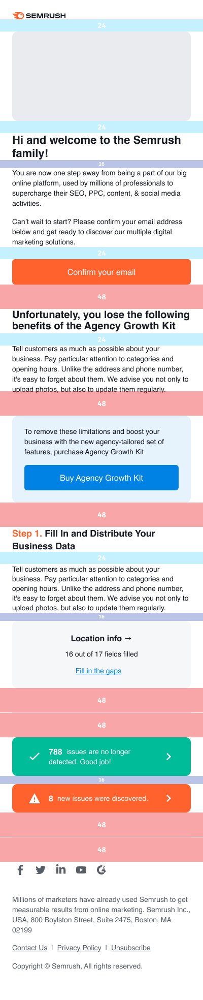

> You can find all basic design components, blocks and styles for product emails in our **[Figma library](https://www.figma.com/file/uBxKSTlXSEDiKvFp6txzrr/NEW-%E2%80%A2-Product-emails?node-id=1%3A164) (available for Semrush designers only).**

@## Typography and styles

Use Helvetica font for correct display on all devices and all browsers.

Keep in mind that the email can be displayed with Arial or other sans-serif font if user doesn't have Helvetica font installed. For marketing illustrations use Factor A or Intro font.

@## Spacings

**All spacings, margins and paddings in the email should be the multiples of 4.**

Left and right margins are:

- for desktop template — 40px;
- for mobile template — 24px.

@## Basic template

We have default template for our product newsletter. It's adaptive for desktop and mobile screens.

Template content is fluid and has `max-width: 600px`. It switches to mobile version when its width is less than 480px.

| Desktop version                          | Mobile version                         |
| ---------------------------------------- | -------------------------------------- |
|  |  |

@## Icons and illustrations

All interface icons and small illustrations we need for product emails we store in the [Figma library](https://www.figma.com/file/uBxKSTlXSEDiKvFp6txzrr/NEW-%E2%80%A2-Product-emails?node-id=456%3A8265)(available for Semrush designers only).

@page emails-guide-changelog
