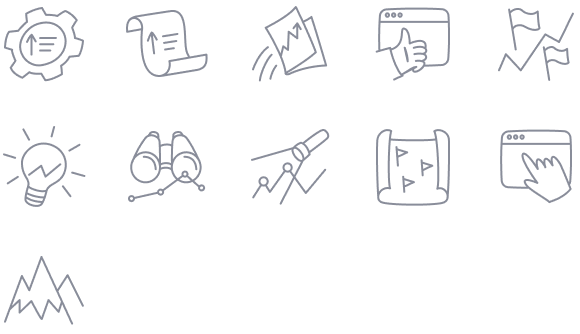

@## Typography and styles

Use Helvetica for correct display on all devices and all browsers.

To see all typography styles and color palette go to the [Figma library](https://www.figma.com/file/uBxKSTlXSEDiKvFp6txzrr/NEW-%E2%80%A2-Product-emails?node-id=1687%3A60078).

@## Spacings

We have default template for our product newsletter. It's adaptive for desktop and mobile screens.

- Template content is fluid and has `max-width: 600px`. Template switches to mobile version when its width is less than 480px.
- **All spacings between the rows should be multiples of 4.**

Left and right margin:

- for desktop template is 40px;
- for mobile template is 24px.

@## Components

> You can find all basic design components and blocks for product emails in our [Figma library](https://www.figma.com/file/uBxKSTlXSEDiKvFp6txzrr/NEW-%E2%80%A2-Product-emails?node-id=1%3A164) (available only for Semrush designers).

@## Template with illustration

| Desktop template                         | Mobile template                        |
| ---------------------------------------- | -------------------------------------- |
|  |  |

@## Template without illustration

| Desktop template                          | Mobile template                         |
| ----------------------------------------- | --------------------------------------- |
|  |  |

@## Icons and illustrations

You can find all interface icons and small illustrations for product emails in the [Figma library](https://www.figma.com/file/uBxKSTlXSEDiKvFp6txzrr/NEW-%E2%80%A2-Product-emails?node-id=456%3A8265)(available only for Semrush designers).

