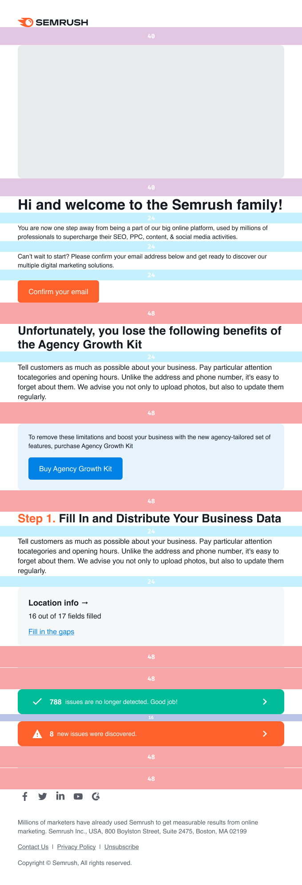
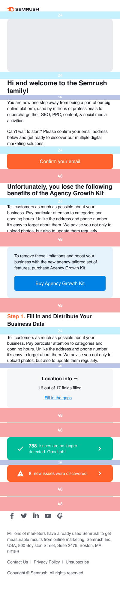

> 🚨 The current `@semcore/email` package is deprecated and using it is not recommended. A new major version is under way.
>
> If you're a Semrush designer, you can find all the basic design components, blocks, and styles for product emails in the **[internal Figma library](https://www.figma.com/file/uBxKSTlXSEDiKvFp6txzrr/NEW-%E2%80%A2-Product-emails?node-id=1%3A164).**

@## Typography and styles

Use the Helvetica font to make sure texts are displayed correctly on all devices and in all browsers.

Keep in mind that an email can be displayed with the Arial or another sans-serif font if the user doesn't have Helvetica installed.
For marketing illustrations, use the Factor A or Intro font.

@## Spacings

**All spacing, margin, and padding values in emails should be multiples of 4.**

The left and right margins are:

- For the desktop template: 40px.
- For the mobile template: 24px.

@## Basic template

We have a default template for our product newsletter that is adaptive for desktop and mobile screens.

The template content is fluid and has `max-width: 600px`. It switches to the mobile version when its width is less than 480 px.

| Desktop version                          | Mobile version                         |
| ---------------------------------------- | -------------------------------------- |
|  |  |

@## Icons and illustrations

If you're a Semrush designer, you can find all the interface icons and small illustrations for product emails in the [internal Figma library](https://www.figma.com/file/uBxKSTlXSEDiKvFp6txzrr/NEW-%E2%80%A2-Product-emails?node-id=456%3A8265).

@page grid-email-code
@page grid-email-readme
@page grid-email-changelog
