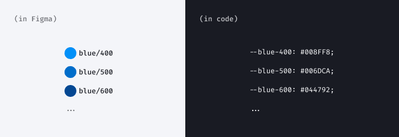

@## What is a design token?

Basically, design tokens are atoms of the design system's visual styles. Think of them as values stored as predefined styles for predefined purposes, elements, and components.

@## Token sets

There are base and semantic token sets in our design system.

**Base tokens** represent the theme's global palette. Changing their values will affect semantic tokens. Therefore, by changing the palette, you can create new themes. For creating new palette you can use tools like [Huetone](https://huetone.ardov.me/).

**Semantic (alias) tokens** relate to a specific component or context of usage. They refer to the base tokens.

Semantic tokens include tokens for:

- colors;
- typography;
- sizing;
- spacings;
- box-shadows;
- border-radius.

@## Token naming structure

Token name is the same in both Figma and code, except for the theme/project name which is added to the token in the code.

For example, compare token for primary neutral background:

- in Figma: `bg/primary/neutral`;
- in code: `--intergalactic-bg-primary-neutral`.

> The token name does not have to contain all the elements of the naming structure. The naming structure creates a system so you can easily name the new token, and it will fit into the design system.

@## Tokens usage

Semantic tokens are context-specific, so they are used according to the intentions implied by their names:

- `bg` token group for backgrounds;
- `control` token group for all button-like controls;
- `text` token group for typography;
- `date-picker` token group for DatePicker;
- etc.

Base tokens can be used for new elements and components which are not in the Intergalactic Design System yet, but only if semantic tokens are not suitable.

@## How to make a new theme

Please see the detailed process explained in the Figma file: [internal](https://www.figma.com/file/K1s6wF8NTH3uNHvjkn6hjc/Themes-playground-%26-tutorial-%F0%9F%8E%93?node-id=24%3A90461&t=uZCoQy8xPBjC1ctm-11), public (link will be here soon).

<!-- @## Default palette (old)

### Brand colors

We use this hot orange and dark indigo as our brand colors. Use them only for the most important and advertising information in the interface.

@import color-group {"group": "brand"}

### Main colors

The main semantic colors that attract attention, mark a status, and highlight main interactive elements on a page.

@import color-group {"group": "main"}

### Gray colors

Use them for text, titles, and hints.

@import color-group {"group": "gray"} -->

<!-- @## Color shades usage

### 50 shade

Use it for backgrounds only.

> May be completely invisible to users with poor vision or low-contrast monitor

@import color-group {"group": "shade50"}

### 100 shade

Use it for:

- Light borders.
- Active faded backgrounds (e.g. widget backgrounds, accordions, table headers).

> APCA ~ 15 to white (minimum visible elements)

@import color-group {"group": "shade100"}

### 200 shade

Use it for:

- Active borders.
- Active backgrounds (e.g. widget backgrounds, accordions, table headers).

@import color-group {"group": "shade200"}

### 300 shade

Use it for:

- Icon on the white background.
- Main colors for charts.
- Text placeholders.

@import color-group {"group": "shade300"}

### 400 shade

Use it for:

- Icons on the color background.
- Buttons backgrounds.

Text colored in this shade can be placed on a white background

> Contrast parameters: APCA ~ 65 to white, WCAG 3:1 to 50 shade.

@import color-group {"group": "shade400"}

### 500 shade

Use it for secondary text. Text colored in this shade can be placed on the background colored in 50 and 100 shades.

@import color-group {"group": "shade500"}

### 600 shade

Use this shade as a dark shade for charts. Text colored in this shade can be placed on the background colored in 50 and 100 shades.

@import color-group {"group": "shade600"}

### 700 shade

Use this shade as a dark shade for charts. Text colored in this shade can be placed on the background colored in 50, 100 and 200 shades.

@import color-group {"group": "shade700"}

### 800 shade

Use this for main text. Text colored in this shade can be placed on the background colored in 50, 100 and 200 shades.

@import color-group {"group": "shade800"} -->
