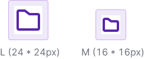
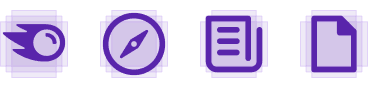
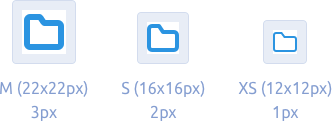

@import icons-old

@## Sizes

There are three main icon sizes:

- XS (12x12px)
- S (16x16px)
- M (22x22px)

In addition, an icon can have two additional sizes: L (44x44px) and XXS (8x8px).

> Icons of the maximum size (44x44px) are considered images.

@## Viewbox

Icon sizes are limited by their viewbox, and icon contours can be slightly smaller.

When drawing icons, we use the Swiss grid. It means that wide or tall icons may approach the viewbox edges, while square and/or round icons may have some padding from the viewbox edges.

@## Stroke thickness

Each icon size has its own stroke thickness, with some exceptions. Icons with a stroke and icons with a painting have different styles.

