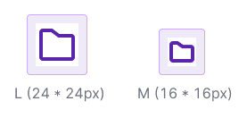

@import icons

@import index

@## Sizes

There are two main icon sizes:

- M (16x16px)
- L (24x24px)

All icons sizes use a consistent stroke width 2px. Including inner and outer strokes.

@## Viewbox

Icon sizes are limited by their viewbox, and icon contours can be slightly smaller.

When drawing icons, we use the Swiss grid. It means that wide or tall icons may approach the viewbox edges, while square or round icons may have some padding from the viewbox edges.

@## Variations

Almost all our icons used a line version.

Filled icon version can be used to represent an action that has been carried out, such as using a filled star when a post has been “favorited“.

> Use **Filled** in icon name. For example: Favorite / FavoriteFilled

@## Stroke alignment & Corners

Stroke should be aligned by inside a shape. Don't use "center" or "outside" align, because it affects the icon's and corner's appearance.

There is one corner radius for all icon sizes - 1px.
Inner shape's corners shouldn't be rounded.

@## End points & Gaps

Use end points rounded. With the exception of composite figures, which imitate nesting one shape into another, shape crossing, dotted line.

Keep 2px gaps between shapes.

@## Perspective

When possible, avoid perspective. Use the flat view for icons.

@## Inner elements & detailing

Don’t use more details than you need for icon recognition. Planty small details into icon make visual noise and can reduce accessibility.

@## Metaphor

Use a common metaphor and simple geometric shapes for icons.
Avoid organic natural forms and complicated icons.

@## Pixel perfection

Use whole numbers of pixels for sizes as well as position of the object on the X and Y coordinates.

@## Strikethrough icon

Strikethrough line use stroke width 2px, rotation 45°, from left to right. Don't forget to use 2px gap between top edge of line and icon.

@## Add icons to library

> If you add new icon to the library, please, add it in both sizes at once.

Icons should be “SVG production-ready”, meaning there shouldn’t be more than one shape inside icon’s frame (merged and flattened).

There should be no borders, outlines, grids or complex boolean operations inside the shape.

Each icon should be tagged in their parent symbol description, with list of tags, matching this JSON (used to make search for specific icon inside Intergalactic). Tagging the icon with synonymic names in both English and Russian helps your colleagues to find the right icon much quicker.

Keep the names **icon** and color --grey800 of shapes inside the symbols consistent (except for colored icons).

If you add new icons, please put them in appropriate group, use UppercaseCamelCase naming and add tags. Provide those tags to UI-Kit team when adding those icons to Intergalactic.

@page icon-old
@page icon-api
@page icon-code
@page icon-changelog
