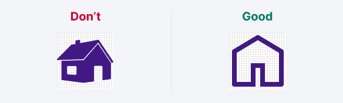

@import icons

@## Sizes

There are two icon sizes:

- M (16 \* 16px)
- L (24 \* 24px)

All icon sizes use a consistent stroke width of 2px. That applies to both inner and outer strokes.

@## Viewbox

The size of an icon is limited by its viewbox, and the icon contours can be slightly smaller.

When drawing icons, we use the Swiss grid. It means that wide or tall icons may approach the viewbox edges, while square and/or round icons may have some padding from the viewbox edges.

@## Variations

Almost all our icons are drawn in an outline style.

Some icons also have a filled variation. Filled icon can be used to represent an action that has been carried out, such as using a filled star when a post has been “favorited“.

> For the filled version of the icon add **Filled** at the end of the icon name. _For example: Favorite / FavoriteFilled._

@## Stroke alignment & corners

Stroke should be aligned to the inside of a shape. Don't align the stroke to the center or outside because it affects the appearance of both the icon and its corners.

There is one corner radius for all icon sizes — 1px. The inner corners of a shape shouldn't be rounded.

@## End points & gaps

Use rounded end points or caps for open lines. The exceptions are: compound figures which imitate nesting one shape into another, shape crossings, or dotted lines.

Keep 2px gaps between shapes.

@## Perspective

When possible, avoid the perspective. Use the flat view for icons.

@## Inner elements & detailing

Don’t use more details than you need to make an icon recognizable. Lot of small details in an icon produce visual noise and reduce accessibility.

The gaps between inner elements should be at least 2px, if possible.

@## Metaphors

Use common metaphors and simple geometric shapes for icons. Avoid organic natural forms and complicated shapes.

@## Pixel perfection

Use a whole number of pixels for sizes and positioning the objects on the X and Y axes.

@## Strikethrough icon

A strikethrough line should have a 2px-wide stroke, rotated at 45°, from left to right.

Don't forget to use a 2px gap between the line and the icon shape.

@## Add an icon to the library

> If you add a new icon to the library, make sure to add it in all necessary sizes at once.

1. Icons should be “SVG production-ready”, meaning there shouldn’t be more than one shape inside the icon's frame (merged and flattened).

2. There should be no borders, outlines, grids, or complex boolean operations inside the shape.

3. Keep the icon shape's name **icon** and `--icon-non-interactive` token for color inside the components consistent (except for colored icons).

4. Each icon should be tagged in their master component description, with a list of tags, matching [this JSON](https://github.com/semrush/intergalactic/blob/master/website/docs/style/icon/components/icons-list.js) (to make it possible to search for an icon on the design system website).

Tagging the icon with synonymic names in both English and Russian helps your colleagues to find the right icon much quicker.

If you add new icons, make sure to put them in the appropriate group, use the **UppercaseCamelCase** naming, and add tags. Provide those tags to the design system team when adding those icons to the design system.

@page icon-old
@page icon-a11y
@page icon-api
@page icon-code
@page icon-changelog
