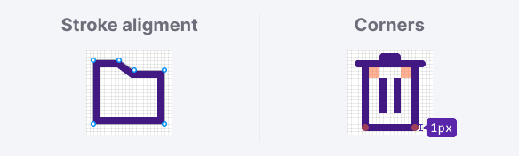
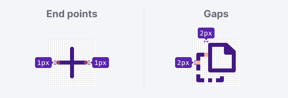
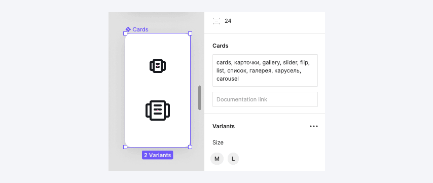
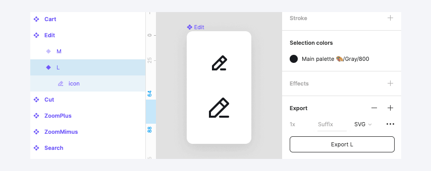

@import icons

@import index

@## Sizes

There are two icon sizes:

- M (16x16px)
- L (24x24px)

All icon sizes use a consistent stroke width of 2px. That applies to both inner and outer strokes.

@## Viewbox

The size of an icon is limited by its viewbox, and the icon contours can be slightly smaller.

When drawing icons, we use the Swiss grid. It means that wide or tall icons may approach the viewbox edges, while square and/or round icons may have some padding from the viewbox edges.

@## Variations

Almost all our icons use a line version.

Filled icon version can be used to represent an action that has been carried out, such as using a filled star when a post has been “favorited“.

> Use **Filled** in icon name. For example: Favorite / FavoriteFilled

@## Stroke alignment & Corners

Stroke should be aligned to the inside of a shape. Don't align the stoke to the center or outside because it affects the appearance of both the icon and its corners.

There is one corner radius for all icon sizes - 1px.
The inner corners of a shape shouldn't be rounded.

@## End points & Gaps

Use rounded end points or caps for open lines. The exceptions are: compound figures which imitate nesting one shape into another, shape crossings, or dotted lines.

Keep 2px gaps between shapes.

@## Perspective

When possible, avoid the perspective. Use the flat view for icons.

@## Inner elements & detailing

Don’t use more details than you need to make an icon recognizable. Many small details in an icon produce visual noise and reduce accessibility.

The gaps between inner elements should be at least 2px, if possible.

@## Metaphors

Use common metaphors and simple geometric shapes for icons.
Avoid organic natural forms and complicated icons.

@## Pixel perfection

Use a whole number of pixels for sizes and positioning the objects on the X and Y axes.

@## Strikethrough icon

A strikethrough line should have a 2px-wide stroke, rotated at 45°, from left to right.

Don't forget to use a 2px gap between top edge of line and icon.

@## Add an icon to the library

> If you add a new icon to the library, make sure to add it in both sizes at once.

Icons should be “SVG production-ready”, meaning there shouldn’t be more than one shape inside the icon's frame (merged and flattened).

There should be no borders, outlines, grids, or complex boolean operations inside the shape.

Each icon should be tagged in their parent symbol description, with a list of tags, matching this JSON (to make it possible to search for an icon in Intergalactic).

Tagging the icon with synonymic names in both English and Russian helps your colleagues to find the right icon much quicker.

Keep the names **icon** and color --gray-800 of shapes inside the symbols consistent (except for colored icons).

If you add new icons, make sure to put them in the appropriate group, use the UppercaseCamelCase naming, and add tags.

Provide those tags to the UI Kit Team when adding those icons to Intergalactic.

@page icon-old
@page icon-api
@page icon-code
@page icon-changelog
