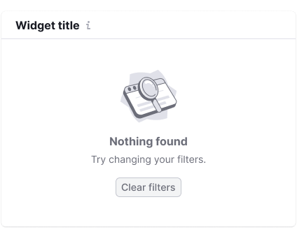

@import illustrations

@## Description

**Illustration** is a component for importing illustrations from our library to your project.

@## Sizes

We use illustrations of three sizes.

| Size (px)              | Illustration sxample                                                                                                     | Usage                                                                     |
| ---------------------- | ------------------------------------------------------------------------------------------------------------------------ | ------------------------------------------------------------------------- |
| Large (130px \* 130px) |                                                                 | Use this size for advertising messages.                                   |
| Medium (80px \* 80px)  |   | Use this size for error messages and empty states.                        |
| Small (40px \* 40px)   |                                                                 | Use this size for secondary messages that should not draw much attention. |

@page illustration-code
@page illustration-api
@page illustration-changelog
