> ⚠️ The component has a major version, changes in the [migration guide](/internal/migration-guide).

@## Font

The main font for Semrush interface is [Ubuntu](https://design.ubuntu.com/font/).

> 💡 For a clearer rendering of the font and its color, use `webkit-font-smoothing: antialiased;` (see cross-browser compatibility at [caniuse.com](https://caniuse.com/#search=-webkit-font-smoothing)).

@## Basic text colors

The main text color in our interface is `$gray20`.

The color used for secondary text is `$gray60`.

Besides, both paragraphs headings and text can be colored in our main semantic colors. Depending on the situation, they are green, red, and orange.

> 💡 Use this opportunity thoughtfully, and do not abuse the text coloring, as it will reduce its readability. **Don't forget to check the text for contrast against its background**.

@## Font size scale

### What it is and how it works

To simplify the process development and to get a proportional size scale, we use [Tim Brown's Modular Scale Calculator](https://www.modularscale.com/?12,16&px&1.2). More information about this approach can be found in [Tim's article](https://alistapart.com/article/more-meaningful-typography), and about the method itself — at [css-live.ru](http://css-live.ru/articles/rukovodstvo-po-razmeru-teksta-dlya-otzyvchivogo-dizajna.html).

_The base font(s) (Bases) are root dimensions of the scale. The fonts that make a paragraph text look best of all (or those that are used more often in your interface) are usually chosen as such Bases._

> 💡 The essence of this approach is to select a text size for your interface based on the base font(s) and one aspect ratio. It is recommended not to use a lot of fonts as a `Base`, as the scale step decreases, it becomes less harmonious and less proportional. In general, with this approach, the typography is more harmonious, and it is more convenient to calculate it mathematically, since the basic fonts and the aspect ratio set the scale equation.

_An aspect ratio, a coefficient (`Ratio`) is a number, the base is multiplied by to form a modular scale._

**For our interface, 12px has been chosen as the main base font size, while 16px – as the complementary one**. These are sizes commonly used in our interfaces.

**A minor third (1.2) is chosen as the `Ratio`**. It is selected, first of all, so that we get a smooth step, without any jumps. And, secondly, it has been selected not to break the typography already existing in our interfaces.

A clear table of all our sizes according to the `Bases` and the `Ratio` described above:

| size | em      | px   | Appearance                 |
| ---- | ------- | ---- | -------------------------- |
| 800  | 3.981em | 48px |  |
| 700  | 2.986em | 36px |  |
| 600  | 2.765em | 33px |  |
| 500  | 2.074em | 25px |  |
| 400  | 1.6em   | 19px |  |
| 300  | 1.333em | 16px |  |
| 200  | 1.2em   | 14px |  |
| 100  | 1em     | 12px |  |

@## Headings

In our interface, we use headings of 6 sizes and 2 styles: `Medium (500)` and `Bold (700)`.

**The first 4 heading sizes are usually used in hero blocks, large ad screens and banners, landing pages, report headers, and tools**.

|     | Appearance           | Styles                                                     |
| --- | -------------------- | ---------------------------------------------------------- |
| h1  |  | `font-size: 48px; line-height: 1.17; font-weight: bold;`   |
| h2  |  | `font-size: 36px; line-height: 1.17; font-weight: bold;`   |
| h3  |  | `font-size: 33px; line-height: 1.2; font-weight: medium;`  |
| h4  |  | `font-size: 25px; line-height: 1.12; font-weight: medium;` |

**The remaining headings are used for the content part of reports and landing pages**. _For example, in widgets._

|     | Appearance           | Styles                                                     |
| --- | -------------------- | ---------------------------------------------------------- |
| h5  |  | `font-size: 19px; line-height: 1.16; font-weight: medium;` |
| h6  |  | `font-size: 16px; line-height: 1.5; font-weight: bold;`    |

A heading can contain additional information, such as a counter of results found, and so on. They can be found in table headings. In these cases, the additional information is presented by secondary text of `$gray60` color and `Light (300)` face.

@## Basic text sizes and paragraph margins

There are three text sizes in our interface. The main font face is `Regular (400)`.

### 16px текст

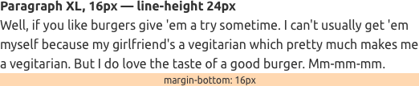

### 14px текст

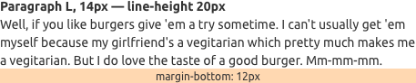

### 12px текст

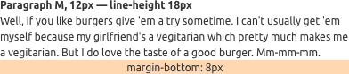

You can select text within a paragraph: change its face to `bold` or `italic`, make it a [link](/components/link/), a hint, or even cross it out.

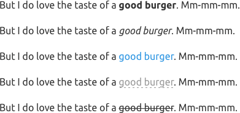

@## List

|     | Styles                                     | Numbered list         | Unordered list        | Check list                   |
| --- | ------------------------------------------ | --------------------- | --------------------- | ---------------------------- |
| XL  | `margin-bottom: 8px; padding-right: 12px;` |  | 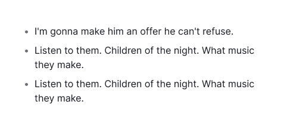 | 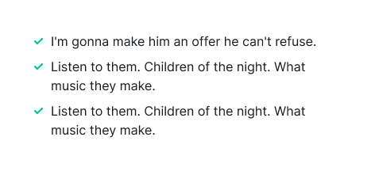 |
| L   | `margin-bottom: 8px; padding-right: 12px;` | 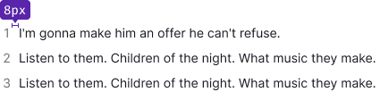 | 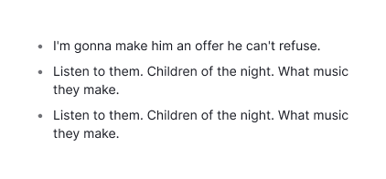 | 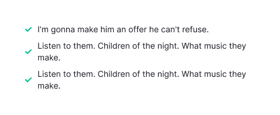 |
| M   | `margin-bottom: 8px; padding-right: 8px;`  | 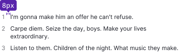 | 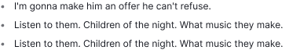 |  |

@## Nested list

Each next level of the nested list is always indented to the left. **Indents between the list levels for all font sizes are 8px**.

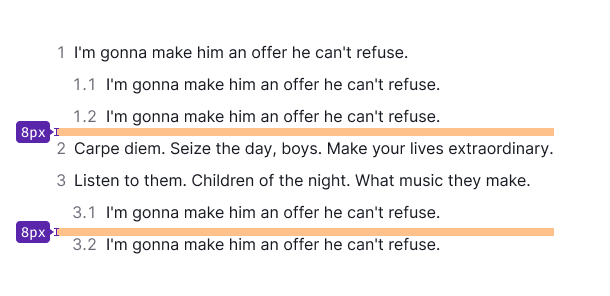

### Paragraph margins

Paragraphs have a lower margin, and each of the three paragraph sizes has its own margin. A paragraph of XL size (16px text) has a lower margin of 16px, a paragraph of L size (14px text) — 12px, a paragraph of M size (12px text) — 8px.

You can also use these margins when a paragraph is followed by a paragraph of smaller font size.

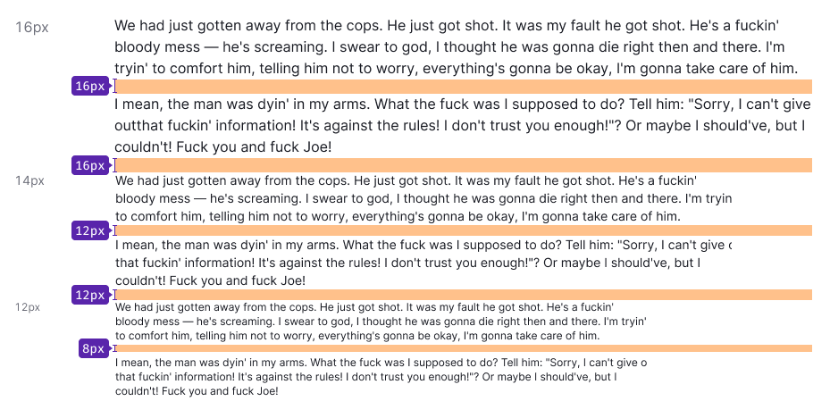

@## Quote

We have special styles for highlighting quotes in paragraphs.

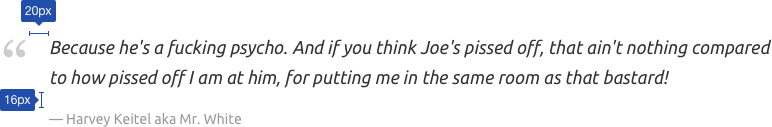

@## Hints (hint links)

The text can be wrapped in a **hint link (pseudo-link)**. In this case, it becomes an inactive control that triggers events on the page without its reloading. Use a pseudo-link for hints.

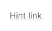

### Состояния hint link

| State        | Appearance                            | Description                                                                                                                                                                                                                               | Cursor                                                          |
| ------------ | ------------------------------------- | ----------------------------------------------------------------------------------------------------------------------------------------------------------------------------------------------------------------------------------------- | --------------------------------------------------------------- |
| normal       | 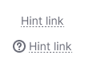    | The dotted text has `$gray60` color.                                                                                                                                                                                                      | `help` or `pointer`, if clickable                               |
| active/hover |        | **The link color is 12% darker than normal**. An absolute color is `#676767`. The dotted underlining remains. If a link is used together with the icon, the latter changes its color along with the text — they have the same hover area. | `help`, `default` or `pointer` (depending on the usage context) |
| disabled     |  | **The transparency of a component changes by 30%**. Use this state as the last resort and be sure to lebel the disabled link with an explanatory tooltip.                                                                                 | `default`                                                       |
| visited      |                                       | This link does not have `visited` state.                                                                                                                                                                                                  |                                                                 |

@## Which heading with which paragraph size shall be used?

These recommendations apply to typography in our core products and reports.

**Use XL paragraph with the following headings:**

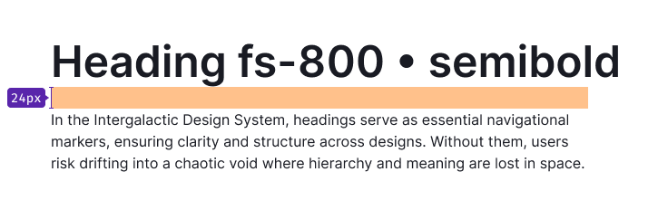

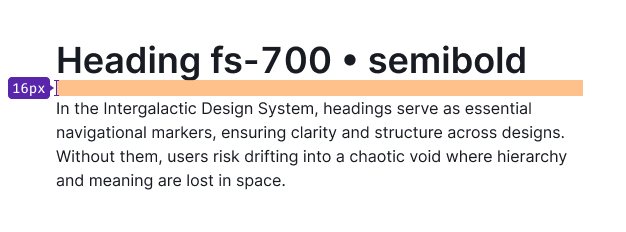

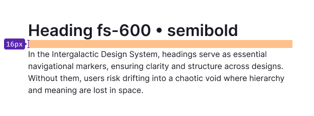

**Use L paragraph with the following headings:**

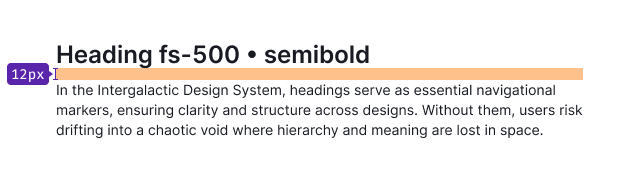

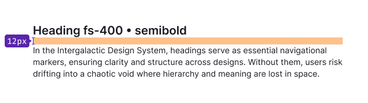

**Use M paragraph with the following heading:**

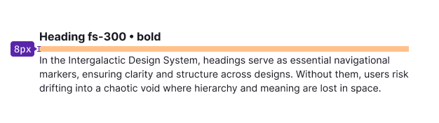

@page typography-api
@page typography-code
@page typography-changelog
