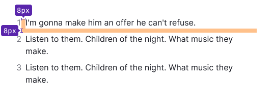

## Description

**Typography** is a component that allows you to apply predefined styles to text content. It includes the following styled components:

- Text with the full font sizes scale
- List
- Blockquote

### Font

In our design system, we use the [Inter](https://fonts.google.com/specimen/Inter?query=inter) font family.

## Font size and line height scale

Table: Font size and line height

| px   | em      | Font size tokens | Line height tokens |
| ---- | ------- | ---------------- | ------------------ |
| 12px | 0.75em  | `--fs-100`       | `--lh-100`         |
| 14px | 0.875em | `--fs-200`       | `--lh-200`         |
| 16px | 1em     | `--fs-300`       | `--lh-300`         |
| 20px | 1.25em  | `--fs-400`       | `--lh-400`         |
| 24px | 1.5em   | `--fs-500`       | `--lh-500`         |
| 32px | 2em     | `--fs-600`       | `--lh-600`         |
| 36px | 2.25em  | `--fs-700`       | `--lh-700`         |
| 48px | 3em     | `--fs-800`       | `--lh-800`         |

::: sandbox

:::

## Text styling and colors

To specify the main text color, use the `--text-primary` token. For the secondary text color, utilize the `--text-secondary` token. Additionally, text can be styled with our [main semantic colors](/style/design-tokens/design-tokens#semantic-tokens), such as `--text-success`, `--text-critical`, and others.

For other styling options, refer to our [Text styling example](/style/typography/typography-code#text-styling).

::: tip
Use text color thoughtfully and avoid excessive color usage, as it can reduce readability. Always ensure sufficient contrast between text and its background.
:::

### Additional information

In some cases, it may be necessary to display additional information next to the primary text (for example, a result count next to some heading). We recommend styling it using the secondary text color (`--text-secondary` token).

::: sandbox

:::

## Headings

Our design system doesn't have a specific heading component because any text can be given a heading tag based on the page's information hierarchy.

::: tip

We recommend using no more than four heading levels (h1-h4) on a page to avoid overcomplicating its structure.

:::

For the hero blocks, large advertising screens, banners, and landing pages, we recommend using the following font sizes with a _semibold_ font-weight (`--semi-bold` token).

::: sandbox

:::

The following font sizes are typically used for headings in content sections such as pages, cards, and summary widgets. For headings that are 16px or smaller, we recommend using a _bold_ font weight (`--bold` token).

::: sandbox

:::

<!-- ### Headings for mobile devices

To improve readability on different screens, adjust the size of headings based on the [breakpoints](/layout/grid-system/grid-system).

::: tip
Only change font styles, not the markup.
:::

Table: Heading styles for mobile devices

| 0px – 768px                    | 768px – ∞                      |
| ------------------------------ | ------------------------------ |
| 36/40 – `--fs-700`, `--lh-700` | 48/56 – `--fs-800`, `--lh-800` |
| 32/40 – `--fs-600`, `--lh-600` | 36/40 – `--fs-700`, `--lh-700` |
| 24/28 – `--fs-500`, `--lh-500` | 32/40 – `--fs-600`, `--lh-600` |
| 20/24 – `--fs-400`, `--lh-400` | 24/28 – `--fs-500`, `--lh-500` |
| 16/24 – `--fs-300`, `--lh-300` | 20/24 – `--fs-400`, `--lh-400` |
| 14/20 – `--fs-200`, `--lh-200` | 16/24 – `--fs-300`, `--lh-300` | -->

## Paragraph

Our design system doesn't have a separate paragraph component because any text can be a paragraph, depending on the page's structure.

The following font sizes are the most commonly used for paragraphs in our design system. **We recommend avoing to use the smallest paragraph size (`--fs-100`), as it may cause accessibility and readability issues.**

::: sandbox

:::

### Paragraph margins

We recommend using the following bottom margins for paragraphs with the most common font sizes in our design system:

- `--spacing-4x` for `--fs-300` font size
- `--spacing-3x` for `--fs-200` font size
- `--spacing-2x` for `--fs-100` font size

These margins can also be used when a paragraph is followed by another paragraph with a smaller font size.

::: sandbox

:::

### Headings and paragraph sizes

**Use a 16px paragraph with the following heading sizes:**

Table: Heading sizes and their bottom margins

| Heading&nbsp;size | Bottom margin                       |
| ----------------- | ----------------------------------- |
| `--fs-800`        | `--spacing-6x`  |
| `--fs-700`        | `--spacing-4x`  |
| `--fs-600`        | `--spacing-4x`  |

**Use a 14px paragraph with the following heading sizes:**

Table: Heading sizes and their bottom margins

| Heading&nbsp;size | Bottom margin                       |
| ----------------- | ----------------------------------- |
| `--fs-500`        | `--spacing-3x`  |
| `--fs-400`        | `--spacing-3x`  |
| `--fs-300`        | `--spacing-2x`  |

## List

List component has the following styles:

- list item has `margin-bottom: 8px`
- list bullet has `padding-right: 8px`

They're sufficient for the most common font sizes used in lists within our design system: `--fs-300`, `--fs-200`, `--fs-100`.

### Nested list

Each subsequent level of the nested list is indented to the left. The `margin` between list levels for all font sizes is 8px.

