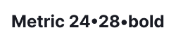
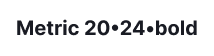

## Font

In our design system, we use the [Inter](https://fonts.google.com/specimen/Inter?query=inter) font family.

## Basic text colors

To specify the main text color, use the `--text-primary` token.

For the secondary text color, utilize the `--text-secondary` token.

Additionally, both paragraphs, headings, and text can be colored with our main semantic colors, which include `--text-success`, `--text-critical` and others.

Please use text coloring thoughtfully and avoid excessive use, as it may reduce readability. Always ensure text contrast against its background.

## Font size and line height

Table: Font size and line height

| px   | em      | Font size tokens | Line height tokens |
| ---- | ------- | ---------------- | ------------------ |
| 48px | 3em     | `--fs-800`       | `--lh-800`         |
| 36px | 2.25em  | `--fs-700`      | `--lh-700`        |
| 32px | 2em     | `--fs-600`      | `--lh-600`        |
| 24px | 1.5em   | `--fs-500`      | `--lh-500`        |
| 20px | 1.25em  | `--fs-400`      | `--lh-400`        |
| 16px | 1em     | `--fs-300`      | `--lh-300`        |
| 14px | 0.875em | `--fs-200`      | `--lh-200`        |
| 12px | 0.75em  | `--fs-100`      | `--lh-100`        |

::: sandbox

:::

## Headings

Our design system offers six heading sizes.

The first four headings are typically used for hero blocks, large advertising screens, banners, and landing pages. Use the `semibold` font-weight (`--semi-bold` token) with these headings.

Table: Heading from 48px to 24px styles

| Appearance           | Styles                     | Tokens                 |
| -------------------- | -------------------------- | ---------------------- |
|  | `font-size: 48px`, `line-height: 1.17`, `font-weight: semibold` | `--fs-800`, `--lh-800` |
|  | `font-size: 36px`, `line-height: 1.11`, `font-weight: semibold` | `--fs-700`, `--lh-700`  |
|  | `font-size: 32px`, `line-height: 1.25`, `font-weight: semibold` | `--fs-600`, `--lh-600`  |
|  | `font-size: 24px`, `line-height: 1.17`, `font-weight: semibold` | `--fs-500`, `--lh-500`  |

The remaining headings are used for the content part of products and landing pages. For headings with a size of 16px and smaller, use the `bold` font-weight (`--bold` token).

Table: Heading from 20px to 16px styles

| Appearance           | Styles                                                  | Tokens                |
| -------------------- | ------------------------------------------------------- | --------------------- |
|  | `font-size: 20px`, `line-height: 1.2`, `font-weight: semibold` | `--fs-400`, `--lh-400` |
|  | `font-size: 16px`, `line-height: 1.5`, `font-weight: bold` | `--fs-300`, `--lh-300` |

## Heading with counter

In certain cases, headings can include additional information, such as a counter of results found. These are often used in table headings. In such cases, the additional information is presented using the secondary text (`--text-secondary` token) and `regular` font-weight (`--regular` token).

## Headings for mobile devices

To improve readability on different screens, adjust the size of headings based on the [breakpoints](/layout/grid-system/grid-system).

::: tip
Only change font styles, not the markup.
:::

Table: Heading styles for mobile devices

| 0px – 768px                    | 768px – ∞                       |
| ------------------------------ | ------------------------------- |
| 36/40 – `--fs-700`, `--lh-700` | 48/56 – `--fs-800`, `--lh-800`  |
| 32/40 – `--fs-600`, `--lh-600` | 36/40 – `--fs-700`, `--lh-700`  |
| 24/28 – `--fs-500`, `--lh-500` | 32/40 – `--fs-600`, `--lh-600`  |
| 20/24 – `--fs-400`, `--lh-400` | 24/28 – `--fs-500`, `--lh-500`  |
| 16/24 – `--fs-300`, `--lh-300` | 20/24 – `--fs-400`, `--lh-400`  |
| 14/20 – `--fs-200`, `--lh-200` | 16/24 – `--fs-300`, `--lh-300`  |

## Paragraph

There are three text sizes commonly used in our products:

### 16px text

### 14px text

### 12px text

::: sandbox

:::

## Paragraph margins

Paragraphs have a `margin-bottom`, and each paragraph size has its own specific `margin`. For instance, a paragraph with a 16px font size has a `margin-bottom: 14px`, a paragraph with a 14px font size has a `margin-bottom: 12px`, and a paragraph with a 12px font size has a `margin-bottom: 8px`.

These margins can also be applied when a paragraph is followed by a paragraph with a smaller font size.

## Metric

For highlighting metrics in your interface, use the following styles:

Table: Font styles for metrics

| px   | Tokens                | Appearance                  |
| ---- | --------------------- | --------------------------- |
| 32px | `--fs-600`, `--lh-600` |  |
| 24px | `--fs-500`, `--lh-500` |  |
| 20px | `--fs-400`, `--lh-400` |  |
| 16px | `--fs-300`, `--lh-300` |  |
| 14px | `--fs-200`, `--lh-200` |  |

::: sandbox

:::

## Text styles

You have the flexibility to change the style of text by making it `bold`, `italic`, adding a [link component](/components/link/link), a [hint component](/style/typography/typography#hints_hint_links), or applying `strikethrough`.

::: sandbox

:::

## List

Table: Font styles for lists

| px  | Tokens | Styles | Numbered list | Unordered list | Check list |
| --- | ------ | ------ | ------------- | -------------- | ---------- |
| 16px | `--fs-300`, `--lh-300` | `margin-bottom: 8px`, `padding-right: 8px` |  |  |  |
| 14px | `--fs-200`, `--lh-200` | `margin-bottom: 8px`, `padding-right: 8px` |  |  |  |
| 12px | `--fs-100`, `--lh-100` | `margin-bottom: 8px`, `padding-right: 8px` |  |  |  |

## Nested list

Each subsequent level of the nested list is indented to the left. The `margin` between list levels for all font sizes are 8px.

Table: Font styles for nested lists

| px   | Tokens                | Margins                                          |
| ---- | --------------------- | ------------------------------------------------ |
| 16px | `--fs-300`, `--lh-300` |  |
| 14px | `--fs-200`, `--lh-200` |  |
| 12px | `--fs-100`, `--lh-100` |  |

## Quote

We have specific styles for highlighting quotes in paragraphs.

## Hints (hint links)

Text can be wrapped in a hint link (pseudo-link) component, creating a control that triggers events on the page without reloading it. This pseudo-link is usually used to show and hide [tooltips](../../components/tooltip/tooltip) or parts of the UI.

### Hint link states

Table: Hint link states

| State        | Appearance example  | Styles and tokens      | Cursor          |
| ------------ | ------------------- | ---------------------- | --------------- |
| Normal       |     | `--text-hint` and underlined with dashed border-bottom.     | `help` or `pointer`, if clickable   |
| Active/hover |        | `--text-hint-hover-active` and underlined with dashed border-bottom. If used with an icon, the icon changes color along with the text. | `help`, `default` or `pointer` (depending on the usage context) |
| Disabled     |  | `--disabled-opacity`. Use this state as a last resort and be sure to label the disabled link with an explanatory tooltip.     | `default`       |
| visited      |             | This link does not have `visited` state.  |                   |

## Which heading with which paragraph size shall be used

**Use a 16px paragraph with the following headings:**

**Use a 14px paragraph with the following headings:**

