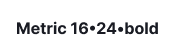
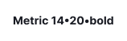

## Description

**Typography** is a component that allows you to apply predefined styles to text content. It includes the following styled components:

- Text with the full font sizes scale
- List
- Blockquote
- Hint (not recommended for use, use [ButtonLink](../../components/button/button-code#button-looking-like-link) component instead)

## Font

In our design system, we use the [Inter](https://fonts.google.com/specimen/Inter?query=inter) font family.

## Font size and line height scale

Table: Font size and line height

| px   | em      | Font size tokens | Line height tokens |
| ---- | ------- | ---------------- | ------------------ |
| 12px | 0.75em  | `--fs-100`       | `--lh-100`         |
| 14px | 0.875em | `--fs-200`       | `--lh-200`         |
| 16px | 1em     | `--fs-300`       | `--lh-300`         |
| 20px | 1.25em  | `--fs-400`       | `--lh-400`         |
| 24px | 1.5em   | `--fs-500`       | `--lh-500`         |
| 32px | 2em     | `--fs-600`       | `--lh-600`         |
| 36px | 2.25em  | `--fs-700`       | `--lh-700`         |
| 48px | 3em     | `--fs-800`       | `--lh-800`         |

::: sandbox

:::

## Headings

Our design system doesn't have a dedicated heading component because text of any size can be assigned a heading tag of any level—this heavily depends on the hierarchy of your information on the page.

### Recommendations on headings

::: tip

We recommend using no more than four heading levels (h1-h4) on a page to avoid overcomplicating its structure.

:::

For the hero blocks, large advertising screens, banners, and landing pages, we recommend using the following font sizes with a _semibold_ font-weight (`--semi-bold` token).

::: sandbox

:::

These font sizes can be used as headings in the content sections of products. For headings that are 16px or smaller, use a _bold_ font weight (`--bold` token).

::: sandbox

:::

<!-- Table: Heading from 20px to 16px styles

| Appearance         | Styles                                                         | Tokens                 |
| ------------------ | -------------------------------------------------------------- | ---------------------- |
|  | `font-size: 20px`, `line-height: 1.2`, `font-weight: semibold` | `--fs-400`, `--lh-400` |
|  | `font-size: 16px`, `line-height: 1.5`, `font-weight: bold`     | `--fs-300`, `--lh-300` | -->

### Heading with counter

In some cases, it may be necessary to display additional information next to the heading (for example, a result count). We recommend styling it with secondary text (`--text-secondary` token) and a _regular_ font-weight (`--regular` token).

::: sandbox

:::

<!-- ### Headings for mobile devices

To improve readability on different screens, adjust the size of headings based on the [breakpoints](/layout/grid-system/grid-system).

::: tip
Only change font styles, not the markup.
:::

Table: Heading styles for mobile devices

| 0px – 768px                    | 768px – ∞                      |
| ------------------------------ | ------------------------------ |
| 36/40 – `--fs-700`, `--lh-700` | 48/56 – `--fs-800`, `--lh-800` |
| 32/40 – `--fs-600`, `--lh-600` | 36/40 – `--fs-700`, `--lh-700` |
| 24/28 – `--fs-500`, `--lh-500` | 32/40 – `--fs-600`, `--lh-600` |
| 20/24 – `--fs-400`, `--lh-400` | 24/28 – `--fs-500`, `--lh-500` |
| 16/24 – `--fs-300`, `--lh-300` | 20/24 – `--fs-400`, `--lh-400` |
| 14/20 – `--fs-200`, `--lh-200` | 16/24 – `--fs-300`, `--lh-300` | -->

## Paragraph

Our design system doesn't have a separate component for paragraphs because text of any size can be made a paragraph—it all depends on the structure of the information on your page.

The following font sizes are the most commonly used for paragraphs in our design system. We recommend avoing to use the smallest paragraph size (`--fs-100`), as it may cause accessibility and readability issues.

::: sandbox

:::

### Paragraph margins

We recommend using the following bottom margins for paragraphs with the most common font sizes in our design system:

- `--spacing-4x` for `--fs-300` font size
- `--spacing-3x` for `--fs-200` font size
- `--spacing-2x` for `--fs-100` font size

These margins can also be used when a paragraph is followed by another paragraph with a smaller font size.

### Headings and paragraph sizes

**Use a 16px paragraph with the following headings:**

**Use a 14px paragraph with the following headings:**

<!-- ## Metric

For highlighting metrics in your interface, use the following styles:

Table: Font styles for metrics

| px   | Tokens                 | Appearance                 |
| ---- | ---------------------- | -------------------------- |
| 32px | `--fs-600`, `--lh-600` |  |
| 24px | `--fs-500`, `--lh-500` |  |
| 20px | `--fs-400`, `--lh-400` |  |
| 16px | `--fs-300`, `--lh-300` |  |
| 14px | `--fs-200`, `--lh-200` |  |

::: sandbox

::: -->

## Text styling

You can style text by changing its color, font-weight, font-style, text-transform, and even changing its font-family to `monospace`.

::: sandbox

:::

### Text colors

To specify the main text color, use the `--text-primary` token. For the secondary text color, utilize the `--text-secondary` token. Additionally, text can be styled with our [main semantic colors](/style/design-tokens/design-tokens#semantic-tokens), such as `--text-success`, `--text-critical`, and others.

::: tip
Use text color thoughtfully and avoid excessive color usage, as it can reduce readability. Always ensure sufficient contrast between text and its background.
:::

## List

Table: Font styles for lists

| px   | Tokens                 | Styles                                     | Numbered list         | Unordered list        | Check list                   |
| ---- | ---------------------- | ------------------------------------------ | --------------------- | --------------------- | ---------------------------- |
| 16px | `--fs-300`, `--lh-300` | `margin-bottom: 8px`, `padding-right: 8px` |  |  |  |
| 14px | `--fs-200`, `--lh-200` | `margin-bottom: 8px`, `padding-right: 8px` |  |  |  |
| 12px | `--fs-100`, `--lh-100` | `margin-bottom: 8px`, `padding-right: 8px` |  |  |  |

### Nested list

Each subsequent level of the nested list is indented to the left. The `margin` between list levels for all font sizes are 8px.

Table: Font styles for nested lists

| px   | Tokens                 | Margins                         |
| ---- | ---------------------- | ------------------------------- |
| 16px | `--fs-300`, `--lh-300` |  |
| 14px | `--fs-200`, `--lh-200` |  |
| 12px | `--fs-100`, `--lh-100` |  |

## Quote

We have specific styles for highlighting quotes in paragraphs.

## Hints (hint links)

::: warning
The [ButtonLink](../../components/button/button.md#button-with-link-styles) component has been implemented to replace the `Hint` component. Using `Hint` as a button or pseudo-link is no longer recommended.
:::
