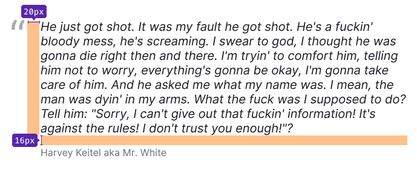

@## Font

We use two font families in our interface:

1. The main font is [Inter](https://fonts.google.com/specimen/Inter?query=inter).
2. The accent font in [Factor A](https://type.today/en/factor_a).

> 💡 For a clearer rendering of the font and its color, use `webkit-font-smoothing: antialiased;` (see cross-browser compatibility at [caniuse.com](https://caniuse.com/#search=-webkit-font-smoothing)).

@## Basic text colors

The main text color in our interface is `--gray800`.

The color used for secondary text is `--gray500`.

Besides, both paragraphs headings and text can be colored in our main semantic colors. Depending on the situation, they are green, red, and orange.

> 💡 Use this opportunity thoughtfully, and do not abuse the text coloring, as it will reduce its readability. **Don't forget to check the text for contrast against its background**.

@## Font variables

<!-- | Variable | em      | px   |
| -------- | ------- | ---- |
| 800  | 3em | 48px |
| 700  | 2.25em | 36px |
| 600  | 2em | 32px |
| 500  | 1.5em | 24px |
| 400  | 1.25em   | 20px |
| 300  | 1em | 16px |
| 200  | 0.875em   | 14px |
| 100  | 0.75em     | 12px | -->

@example text-variables

@## Headings

In our interface, we use headings of 6 sizes. All of them has `bold (700)` font-weight.

**The first 4 headings use Factor A as font-family. They are usually used in hero blocks, large ad screens and banners and landing pages**.

|     | Appearance           | Styles                                                   | Variables              |
| --- | -------------------- | -------------------------------------------------------- | ---------------------- |
| h1  |  | `font-size: 48px; line-height: 1.17; font-weight: bold;` | `--fs-800`, `--lh-800` |
| h2  |  | `font-size: 36px; line-height: 1.11; font-weight: bold;` | `--fs-700`, `--lh-700` |
| h3  |  | `font-size: 32px; line-height: 1.25; font-weight: bold;` | `--fs-600`, `--lh-600` |
| h4  |  | `font-size: 24px; line-height: 1.17; font-weight: bold;` | `--fs-500`, `--lh-500` |

**The remaining headings are used for the content part of products and landing pages**. _For example, in widgets._

|     | Appearance           | Styles                                                  | Variables              |
| --- | -------------------- | ------------------------------------------------------- | ---------------------- |
| h5  |  | `font-size: 20px; line-height: 1.2; font-weight: bold;` | `--fs-400`, `--lh-400` |
| h6  |  | `font-size: 16px; line-height: 1.5; font-weight: bold;` | `--fs-300`, `--lh-300` |

A heading can contain additional information, such as a counter of results found, and so on. They can be found in table headings. In these cases, the additional information is presented by secondary text of `--gray500` color and `regular (300)` font-weight.

@## Headings for mobile devices

To improve readability on different screens, change the size of the headings, depending on the [breakpoint](layout/grid-system/).

> Change only font styles, not the markup.

| 0px – 768px                         | 768px – ∞                           |
| ----------------------------------- | ----------------------------------- |
| H1 (36/40) — `--fs-700`, `--lh-700` | H1 (48/56) — `--fs-800`, `--lh-800` |
| H2 (32/40) — `--fs-600`, `--lh-600` | H2 (36/40) — `--fs-700`, `--lh-700` |
| H3 (24/28) — `--fs-500`, `--lh-500` | H3 (32/40) — `--fs-600`, `--lh-600` |
| H4 (20/24) — `--fs-400`, `--lh-400` | H4 (24/28) — `--fs-500`, `--lh-500` |
| H5 (16/24) — `--fs-300`, `--lh-300` | H5 (20/24) — `--fs-400`, `--lh-400` |
| H6 (14/20) — `--fs-200`, `--lh-200` | H6 (16/24) — `--fs-300`, `--lh-300` |

@## Basic text sizes and paragraph margins

There are three text sizes we use in our products.

### 16px text

### 14px text

### 12px text

You can select text within a paragraph: change its face to `bold` or `italic`, make it a [link](/components/link/), a hint, or even cross it out.

@example text-emphasis

@## List

| Variables                  | Styles                                    | Numbered list                           | Unordered list                           | Check list                                  |
| -------------------------- | ----------------------------------------- | --------------------------------------- | ---------------------------------------- | ------------------------------------------- |
| 16px, `--fs300`, `--lh300` | `margin-bottom: 8px; padding-right: 8px;` |  |  |  |
| 14px, `--fs200`, `--lh200` | `margin-bottom: 8px; padding-right: 8px;` |  |  |  |
| 12px, `--fs100`, `--lh100` | `margin-bottom: 8px; padding-right: 8px;` |  |  |  |

@## Nested list

Each next level of the nested list is always indented to the left. **Indents between the list levels for all font sizes are 8px**.

| Variables                  | Margins                                          |
| -------------------------- | ------------------------------------------------ |
| 16px, `--fs300`, `--lh300` |  |
| 14px, `--fs200`, `--lh200` |  |
| 12px, `--fs100`, `--lh100` |  |

### Paragraph margins

Paragraphs have a margin-bottom, and each of the three paragraph sizes has its own margin. A paragraph of XL size (16px text) has a margin-bottom of 16px, a paragraph of L size (14px text) — 12px, a paragraph of M size (12px text) — 8px.

You can also use these margins when a paragraph is followed by a paragraph of smaller font size.

@## Quote

We have special styles for highlighting quotes in paragraphs.

@## Hints (hint links)

The text can be wrapped in a **hint link (pseudo-link)**. In this case, it becomes an inactive control that triggers events on the page without its reloading. Use a pseudo-link for hints.

### Hint link states

| State        | Appearance                            | Description                                                                                                                                                                                             | Cursor                                                          |
| ------------ | ------------------------------------- | ------------------------------------------------------------------------------------------------------------------------------------------------------------------------------------------------------- | --------------------------------------------------------------- |
| normal       |     | Link has `--gray500` color and is underlined with dashed bottom border. color.                                                                                                                          | `help` or `pointer`, if clickable                               |
| active/hover |        | **Link changes it's color to `--gray600`**. The dotted underlining remains. If a link is used together with the icon, the latter changes its color along with the text — they have the same hover area. | `help`, `default` or `pointer` (depending on the usage context) |
| disabled     |  | **The transparency of a component changes by 30%**. Use this state as the last resort and be sure to label the disabled link with an explanatory tooltip.                                               | `default`                                                       |
| visited      |                                       | This link does not have `visited` state.                                                                                                                                                                |                                                                 |

@## Which heading with which paragraph size shall be used?

**Use 16px paragraph with the following headings:**

**Use 14px paragraph with the following heading:**

@page typography-a11y
@page typography-api
@page typography-code
@page typography-changelog
