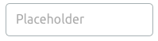
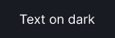

@## Description

This section describes all the variable parameters that we use in our component styles.

@## Main denominator

**The main denominator of our interface is 4**. All margins between the components and the blocks shall be a multiple of this denominator. All paddings and margins in blocks shall also be a multiple of 4. These rules help to keep consistency.

> 💡 Paddings inside some atomic components (icons, labels, etc.) may differ from multiples of 4, as they depend on other variable values. It is important for a visual side of these "bricks".
>
> You don't have to think about padding inside buttons, icons, etc. — our [libraries in Figma](https://www.figma.com/@semrush) and code are designed to do it for you.

@## Basic colors

> See [Visual loudness scale](/patterns/visual-loudness-scale/) guide for more information about colors using and visual hierarchy.

|                                                                | Example                                 | Styles                  |
| -------------------------------------------------------------- | --------------------------------------- | ----------------------- |
| Basic text color                                               |                 | `gray20` (#333)         |
| Secondary text color                                           |  | `gray60` (#757575)      |
| Placeholder color                                              |   | `gray70` (#aaa)         |
| Color of tools background, of a text against a dark background |      | `white`                 |
| Link color                                                     |                 | `denim-blue` (#0071BC)  |
| Color of success ✅                                            |           | `green` (#4FAE33)       |
| Color of warning, validation and error ⚠️                      |           | `orange` (#ff7f00)      |
| Critical message color 🚩                                      |         | `red` (#ed2d2d)         |
| Old color of brand, branded controls, and elements             |               | `brand-color` (#ba4717) |

@## Basic sizes of components

| Size      | Description                                                                                                                                                                                                                                                     |
| --------- | --------------------------------------------------------------------------------------------------------------------------------------------------------------------------------------------------------------------------------------------------------------- |
| XL (42px) | An extra-large size of components that are used mainly for landing pages, home pages, and mobile versions. For buttons and inputs, it is 42px. For other components such as input fields, etc., it is a size with 16px text size.                               |
| L (32px)  | A large size of the components. For buttons and inputs, it is 32px. For other components such as tags, labels, input fields, etc., it is a size with 14px text size.                                                                                            |
| M (26px)  | **Default size of components**. For buttons and inputs, it is 26px. For other components such as tags, labels, input fields, etc., it is a size with 12px text size.                                                                                            |
| S (18px)  | A small size of the components. For buttons and inputs, it is 18px. For other components such as tags, labels, input fields, etc., it is a size with 10px text size. **When using this size, keep in mind that this type of text is very difficult to read** 🙏 |
| XS        | An extra-small size of the components.                                                                                                                                                                                                                          |

@## States

| Hover | Styles                                                                                                                                           |
| ----- | ------------------------------------------------------------------------------------------------------------------------------------------------ |
|       | 1. If it is a text (for example, a link) or an icon, then use an `interactive` property. It makes a component color darker by 12%.               |
|       | 2. If it is an element with a transparent background (usually, it is opacity of 0 – 15%), then it changes its transparency by 20% when hovering. |

| Active | Styles                                                                                                                                               |
| ------ | ---------------------------------------------------------------------------------------------------------------------------------------------------- |
|        | 1. If it's a text (for example, a link) or an icon, then use an `interactive` property. It makes a component color darker by 12%.                    |
|        | 2. If it's a button or something big, make it 5% darker than a hover and add 5% brightness: `saturate(darken ($hover, 5%), 5%);`.                    |
|        | 3. If it's an element with a transparent background (usually, it is opacity of 0 – 15%), then in an active state it changes its transparency by 30%. |

|          | Styles                                                                                                                                                                       |
| -------- | ---------------------------------------------------------------------------------------------------------------------------------------------------------------------------- |
| Focus    | `box-shadow: 0 0 0 3px rgba($color, .3);`. For `normal` and `active` states, the focus color is `light-blue`. For `invalid` — `orange`; for `valid` — `green`, respectively. |
| Invalid  | `border-color: var(--orange);`                                                                                                                                               |
| Valid    | `border-color: var(--green);`                                                                                                                                                |
| Disabled | `opacity: .3;`                                                                                                                                                               |
| Loading  | `opacity: .3;` and a spinner is added.                                                                                                                                       |

@## Dividers and shadows

|                                                                      | Description                                                                            |
| -------------------------------------------------------------------- | -------------------------------------------------------------------------------------- |
| Color of borders and dividers                                        | `gray80`                                                                               |
| Border for dropdown items (dropdowns and popovers)                   | `border: solid 1px var(--stone-light);`                                                |
| Shadow of the blocks, raised above the content (dropdowns, popovers) | `box-shadow: 0 2px 5px 0 rgba(0, 0, 0, 0.25);`                                         |
| Mask or overlay                                                      | Black — `background: rgba(0,0,0,0.8);`, white — `background: rgba(255,255,255,0.85);`. |

@## Border-radius

These are rules for the rounding radius of controls, fields, dropdowns, etc.

| Size      | Styles                | Usage                                                    |
| --------- | --------------------- | -------------------------------------------------------- |
| XXL       | `border-radius: 6px;` | The border-radius is only for modal dialogues.           |
| XL (42px) | `border-radius: 5px;` | Additional border-radius. Used in XL (42px) components.  |
| L (32px)  | `border-radius: 4px;` | Additional border-radius. Used in L components.          |
| M (26px)  | `border-radius: 3px;` | Main border-radius. Used in M components.                |
| S (18px)  | `border-radius: 2px;` | Border-radius for widgets and [Card](/components/card/). |
