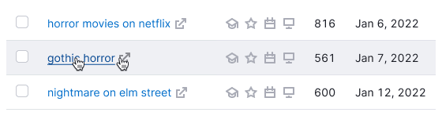
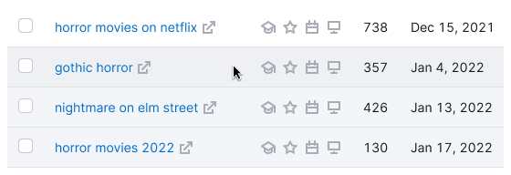
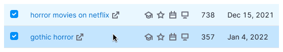
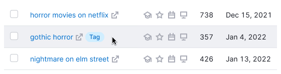
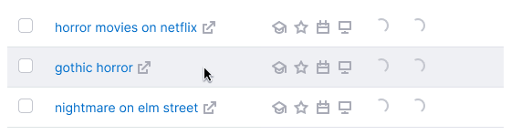
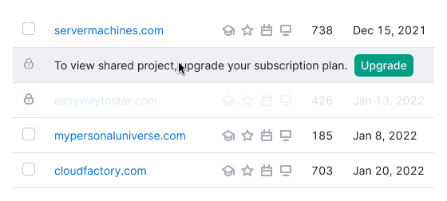

## Description

**DataTable** is a complex component designed for managing complex data lists.

## Appearance

### Types

Our design system has two table types – [primary](../table-primary/table-primary) and [secondary](../table-secondary/table-secondary).

### Common styles for table content

Table: Common styles for table content

| Content                   | Styles and tokens                                                                                                      |
| ------------------------- | ---------------------------------------------------------------------------------------------------------------------- |
| Text in the header        | Use `--fs-100` and `--lh-100` tokens for font-size and line-height respectively, and `--text-primary` token for color. |
| The text in the row       | Use `--fs-200` and `--lh-200` tokens for font-size and line-height respectively, and `--text-primary` token for color. |
| Secondary text            | Use `--text-secondary` token for color.                                                                                |
| Stand alone icon          | Icon with M size and `--icon-secondary-neutral` token for color.                                                       |
| The icon next to the text | Icon with M size and `--icon-secondary-neutral` token for color.                                                       |
| Header and cell checkbox  | Use [Checkbox](/components/checkbox/checkbox) with M size.                                                             |

## Sorting

For detailed information on sorting columns in the table, refer to [Table controls](/table-group/table-controls/table-controls).

## Tooltip

To display additional information about a column, use tooltip. It will appear by hovering over the column title.

### Conditions for tooltip appearance

Table: Conditions for the tooltip appearance

| Case                                                  | Appearance example        |
| ----------------------------------------------------- | ------------------------- |
| If text is too long and collapsed into an `ellipsis`. |  |
| If the column has additional explanatory information. |  |

## Table row states

::: tip
Hover state for a row is required for all table types.
:::

Hovering highlights information in large data volumes, making it easier to perform actions such as reading, deleting, or opening.

- The row changes to the `hover` state when you hover over any part of it.
- If the cursor is over an item, the row remains in the `hover` state, and the item under the cursor is also highlighted.

### Hover styles for different cells

If an entire row is in the disabled state, it shouldn't have a hover state.

::: tip
Consider using darker icon colors to increase contrast when using colored cell backgrounds. For instance, switch from `--icon-secondary-neutral` to `--icon-primary-neutral`.
:::

Table: Hover styles for different cells

| State                    | Appearance                     | Styles                                                                                                                                                                                 |
| ------------------------ | ------------------------------ | -------------------------------------------------------------------------------------------------------------------------------------------------------------------------------------- |
| Default, hover           |   | `background-color: var(--table-td-cell); border-bottom: 1px solid var(--border-secondary)`. When you `hover` on, background color changes to `background: var(--table-td-cell-hover)`. |
| Unread, unread hover     |    | `background-color: var(--table-td-cell-unread)`. The `hover` state is the same as default cell has.                                                                                    |
| Selected, selected hover |  | `background-color: var(--table-td-cell-selected)`. When you `hover` on, the background color changes to `background-color: var(--table-td-cell-selected-hover)`.                       |
| New, new hover           |       | `background-color: var(--table-td-cell-new)`. When you `hover` on, the background color changes to `background-color: background-color: var(--table-td-cell-new-hover)`.               |
| Error, error hover       |    | `background-color: var(--table-td-cell-critical)`. When you `hover` on, the background color changes to `background-color: var(--table-td-cell-critical-hover)`.                       |
| Warning, warning hover   |   | `background-color: var(--table-td-cell-warning)`. When you `hover` on, the background color changes to `background-color: var(--table-td-cell-warning-hover)`.                         |
| Current, current hover   |   | The row is tagged with tag `You`. The `hover` state is the same as the `default` state.                                                                                                |
| Loading                  |   | Change opacity of the elements inside a row to `--disabled-opacity`. Spin has size XS.                                                                                                 |
| Limit, limit hover       |           | For limiting rows use `--overlay-limitation-secondary` token. The `hover` state is the same as the default state has.                                                                  |

### Hover for row-span and col-span

- Hovering over the parent column highlights all child rows.
- Hovering over a child row highlights the parent column.

### Cells coloring

If a cell is colored, it remains colored when you hover over it. Users shouldn't lose information about the cell's color when hovering over a row.

## Cell content alignment

Text inside cells in rows and headers is aligned according to these rules.

### Left-aligned

- Text
- The link (URL)
- Keyword
- Code/Numbers/Hashes (text consisting of numbers, symbols, and letters)
- Abbreviation
- Date
- Control element
- Button
- Select
- Tag/Badge
- Icons (if multiple, SERP features)

### Center-aligned

- Numbers (if horizontal comparison is needed)
- Icon (if single)
- Particular character
- Image

### Right-aligned

- Numbers (if vertical comparison is needed)
- Decimal numbers
- Tags/Badges (when marking the entire row)

## Scroll bar

The most common case is scroll bar showed at the bottom of the table. Horizontal scrolling in our tables indicates hidden data beyond the viewport in wide tables. It's needed when:

- All table columns don't fit the viewport.
- Adding a new column from the settings manager makes the table data exceed the viewport.
- The screen where the user views the report is smaller than 992px.

::: tip
Having a horizontal scroll in a large table isn't a bad practice; it's a familiar experience for most users (similar to Excel). It's wrong when adding columns to a table makes them unnecessarily narrow, without the need for scrolling.

<!-- > [UX tables to work with (Russian)](https://designpub.ru/ux-%D1%82%D0%B0%D0%B1%D0%BB%D0%B8%D1%86-%D1%81-%D0%BA%D0%BE%D1%82%D0%BE%D1%80%D1%8B%D0%BC%D0%B8-%D1%80%D0%B0%D0%B1%D0%BE%D1%82%D0%B0%D1%8E%D1%82-%D1%87%D0%B0%D1%81%D1%82%D1%8C-1-%D0%BF%D1%80%D0%BE%D1%81%D0%BC%D0%BE%D1%82%D1%80-%D0%B4%D0%B0%D0%BD%D0%BD%D1%8B%D1%85-5ea60df37f12) -->

:::

### Two scroll bars

You can add two scroll bars to a table if needed—one in the header and one at the bottom. This is useful when the table is very long and has fixed columns, so users can scroll the table without scrolling to its very end. In these cases, the scroll bars can be in both the header and bottom. Refer to the [examples in the Sticky header section](/table-group/data-table/data-table-code#sticky-header).

## Pagination

Refer to the [Table controls](/table-group/table-controls/table-controls#pagination) guide for detailed recommendations on pagination.

## Table states

For information about table states, refer to the specific document on [Table states](/table-group/table-states/table-states).
