::: tip
For all main table styles and principles, refer to [DataTable](/table-group/data-table/data-table).
:::

## Description

This documentation outlines elements and controls crucial for working with our tables.

Users typically engage with tables for the following tasks:

- Viewing data
- Entering data
- Searching for data
- Controlling data
- Collecting data

Each of these tasks represents a distinct process that demands attention.

## Sorting

### Sorting principles

1. Columns that can be sorted show a `SortDesc` icon on hover. Default sorting direction is descending.
2. In an already sorted column, a `SortDesc` or a `SortAsc` icon is always visible and indicates the current sorting direction.
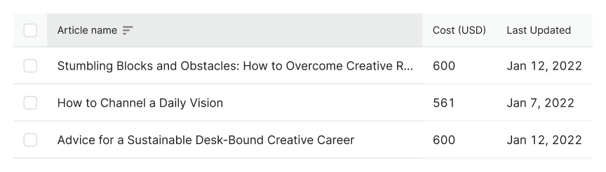
4. When user sorts a column, sorting icons on other columns don’t change their direction.
5. Sorting action reloads the table, returning user to the first row.
6. Sorting isn't available for parent header cells in multi-level headers.
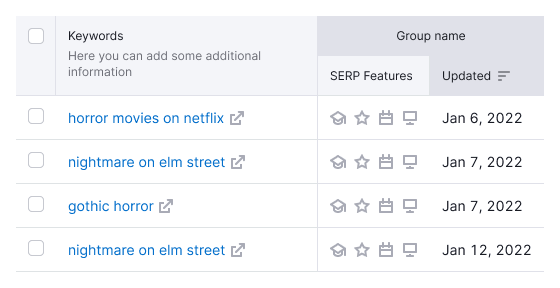

::: tip
If data in a column shouldn't be sorted, there should be no sorting icon at all.
:::

### Sorting in secondary table

Try to avoid fully functional sorting in secondary tables—show a non-interactive sorting indicator instead.
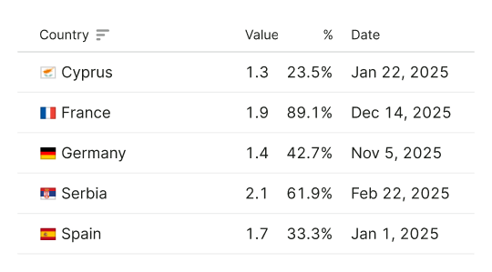

### Click zone for sorting

- If a column header contains only non-interactive text or icons, the entire cell area serves as the target area for sorting.
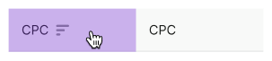
- If there is a control in the header, such as [Select](/components/select/select), it should be excluded from the sorting target area.
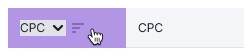

### Sorting direction

Table: Sorting direction

| Description                                                                                                                                                                                                                     | Ascending (SortAsc)                  | Descending (SortDesc)                |
| ------------------------------------------------------------------------------------------------------------------------------------------------------------------------------------------------------------------------------- | ------------------------------------ | ------------------------------------ |
| **Icon**                                                                                                                                                                                                                        | 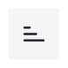                  | 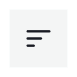                 |
| **Numbers**. Values `-`, `n/a`, `0`, etc. are smaller values.                                                                                                                                                                   | From smaller to larger – 0, 1, 2 → 9 | From larger to smaller – 9, 8, 7 → 0 |
| **Texts**. If there are several languages in the table, it's recommended to divide them into groups and sort them according to the priority and user needs (it may also depend on the target audience, product specifics, etc.) | A to Z                               | Z to A                               |
| **Statuses**. We recommend using gradations of the form: good/bad, necessary/not necessary, fresh/not fresh, higher/lower, etc.                                                                                                 | At the discretion of UX and PO       | At the discretion of UX and PO       |
| **Dates**                                                                                                                                                                                                                       | From a newer date to an older one    | From an older date to a newer one    |

## Accordion

A table row can expand like [Accordion](/components/accordion/accordion), containing more detailed table data, charts, text, links, or other information.

::: tip
If you have too much data inside an accordion, consider moving it to a separate page.
:::

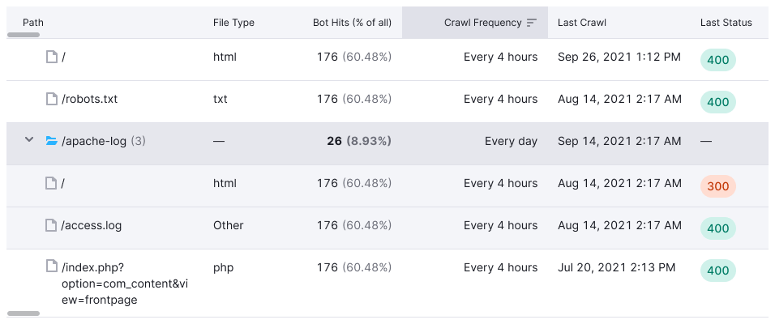

If the data inside an accordion is relevant only to a certain cell in a row, this single cell can function as the accordion trigger, instead of the entire row.

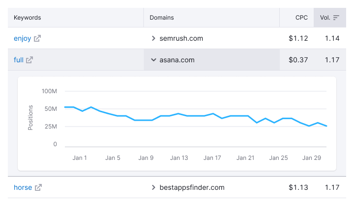

## Checkboxes

Table rows can be selectable. In this case, each row, including the header, will have a [Checkbox](/components/checkbox/checkbox) at the beginning.

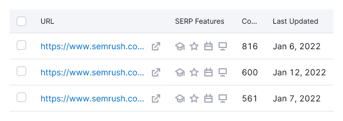

### Row selection and pagination

When switching pages, row selection shouldn't reset.

_For example, user selects 3 rows on page 1, then goes to page 2, and selects 5 rows there. When user returns to page 1, the selected rows should be preserved._

### Selecting multiple rows with Shift

Use `Shift` key to select a range of rows at once.

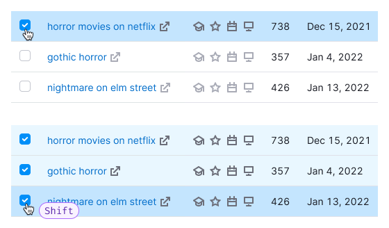

## Status and actions

Use the action bar to show info and actions for the selected rows.

<!-- vale DevDocs.Inclusive = NO -->
* Place the bar above the table. Placing the bar between the table header and body will make the table less accessible.
* If the beginning of the table is currently visible, the action bar shifts the whole table down and up when appearing and disappearing.
* Alternatively, the action bar can be displayed permanently. In this case selecting rows adds or replaces elements in the bar.
<!-- vale DevDocs.Inclusive = YES -->

::: tip
If your action bar shifts the table down and up, set a 150–200ms transition for smooth entrance and exit. [Refer to our example](../data-table/data-table-code.md#checkboxes-and-action-bar).
:::

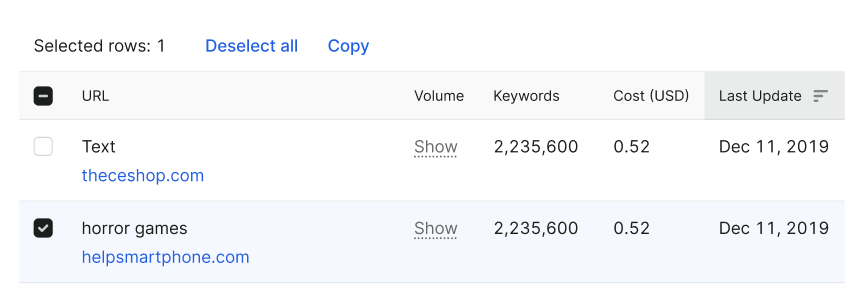

When scrolling, pin the action bar alongside the table header.

If the action bar appears or disappears when the beginning of the table is scrolled out of the view, it only shifts the header and doesn't shift the rows.

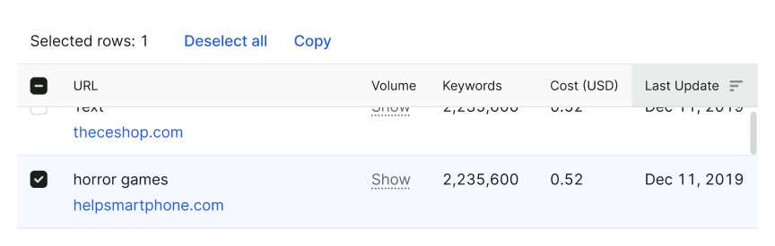

### Styles

Use `--bg-primary-neutral` color for background and `--border-secondary` color for border-bottom.

### Actions and rules of use

- **Deselect all** deselects all rows on all pages
- **Select all on page (N)** selects all rows on the current page
- **Select all in table (N)** selects all rows in the table
- limit actions to 3-5 popular options

**Select all** isn't an obvious action name, so we recommend avoiding it and using the options mentioned earlier instead.

## Column resizing

Hovering over the header border changes the cursor to `col-resize`, with a border color change to `--border-table-accent`.

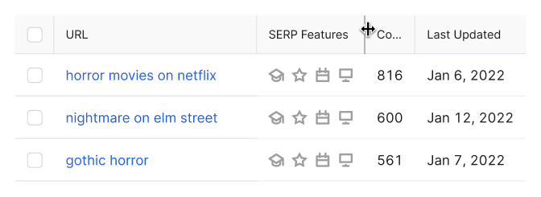

The interactive area includes the border itself and 5px to its left.

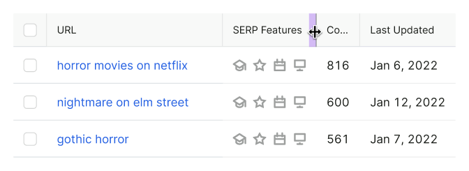

::: tip
Changing one column's size shouldn't affect others.
:::

## Editing and adding content

1. For inline editing, show an **Edit** icon-only [ButtonLink](../../components/button/button) while hovering over the row. Use `--icon-secondary-neutral` color and `--spacing-1x` for `margin-left`.

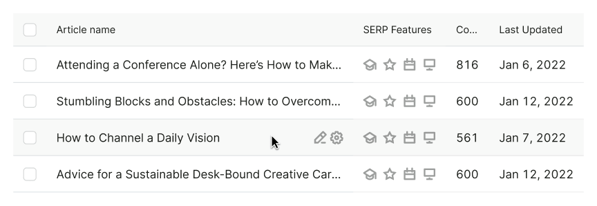

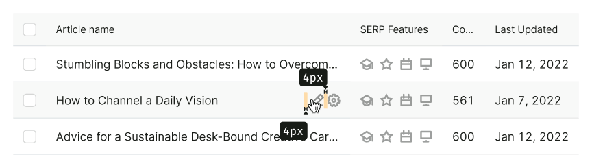

2. Clicking on **Edit** reveals an [InlineInput](/components/inline-input/inline-input).

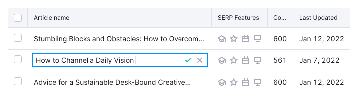

If other actions are present in the same cell, **Edit** should be closer to the text.

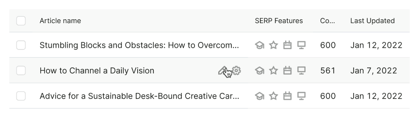

## Highlighting content

When searching in a table, highlight matches with `--bg-highlight-results` background-color.

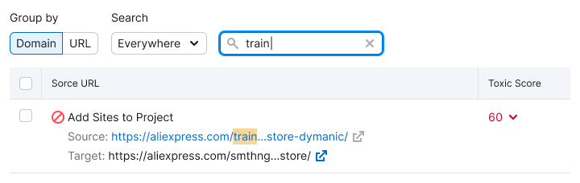

## Internal and external links

Links in cells can lead to internal pages or external resources:

- For links leading to an internal page, use a link or a button, depending on the context.
- For links leading to an external resource, add the `LinkExternal` icon at the end, with M size and `--icon-secondary-neutral` color.

## Long links and text

Choose from three options based on context:

<!-- vale DevDocs.ArticlesHeadings = NO -->
### Truncate text at the end

- this solution is suitable for most tables, since data they contain usually occupies a single row
- show the full text in a [hint](../../utils/hint/hint) while hovering over the text

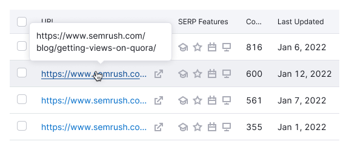

### Truncate text in the middle
<!-- vale DevDocs.ArticlesHeadings = YES -->

- this option is suitable for URLs that differ in the last characters
- show the full text in a [hint](../../utils/hint/hint) while hovering over the text

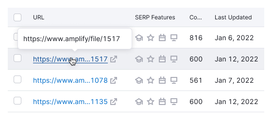

### Wrap text to next line

This option is suitable for cases when the table cell has more than one row of a data. For example, if there is a `row-span` with substrings in the row.

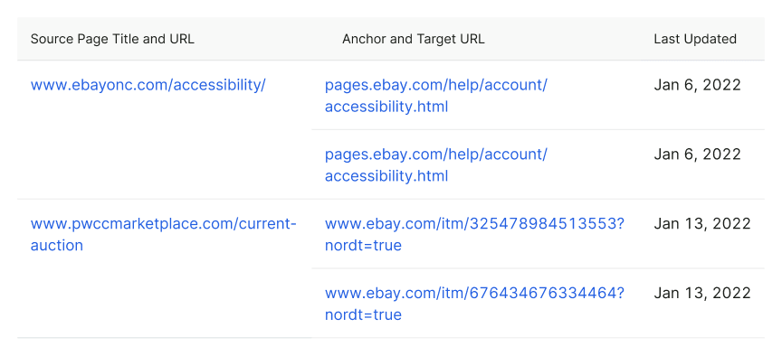

## Pagination

If the table has more than one page, display [Pagination](/components/pagination/pagination) with a 16px margin between the table and pagination.

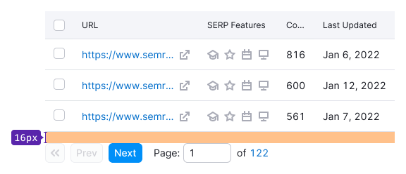

::: tip
Scroll the table to the first row when navigating pages or applying filters.
:::

## Table settings and column manager

For complex tables you can add a list of table settings or column manager.

### Table settings

- Place a list of settings inside such a control: from disabling columns to changing the appearance of the table.
- Don't use it for changing columns order.
- Avoid showing columns that can't be hidden.

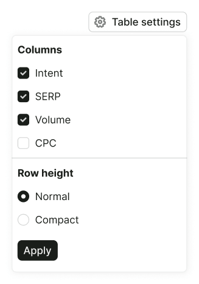

### Column manager

Use it only to enable and disable columns. Show this with a counter inside the button.

- Use it for changing the columns order.
- Show columns that can't be hidden as `disabled`.

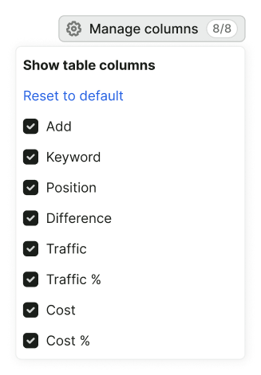
