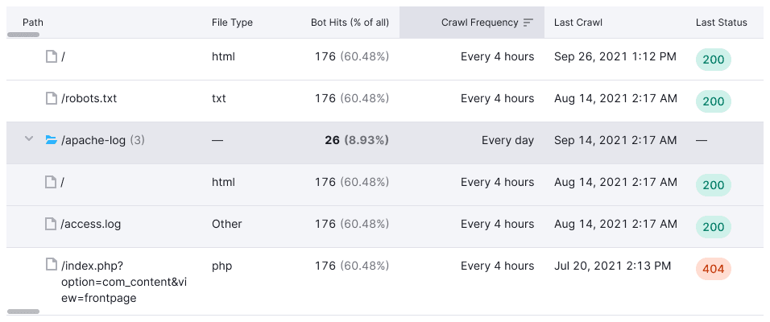
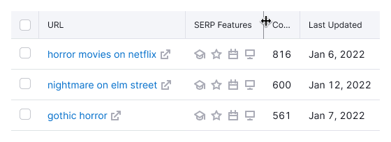
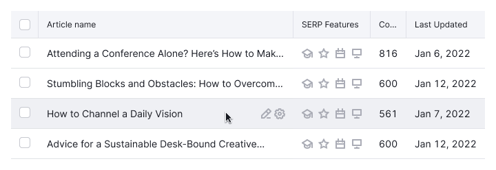
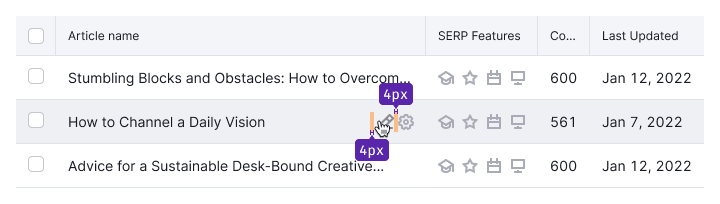
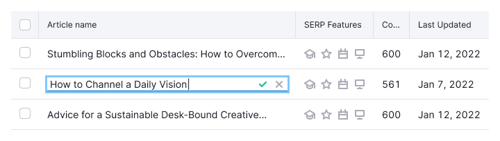
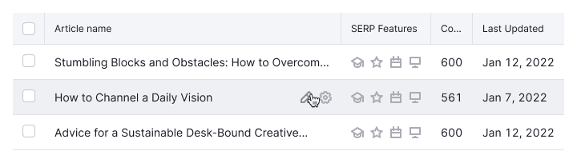
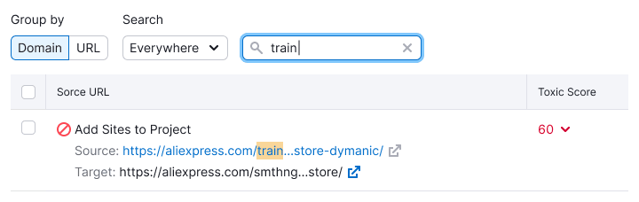
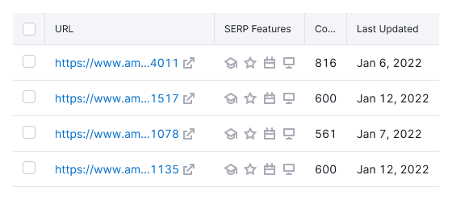
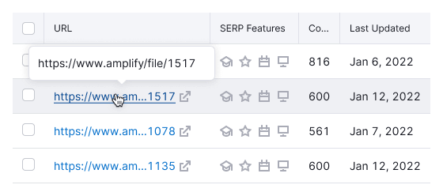
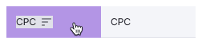

::: tip
For all main table styles and principles, refer to the [Table](/table-group/data-table/data-table).
:::

## Description

This documentation outlines elements and controls crucial for working with our tables.

::: tip
Users typically engage with tables for the following tasks:

- Viewing data
- Entering data
- Searching for data
- Controlling data
- Collecting data

Each of these tasks represents a distinct process that demands attention.

<!-- _[Article by M. Grekov about UX tables that are used (in Russian)](https://designpub.ru/ux-%D1%82%D0%B0%D0%B1%D0%BB%D0%B8%D1%86-%D1%81-%D0%BA%D0%BE%D1%82%D0%BE%D1%80%D1%8B%D0%BC%D0%B8-%D1%80%D0%B0%D0%B1%D0%BE%D1%82%D0%B0%D1%8E%D1%82-%D1%87%D0%B0%D1%81%D1%82%D1%8C-1-%D0%BF%D1%80%D0%BE%D1%81%D0%BC%D0%BE%D1%82%D1%80-%D0%B4%D0%B0%D0%BD%D0%BD%D1%8B%D1%85-5ea60df37f12)_ -->
:::

## Accordion

A table row can expand like an [Accordion](/components/accordion/accordion), typically containing more detailed information like charts, text, or links.

::: tip
If you have too much data inside such an accordion, we consider you to think about a separate page for it.
:::

- The accordion row should have a `ChevronRight` icon in the leftmost column to indicate expandability. Use icon with M size and `--icon-secondary-neutral` token for color.
- The active state of an opened accordion row is highlighted with the `--table-td-cell-active` token.
- When opened, the `ChevronRight` icon changes to `ChevronDown` of the same size and color.
- Rows inside the accordion have specific styling to prevent visual merging when multiple rows are open. Use `--table-td-cell-accordion` for background-color and `--border-table-accent` for 1px solid border-bottom.

### Opening accordion from table cell

If a table cell content (text, link, etc.) opens an accordion, place the `ChevronRight` icon next to it.

The `active` state of the cell should be highlighted with `--table-td-cell-active` token, with the `ChevronRight` changing to `ChevronDown`.

## Checkboxes

For selecting multiple rows and performing actions, add a [Checkbox](/components/checkbox/checkbox) in the leftmost cell of each row.

The table header should have a main [Checkbox](/components/checkbox/checkbox) to highlight all rows on the page.

[Checkbox](/components/checkbox/checkbox) must cover the entire cell as the target zone.

### Row selection and pagination

When switching pages, row selection shouldn't reset.

_For example, user selects 3 rows on page 1, then goes to page 2, and selects 5 rows there. When user returns to page 1, the selected rows should be preserved._

### Selecting multiple rows with Shift

Use `Shift` key to select a range of rows at once.

## Status and actions

Use the action bar to show info and actions for the selected rows.

* Place the bar above the table. Placing the bar between the table header and body will make the table less accessible.
* If the beginning of the table is currently visible, the action bar shifts the whole table down and up when appearing and disappearing.
* Alternatively, the action bar can be displayed permanently. In this case selecting rows adds or replaces elements in the bar.

::: tip
If your action bar shifts the table down and up, set a 150–200ms transition for smooth entrance and exit. [Refer to our example](../data-table/data-table-code.md#checkboxes-and-action-bar).
:::

When scrolling, pin the action bar alongside the table header.

If the action bar appears or disappears when the beginning of the table is scrolled out of the view, it only shifts the header and doesn't shift the rows.

### Styles

Use `--bg-primary-neutral` token for background-color and `--border-secondary` token for 1px solid border-bottom.

### Actions and rules of use

- **Deselect all** deselects all rows on all pages
- **Select all on page (N)** selects all rows on the current page
- **Select all in table (N)** selects all rows in the table
- limit actions to 3-5 popular options

**Select all** isn't an obvious action name, so we recommend avoiding it and using the options mentioned earlier instead.

## Column resizing

Hovering over the header border changes the cursor to `col-resize`, with a border color change to `--border-table-accent`.

The resizable area includes 1px border and 5px to the left of it.

::: tip
Changing one column's size shouldn't affect others.
:::

## Editing and adding content

1. For inline editing add `Edit` icon which showed while user hovers over a table cell. Use icon with M size, `--icon-secondary-neutral` token for color and add `--spacing-1x` for `margin-left`.

2. Clicking on the `Edit` icon reveals [InlineInput](/components/inline-input/inline-input).

If other clickable icons are present, position the edit icon closer to the text.

## Highlighting content

When searching a table, highlight matches in the data with `--bg-highlight-results` token for background-color.

## Internal and external links

Links in cells can lead to internal pages or external resources:

- For those which lead to the internal page, use the link/button, depending on the context.
- For those which lead to the external resource, use `LinkExternal` icon with M size and `--icon-secondary-neutral` token for color.

## Long links and text

Choose from three options based on context:

### Wrap long text at the end with an ellipsis

- This solution is suitable for most of the tables, since data they contain usually occupies a single row.
- Show the full text in the tooltip while hovering over the text.

### Wrap long text in the middle with an ellipsis

- This option is suitable for URLs that differ in the last characters.
- Show the full text in the tooltip while hovering over the text.

### Move long text to the next line

This option is suitable for cases when the table cell has more than one row of a data. For example, if there is a `row-span` with substrings in the row.

## Pagination

If the table has more than one page, include [Pagination](/components/pagination/pagination) with a 16px margin between the table and pagination.

If the table contains a small amount of data, show the pagination for one page.

::: tip
Scroll the table to the first row when navigating pages or applying filters.
:::

## Sorting

### Sorting principles

1. Columns that can be sorted must have `SortDesc`/`SortAsc` icon indicating sorting direction. It's shown while hovering over TH cell and is always shown for TH cell with `active` state. Use the `--icon-secondary-neutral-hover-active` token (same for active and hover icon states).

2. Sorting icons should show the potential sorting direction, not the current state.
3. Default sorting is descending order (`SortDesc`).
4. If you can't sort data in the column, but you need to show which column is sorted (usually necessary in secondary tables), then add sorting icon in active state with `--icon-secondary-neutral-hover-active` token for color.

::: tip
If data in a column shouldn't be sorted, there should be no sorting icon at all.
:::

### Click zone for sorting

Table: Click zone for sorting

| Case                                                                                  | Click zone                             |
| ------------------------------------------------------------------------------------- | -------------------------------------- |
| If there is a simple text/icon inside the cell.                                       |  |
| If there is a control inside the cell (for example, [Select](/components/select/select)). |  |

### Sorting behavior

- If sorting in a column is active, the icon has an `active` state and shows the corresponding sorting direction.
- When user selects a different column, icon on the selected column becomes active. Icons on other columns don’t change their direction.
- Clicking on a sorting icon reloads the table, returning user to the first row of the table.

### Sorting direction

Table: Sorting direction

| Description | Ascending (SortAsc)                  | Descending (SortDesc)               |
| -------------------------------------------------------------------------------------------------------------------------------------------------------------------------------------------------------------------------------- | ------------------------------------ | ----------------------------------- |
| **Icon**                                                                                                                                                                                                                         |           |        |
| **Numbers**. Values `-`, `n/a`, `0`, etc. are smaller values.                                                                                                                                                                    | From smaller to larger – 0, 1, 2 → 9 | From larger to smaller – 9, 8, 7 → 0 |
| **Texts**. If there are several languages in the table, it is recommended to divide them into groups and sort them according to the priority and user needs (it may also depend on the target audience, product specifics, etc.) | A to Z                               | Z to A                              |
| **Statuses**. We recommend using gradations of the form: good/bad, necessary/not necessary, fresh/not fresh, higher/lower, etc.                               | At the discretion of UX and PO       | At the discretion of UX and PO      |
| **Dates**                                                                                                                                                                                                                        | From a newer date to an older one    | From an older date to a newer one   |

## Table settings and column manager

For complex tables you can add a list of table settings or column manager.

### Table settings

- Place a list of settings inside such a control: from disabling columns to changing the appearance of the table.
- Do not use it for changing columns order.
- Avoid showing columns that cannot be hidden.

### Column manager

Use it only to enable and disable columns. Show this with a counter inside the button.

- Use it for changing the columns order.
- Show columns that cannot be hidden as `disabled`.

