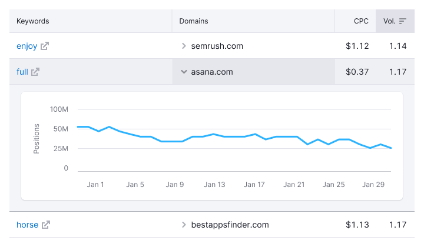
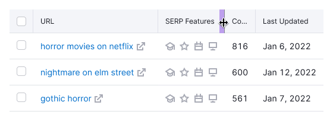
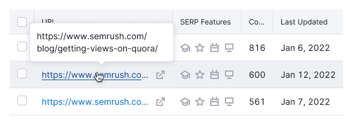
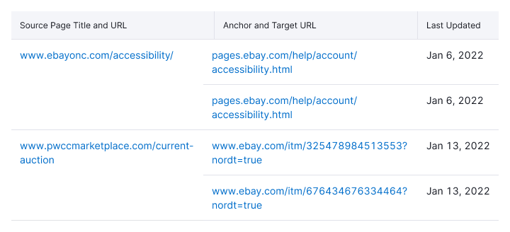

> 💡 For all the main table styles and principles, see [Table](/table-group/table/).

Here we describe all the elements and controls that are important when working with our tables.

> ...what exactly do users do with tables:
>
> 1. viewing data,
> 2. enter data,
> 3. search for data,
> 4. control data,
> 5. collect data.
>
> **Each item is a separate process that requires attention.**.
>
> _[Article by M. Grekov about UX tables that are used (in russian)](https://designpub.ru/ux-%D1%82%D0%B0%D0%B1%D0%BB%D0%B8%D1%86-%D1%81-%D0%BA%D0%BE%D1%82%D0%BE%D1%80%D1%8B%D0%BC%D0%B8-%D1%80%D0%B0%D0%B1%D0%BE%D1%82%D0%B0%D1%8E%D1%82-%D1%87%D0%B0%D1%81%D1%82%D1%8C-1-%D0%BF%D1%80%D0%BE%D1%81%D0%BC%D0%BE%D1%82%D1%80-%D0%B4%D0%B0%D0%BD%D0%BD%D1%8B%D1%85-5ea60df37f12)_

@## Accordion

A table row can be expanded as an [Accordion](/components/accordion/). As a rule such row has more detailed information on row data - chart, text, links, etc.

> 💡 If you have too much data inside a row with accordion, you may need to think about a separate page for it.

- The accordion row must have the `ChevronRight` icon in the leftmost column. It indicates that this line can be expanded. Icon has M size and `--gray-300` color.
- The row that opened additional data from must remain highlighted. The `active` state of a row has `background-color: color-mod(var(--gray-100) a(80%));`.
- When the row with accordion is opened, the `ChevronRight` icon should change to `ChevronDown` of the same size and color.
- The row inside the accordion has `background-color: var(--gray-50);` and `border-bottom: 1px solid var(--gray-300);`. It is necessary so that when several rows with accordion are opened, they do not visually merge with each other.

### Opening an accordion from a table cell

- If a value in a table cell should open a row with accordion, make sure to put the `ChevronRight` icon next to it.
- Place the icon to the left of the value, because it indicates that the table cell opens as accordion.

In the `active` state, the cell must be additionally highlighted with the `background-color: color-mod(var(--gray-100) a(80%));`. And the `ChevronRight` icon changes to `ChevronDown` icon of the same size and color.

@## Checkboxes

If you need to select several rows in the table at the same time and perform actions on them, add a [Checkbox](/components/checkbox/) in the leftmost cell of the each row.

To highlight all rows, the table header must have the main [Checkbox](/components/checkbox/). When you click on the checkbox in the header, all the rows on **the first page are highlighted as selected**.

The [Checkbox](/components/checkbox/) must have the entire cell in the table as a click zone.

### Rows highlighting and pagination

When switching between pages of the table, do not reset checked checkboxes. _For example, on page 1, the user selected 3 lines, went to page 2, and selected 5 lines there. When the user returns to page 1, the selected rows should be saved._

### Keyboard shortcuts for working with rows

You can select multiple rows at once with `Shift` key.

 

@## Columns resizing

When you hover over a border in the header, the cursor changes to `col-resize`, and the border color changes to `--gray-300`.

The area that you can grab and change the size of the column includes not only the 1px border of the cell, but also 5px to the left of the border.

> 💡 Changing the size of one column should not change the size of other columns.

@## Editing and adding content

1. When you hover over the line, you can see the `Edit` icon with S size and `--gray-300` color.

It is always nailed to the right side of the cell and has a `margin-left: 4px`, so that it is easier to get into it with the cursor and the content does not stick to it.

2. Clicking on the `Edit` icon shows an [InlineInput](/components/inline-input/).

If there are any other clickable icons in the row, then the edit icon should always be closer to the text.

@## Highlighting content

When searching a table, sometimes you need to highlight the match in the data. In this case, highlight what you've found with the `background-color: color-mod(var(--yellow-300) a(40%));`.

@## Internal and external links

**The link in the cell can lead to:**

- the internal report — use the link/button, depending on the context;
- another website — use the `LinkExternal` icon with S size and `--gray-300` color.

@## Long links and text

There are three solutions for displaying long text in a table cell. The choice of one of them depends on the context and usage case.

### The long text at the END is wrapped in an ellipsis (...)

- This solution is suitable for most of the tables, since data in them usually occupies a single row.
- Show the full text in the tooltip by hovering over the text.

### The long text in the MIDDLE is wrapped with an ellipsis (...)

- This option is suitable for URLs that differ in the last characters and therefore it is more logical to wrap THEM with an ellipsis in the middle.
- Show the full text in the tooltip by hovering over the text.

### Long text is moved to the next line

This option is suitable for cases when the cell can have more than one row of a data. For example, if there is a `row-span` with substrings in the row.

@## Pagination

If the table has more than one page, it must have [Pagination](/components/pagination/). Margin between the table and the pagination is 16px.

If the table contains a small amount of data, we show the pagination for one page.

> 💡 When you navigate through the pages in the table, **scroll the table to the first row**. Otherwise, the user have to scroll on their own.
>
> Applying filters to a table always takes the user to the first page of the table.

@## Sorting

- **If you can sort by column, it must have the `SortDesc`/`SortAsc` icon. By default, use `SortDesc`.**
- If you can't sort data in the column, but you need to show which column it is sorted by (it is usually necessary in secondary tables), then add sorting icon in active state with `--gray-400` color.

### Click zone for sorting

| Case                                                                                  | Click zone                             |
| ------------------------------------------------------------------------------------- | -------------------------------------- |
| If there is a simple text/icon inside the cell.                                       |  |
| If there is a control inside the cell (for example, a [Select](/components/select/)). |  |

### Sorting icon styles

- The default color for the sorting icon is `--gray-300`.
- If column sorting is active, the icon changes color to `--gray-400`.

If table has only one column with sorting, usually its sorting icon is unclickable and has an active state.

### Rules for sorting

> 💡 If the data in the column should not be sorted, there should be no sorting icon.

- The sort icon should always be displayed on columns that can be sorted. **The icon shows not the current state, but how the column will be sorted if sorting is activated.**
- The default sorting must be set for each column to be sorted. Descending order is used by default (use `SortDesc` icon).
- If sorting on a column is active, the icon has the `active` state and shows the corresponding sorting direction.
- **When you select a different column**, the icon on the selected column becomes active. Icons on other columns go to the inactive state and do not change their direction.
- When you reload data in a table where data was sorted in one of the columns, the header of the sorted column remains highlighted.

> 💡 When you click on the sorting icon in the header, the table should be reloaded and always return the user to the top of the first row.

### Sort direction

|                                                                                                                                                                                                                                  | Ascending (SortAsc)                  | Descending (SortDesc)               |
| -------------------------------------------------------------------------------------------------------------------------------------------------------------------------------------------------------------------------------- | ------------------------------------ | ----------------------------------- |
| **Icon**                                                                                                                                                                                                                         |           |        |
| **Numbers**. Values `-`, `n/a`, `0`, etc. are smaller values.                                                                                                                                                                    | From smaller to larger – 0, 1, 2 → 9 | From larger to smaller– 9, 8, 7 → 0 |
| **Texts**. If there are several languages in the table, it is recommended to divide them into groups and sort them according to the priority and user needs (it may also depend on the target audience, product specifics, etc.) | A to Z                               | Z to A                              |
| **Statuses**. At the discretion of the priority, SOFTWARE, or utility for users. We recommend using gradations of the form: good/bad, necessary/not necessary, fresh/not fresh, higher/lower, etc.                               | At the discretion of UX and PO       | At the discretion of UX and PO      |
| **Dates**                                                                                                                                                                                                                        | From a newer date to an older one    | From an older date to a newer one   |

@## Status and actions row

> The row must have `transition: 400ms` specified for appearing and hiding.

We recommend using the status row when the table has multi-row selection and pagination at the same time. This is necessary so that the user understands that the table has selected rows when paginating the table. You can also show popular actions that can be performed on rows in the status row.

When scrolling a table, this row should be pinned to the table header. In this case, it does not have a shadow, as well as a pinned header.

| Appearance                                         | Styles                                                                              |
| -------------------------------------------------- | ----------------------------------------------------------------------------------- |
|  | `background-color: var(--gray-50);` and `border-bottom: 1px solid var(--gray-100);` |

### The actions and rules of use

- `Deselect all` deselects all selected rows (on any page).
- `Select all` is not an obvious action, so we recommend avoiding this and using the following instead.
- `Select all on page (N)` selects all rows on the current page of the table.
- `Select all on table (N)` selects all rows in the table.

Use no more than 3-5 actions, which are the most popular among actions on the table rows.

> 💡 For all the main table styles and principles, see [Table](/table-group/table/).
