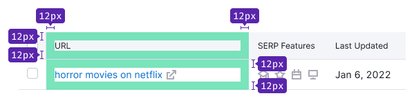
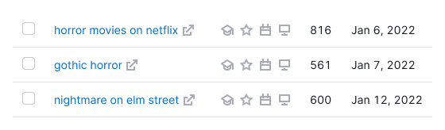
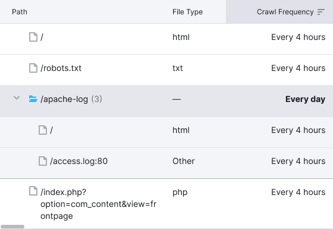
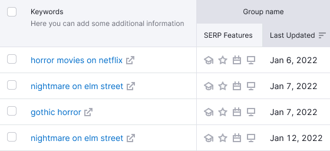
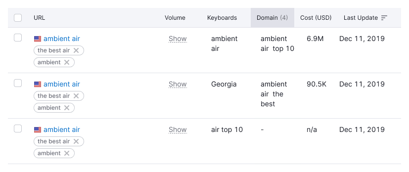

## Description

**Primary table** is the foundational table type for displaying large data volumes and complex functionality.

## Appearance

### Paddings

In the primary table, whether it's a header or a row, cells use `--spacing-3x` token for padding.

You can also make a cell more compact by using the `compact` property, which reduces the left and right paddings to `--spacing-2x`.

### Styles

::: tip
Content inside header cells and rows is always aligned to the top.
:::

Table: Primary table styles

| Description                     | Appearance                                | Styles                                                                        |
| ------------------------------- | ----------------------------------------- | ----------------------------------------------------------------------------- |
| Header                         |         | `background-color: var(--table-th-primary-cell)`, `border-bottom: 1px solid var(--border-secondary)` |
| Header of the scrollable table |  | When scrolling a page with a table, the header shouldn't have a shadow.      |
| Default row                     |       | `border-bottom: 1px solid var(--border-secondary)`                                   |
| The last line of the accordion  |   | `border-bottom: 1px solid var(--table-td-cell-accordion)`                                   |

## Multi-level header

In some cases, a header may comprise two or more rows. To maintain consistency:

- The title of the merged column should always be center-aligned.
- Sorting is not available for the parent header cells in multi-level headers.

In other cases, when space is limited, wrap text to the next line within the cell.

## Table header states

Table: Table header states

| State  | Appearance                | Tokens                                                    |
| ------ | ------------------------- | --------------------------------------------------------- |
| Hover  |   | Use `--table-th-primary-cell-hover` for background color. |
| Sorted |  | Use `--table-th-primary-cell-active` for background color.|

## Row states

For more information, refer to the general [DataTable](/table-group/data-table/data-table#table-row-states) guide.
