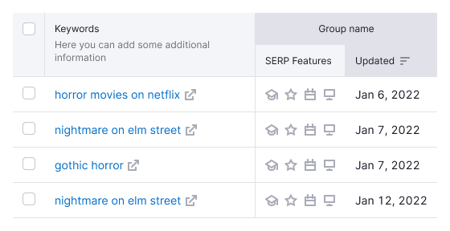

**Primary** is the basic type of tables for displaying large data volumes and complex functionality.

@## Paddings

The cell in the primary table, whether it is a header or a row, has 12px padding.

You also can make a cell compact simply by using `compact` prop. In this case paddings of the cell change to 8px on the left and right.

@## Styles

> Content inside header cells and rows is aligned to the top.

| Description                     | Appearance                                | Styles                                                                        |
| ------------------------------- | ----------------------------------------- | ----------------------------------------------------------------------------- |
| Heading                         |         | `background-color: var(--table-th-primary-cell)`, `border-bottom: 1px solid var(--border-secondary)` |
| Heading of the scrollable table |  | When scrolling a page with a table, the header should not have a shadow.      |
| Default row                     |       | `border-bottom: 1px solid var(--border-secondary)`                                   |
| The last line of the accordion  |   | `border-bottom: 1px solid var(--table-td-cell-actions-accordion)`                                   |

@## Multi-level header

In some cases, a header should comprise two or more rows. Following conditions are recommended to be met:

- the title of the merged column should be always center-aligned;
- you can't sort by the head cell.

In other cases, if there is insufficient space, two lines of text in one cell can be used.

@## Table header states

| State  | Appearance                         | Styles                                                |
| ------ | ---------------------------------- | ----------------------------------------------------- |
| Hover  |    | `background-color: var(--table-th-primary-cell-hover)`, `cursor: pointer` |
| Sorted |  | `background-color: var(--table-th-primary-cell-active)`, `cursor: pointer` |

@## Row states

See more information in the common [Table principles](/table-group/table/#a1c3dd) guide.

@page table-primary-code
