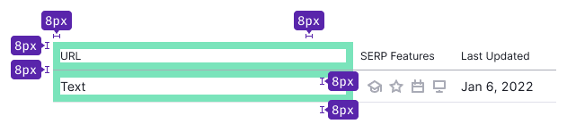
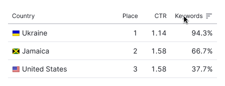
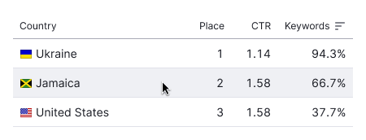

**Secondary** is a table type for compact displaying small amount of data inside widgets and [cards](/components/card/). These tables commonly either don't have any functionality, or they have something simple like sorting.

@## Paddings

The cell in the primary table, whether it is a header or a row, has 8px padding.

@## Styles

> If there is a sorting icon in the column, icon should be in active state and has `--gray-400` color.

| Description | Appearance                                  | Styles                                                                      |
| ----------- | ------------------------------------------- | --------------------------------------------------------------------------- |
| Heading     |  | `background-color: var(--white); border-bottom: 1px solid var(--gray-300);` |
| Default row |  | `background-color: var(--white); border-bottom: 1px solid var(--gray-100);` |

@## Row states

See more information in the common [Table principles](/table-group/table/#a1c3dd) guide.

@page table-secondary-code
