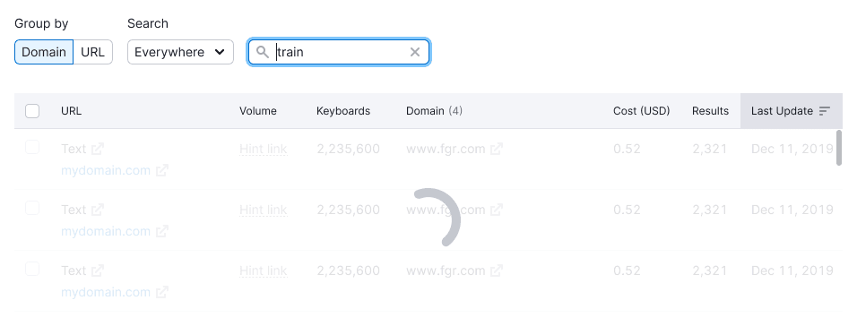

@## Empty table

All the basic states of our [table](/table-group/table/) ✨ are gathered here.

> 💡 The block with the text of the states inside the table must get the `sticky` property when scrolling and be centered relative to the parent block and the user's viewport.
>
> Thus the user will always see what is happening with the table, and won't need to scroll to the top of the table.

A block with a loading state or error state must have `margin-top: 40px`, so that when the user changes the size of the viewport, the block with the error does not "stick" to other blocks.

|                          | First screen                                              | The state of the page scrolling                           |
| ------------------------ | --------------------------------------------------------- | --------------------------------------------------------- |
| Example with Progressbar |      |      |
| Example with Spin        |  |  |

> 💡 It is also not recommended to change the table height when changing states.

@## Loading

When loading data for the first time, show the structure of the loaded page and data. Use the [Skeleton](/components/skeleton/).

**When showing:**

- page loading;
- initial data loading;
- uploading new data.

We recommend using the skeleton to show only the first three rows, not the entire table.

> 💡 We don't show pagination when loading the table for the first time, because we don't know how much data we will show in the end.

In a secondary table, you can use the skeleton for all the rows (there are usually no more than 5-10 rows).

@## No data

If gathering data takes a large period of time (more than 1 minute, for example), we show that data is being collected. Use the [ProgressBar](/components/progress-bar) in this case.

**We show it in cases when data is collected for a very long time (more than 1 minute).** Showing the progressbar. A block with a progress bar and text gets `sticky` property and is centered relative to the block that the user scrolls.

When scrolling the table, pin the progressbar to the table header. The state description is centered relative to the user's viewport.

@## Nothing found

This state is for cases when we filter/sort/search data. In this case, we use [Spin](/components/spin/).

If data loading is fast, then this state is not necessary.

**When showing:**

- filtering vast data volumes in a table;
- sorting a large amount of data in a table;
- go to another page;
- other data operations that do not require a long wait;
- search in the table (if possible, show the search query).

The block with the spinner gets the `sticky` property and is centered relative to the block that the user scrolls.

@## Skeleton

The table is empty and has no data in it, because the data was either deleted or was not provided at the beginning of working with the table.

**When showing:**

- the table is empty and, for example, you need to connect data to it;
- the user deleted all data from the table.

> 💡 The illustrations for these cases are usually unique. Designers create them for each specific case or tool if needed.

@## Something went wrong

**When showing:**

- We don't have data for some reason.
- For some reason, we can't show the data.

> 💡 The icon for this state can be found in the [library for empty states](https://static.semrush.com/ui-kit/widget-empty/1.4.0/table.svg). All other icons and their names can be found in the [documentation of empty states](/components/widget-empty/widget-empty-code/).

[comment]: <> (@## Nothing found)

[comment]: <> (When searching or applying a filter in the table, we didn't find anything.)

[comment]: <> (> 💡 In this state, the illumination of the sorted column must be preserved.)

[comment]: <> (**Showing this state when there is no have data** on the parameters requested by the user. The user performed some actions with filters or sorting of data.)

[comment]: <> (In this state, we recommend adding a control that will help the user correct the situation. For example, you can add a `Clear filters` button.)

[comment]: <> (![table with nothing found]&#40;static/nothing-found-button.png&#41;)

[comment]: <> (> 💡 The icon for this state can be found in the [library for empty states]&#40;https://static.semrush.com/ui-kit/widget-empty/1.4.0/nothing-found.svg&#41;. All other icons and their names can be found in the [documentation of empty states]&#40;/components/widget-empty/widget-empty-code/&#41;.)

[comment]: <> (@## Service error)

[comment]: <> (There was an error in the tool on the backend, so we can't show the data. For more information about such errors, see [Errors, n/a, nothing found in the widgets]&#40;/components/widget-empty/&#41;.)

[comment]: <> (**When showing:**)

[comment]: <> (- The error at the stage of table loading)

[comment]: <> (- Error while working with the table)

[comment]: <> (| | Apperance example |)

[comment]: <> (| ------------------------------------------ | --------------------------------------------------------- |)

[comment]: <> (| We are aware of the problem, and report it | ![table with known error]&#40;static/error-known.png&#41; |)

[comment]: <> (| We don't know about the problem | ![table with not known error]&#40;static/error-not-known.png&#41; |)

[comment]: <> (> 💡 The icon for this state can be found in the [library for empty states]&#40;https://static.semrush.com/ui-kit/widget-empty/1.4.0/warning.svg&#41;. All other icons and their names can be found in the [documentation of empty states]&#40;/components/widget-empty/widget-empty-code/&#41;.)

[comment]: <> (@## Message text)

[comment]: <> (It is important to indicate the following things in the empty state message:)

[comment]: <> (- In the heading – the essence of the current situation.)

[comment]: <> (- In the description – what you need to do to change the state.)

[comment]: <> (- If possible, suggest an action &#40;in the form of a button or link&#41;.)

[comment]: <> (For more information about the rules for such States, see the guides – [Errors, n/a, nothing found in widgets]&#40;/components/widget-empty/&#41;, [Global errors]&#40;/patterns/global-errors/&#41;, etc.)

[comment]: <> (@## Table header)

[comment]: <> (For all empty states of the table, we keep the header. If it has sorting icons, we also keep them.)

[comment]: <> (![empty table with head]&#40;static/empty-yes-no.png&#41;)

[comment]: <> (@## Cell edge cases)

[comment]: <> (### There is no data in the cell)

[comment]: <> (- Show the `n/a` text in the secondary text color `var&#40;--gray60&#41;`.)

[comment]: <> (- It is recommended to show a tooltip with an explanation that the data is not available &#40;and for what reason&#41;.)

[comment]: <> (![table cell with n/a]&#40;static/cell-na.png&#41;)

[comment]: <> (![table cell with n/a]&#40;static/cell-na-tooltip.png&#41;)

[comment]: <> (### Data uploading in the cell)

[comment]: <> (> 💡 Note that we use [Skeleton]&#40;/components/skeleton/&#41;. when loading the table for the first time.)

[comment]: <> (When loading content in one or more cells, we show the [Spin]&#40;/components/spin/&#41; of S size.)

[comment]: <> (![table cell with spin]&#40;static/cell-loading.png&#41;)

[comment]: <> (### Error in a table cell)

[comment]: <> (This is the state when something broke in a particular cell and we can't show the data.)

[comment]: <> (- We use the `WarningXS` icon in a warning orange color.)

[comment]: <> (- On the hover, we always show a tooltip with an explanation that something went wrong.)

[comment]: <> (> 💡 We recommend giving the user the opportunity to change the situation so that the data appears. In this case, you can display the control in a cell for reloading data, and so on.)

[comment]: <> (![table cell with warning]&#40;static/cell-danger.png&#41;)

[comment]: <> (![table cell with warning]&#40;static/cell-danger-tooltip.png&#41;)

[comment]: <> (### The cell is blocked)

[comment]: <> (A cell in a table may be blocked by a limit or by the need to take some action to unlock the data.)

[comment]: <> (- Use the `LockXS` icon in the color `var&#40;--stone&#41;`.)

[comment]: <> (- On the hover, we always show a tooltip with an explanation of why the cell is blocked and, if possible, how to get rid of this state.)

[comment]: <> (![locked table cell]&#40;static/cell-locked.png&#41;)

[comment]: <> (![locked table cell]&#40;static/cell-locked-tooltip.png&#41;)

> 💡 For all the main table styles and rules, see [Table](/table-group/table/). For all icons for different States and their names, see the [empty states documentation](/components/widget-empty/widget-empty-code/).
