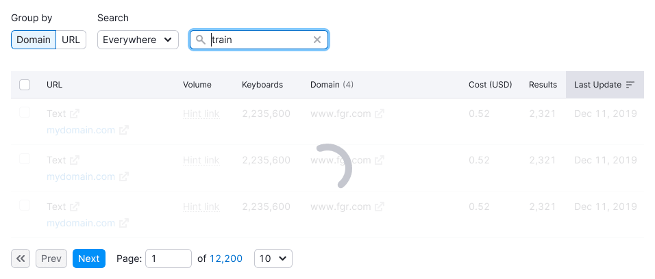
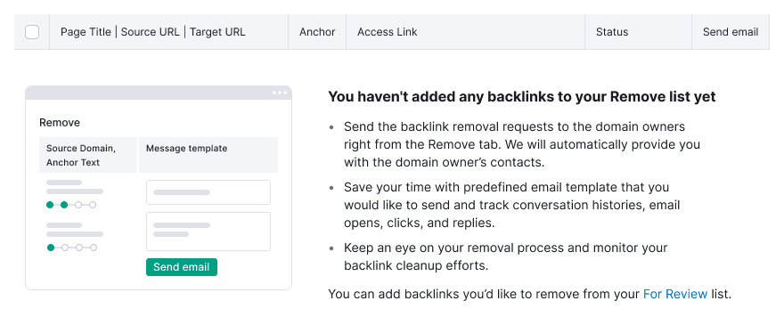

@## Basic rules for table states

> The message inside the table must get the `sticky` property when scrolling and be centered relative to the parent table and the user's viewport.
>
> Thus the user will always see what is happening with the table, and won't need to scroll to the top of it.

Message with a loading or error state must have `margin-top: 40px`, so that when the user changes the size of the viewport, the message does not "stick" to table header.

|                                                       | First screen                                              | The state of the page scrolling                           |
| ----------------------------------------------------- | --------------------------------------------------------- | --------------------------------------------------------- |
| Example with [Progressbar](/components/progress-bar/) |      |      |
| Example with [Spin](/components/spin/)                |  |  |

> It is also not recommended to change the table height when switching between states.

@## Skeleton

When loading data for the first time, show the structure of the loaded page and data. Use the [Skeleton](/components/skeleton/).

**Show skeleton while there is:**

- initial loading of the page;
- initial data loading;
- new data uploading.

We recommend using the skeleton to show only the first three rows, not the entire table.

> Don't show [Pagination](/components/pagination/) when loading the table for the first time.

In a secondary table, you can show the skeleton for all the rows (there are usually no more than 5-10 rows).

@## Progressbar

If gathering data takes a large period of time **(more than 1 minute, for example)**, show that data is being collected. Use the [ProgressBar](/components/progress-bar) in this case.

A message with a progressbar gets [`sticky` property](/components/sticky/) and is centered relative to the screen that the user scrolls.

When scrolling the table, fix the progressbar to the table header. The message remains centered relative to the user's viewport.

@## Loading

This state is for cases when user filters/sorts/searchs data. In this case, use [Spin](/components/spin/).

If data loading is fast, then this state is not necessary.

**Use spin when:**

- filtering vast data volumes in a table;
- sorting a large amount of data in a table;
- going to another page;
- having other data operations that do not require a long wait;
- searching in the table (if possible, show the search query).

The loading message gets the [`sticky` property](/components/sticky/) and is centered relative to the screen that the user scrolls.

@## Empty table

The table can be empty and has no data in it, because of the data that was either deleted or not provided at the beginning of working with the table.

**Use empty state when:**

- the table is empty and, for example, you need to connect data to it;
- the user deleted all data from the table.

See more information in the [Empty page](/patterns/empty-page/).

> Note that illustrations for these cases are usually unique. Designers create them for each specific case or product if needed.

@## No data

**Show this message when:**

- you don't have data for some reason;
- for some reason, you can't show the data.

> The svg illustration for this state can be found in the [library for empty states](https://static.semrush.com/ui-kit/widget-empty/1.4.0/table.svg). All other illustrations and their names can be found in the [documentation for empty states](/components/widget-empty/widget-empty-code/).

@## Nothing found

Show this state when user has been searching or applying a filter in the table, and we didn't find anything.

> In this state, save the active state of the sorted column.

In this state, we recommend adding a control that will help user correct the situation. For example, you can add a "Clear filters" button.

> The svg illustration for this state can be found in the [library for empty states](https://static.semrush.com/ui-kit/widget-empty/1.4.0/nothing-found.svg). All other illustrations and their names can be found in the [documentation for empty states](/components/widget-empty/widget-empty-code/).

@## Something went wrong

Show this state when there was an error in the product on the backend, so we can't show the data. For more information about such errors, see [Errors, n/a, nothing found in the widgets](/components/widget-empty/).

**Show it when:**

- the error happens at the stage of table loading;

- error happened while user was working with the table.

|                                            | Apperance example                                         |
| ------------------------------------------ | --------------------------------------------------------- |
| We are aware of the problem, and report it |          |
| We don't know about the problem            |  |

> The svg illustration for this state can be found in the [library for empty states](https://static.semrush.com/ui-kit/widget-empty/1.4.0/warning.svg). All other illustrations and their names can be found in the [documentation for empty states](/components/widget-empty/widget-empty-code/).

@## Message text

It is important to indicate the following things in the empty state message:

- In the title – the essence of the current situation.
- In the description – what user need to do to change the situation.
- If possible, suggest an action (in the form of a button or link) which will help user to change the situation.
  For more information about the rules for such states, see the guides – [Errors, n/a, nothing found in widgets](/components/widget-empty/), [Global errors](/patterns/global-errors/), etc.

@## Table header

For all empty states of the table, keep the header. If it has sorting icons, also keep them.

@## Cell empty & error states

### There is no data in the cell

- Show the `n/a` text in the secondary text color `--gray-500`.
- It is recommended to show a tooltip with an explanation that the data is not available (and for what reason).

### Data uploading in the cell

> Use [Skeleton](/components/skeleton/) when loading the table for the first time.

When loading content in one or more cells, show the [Spin](/components/spin/) of XS size.

### Error in a table cell

This is the state when something broke in a particular cell and we can't show the data.

- Use `Warning` icon with M size and `--orange-400` color.
- On the hover, always show a tooltip with an explanation that something went wrong.

> We recommend giving the user the opportunity to change the situation. In this case, you can display the control in a cell for reloading data, for example.

### The cell is blocked

A cell in a table may be blocked by a limit or by the need to take some action to unlock the data.

- Use the `Lock` icon with M size and `--gray-300)` color.
- On the hover, always show a tooltip with a message why the cell is blocked and, if possible, how to get rid of this state.

> For all the main table styles and principles, see [Table](/table-group/table/). For all svg illustrations for different states and their names, see the [empty states documentation](/components/widget-empty/widget-empty-code/).
