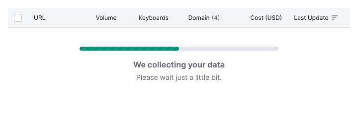
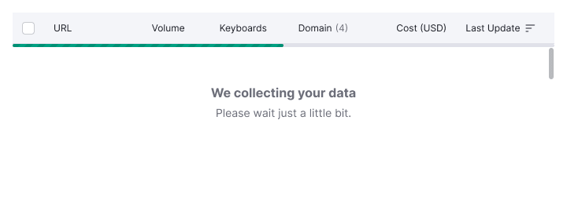
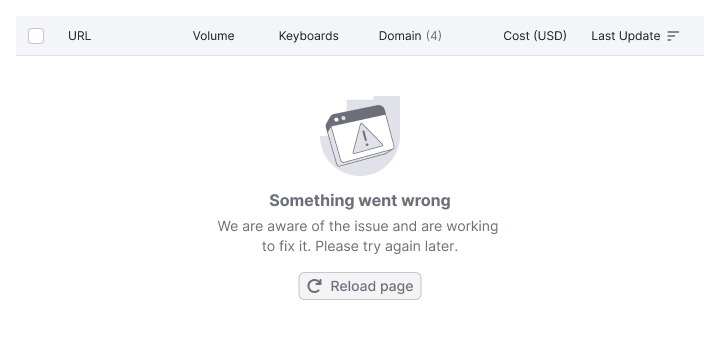
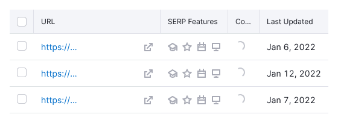

## Basic rules for table states

::: tip
Ensure that the message inside the table becomes `sticky` when scrolling and is centered relative to the parent table and the user's viewport. This ensures that the user always sees what is happening with the table without the need to scroll to the top.
:::

When a message with a loading or error state appears, it should have a `margin-top: 40px`. This prevents the message from "sticking" to the table header when the user changes the viewport size.

Table: Basic rules for table states

| Examples                                                        | First screen                     | Scrolling the page               |
| --------------------------------------------------------------- | -------------------------------- | -------------------------------- |
| With [ProgressBar](/components/progress-bar/progress-bar)       |    |    |
| With [SpinContainer](/components/spin-container/spin-container) |  |  |

::: tip
Avoid changing the table height when it's switched between states.
:::

## Initial loading

Display the structure of the page and data using the [Skeleton](/components/skeleton/skeleton) when loading data for the first time. Show the skeleton for the first three-five rows, not the entire table.

**Show skeleton while:**

- Initial page loading
- Initial data loading
- New data uploading

::: tip
Omit [Pagination](/components/pagination/pagination) when loading the table for the first time.
:::

## Long loading

If data gathering takes more than 1 minute, use the [ProgressBar](/components/progress-bar/progress-bar) to indicate that data is being collected. The progress bar should be sticky and centered relative to the scrolling screen.

When scrolling the table, fix the progress bar to the table header while keeping it centered relative to the user's viewport.

## Loading filtered or sorted data

Use [SpinContainer](/components/spin-container/spin-container) when filtering, sorting, or searching data. If data loading is fast, skip this state.

**Use it when:**

- Filtering vast data volumes in a table
- Sorting a large amount of data in a table
- Moving user to another page
- Performing other data operations that don’t require a long wait
- Searching in the table (if possible, display the search query)

The loading message should be sticky and centered relative to the scrolling screen.

## Empty table

The table can be empty due to deleted or unavailable data. Use the empty state when:

- The table is empty and needs data connection
- The user deleted all data from the table

Refer to [Empty page](/patterns/empty-page/empty-page) pattern for more information.

::: tip
Illustrations for these cases are usually unique, designed specifically for each case or product. All existing illustrations we already have in our library you can find in the [Illustration](/style/illustration/illustration) component.
:::

## No data

Show this message when:

- There is no data for some reason
- The data cannot be displayed for some reason

::: tip Useful links
- Live example of this state in [WidgetEmpty > NoData example](/components/widget-empty/widget-empty-code#nodata-state)
- [Full list of illustrations](/style/illustration/illustration)
:::

## Nothing found

Display this state when the user has been searching or filtering data, and nothing was found.

::: tip
In this state, save the active state of the sorted column.
:::

Include a control, such as a "Clear filters" button, to help the user correct the situation.

::: tip Useful links
- Live example of this state in [WidgetEmpty > Nothing found example](/components/widget-empty/widget-empty-code#nodata-state)
- [Full list of illustrations](/style/illustration/illustration)
:::

## Something went wrong

Show this state when there is an error in the product on the backend, preventing data display. Display it when:

- An error occurs during table loading
- An error occurs while the user is working with the table

Table: Examples of "Something went wrong" state

| Case                                       | Appearance example              |
| ------------------------------------------ | ------------------------------- |
| We are aware of the problem, and fixing it |      |
| We don't know about the problem yet        |  |

::: tip Useful links
- Live example of this state in [WidgetEmpty > Error example](/components/widget-empty/widget-empty-code#error-state)
- [Full list of illustrations](/style/illustration/illustration)
:::

## Message text

- Title: Indicate the essence of the current situation
- Description: Explain what the user needs to do to change the situation
- If possible, suggest an action (button or link) to help the user change the situation

Refer to [WidgetEmpty](/components/widget-empty/widget-empty) and [Global errors](/patterns/global-errors/global-errors) guides.

## Table header

Keep the header for all empty states of the table, including sorting icons.

## Table cell states

### No data in cell

- Show the n/a text in the secondary text color (`--text-secondary` token).
- Display a tooltip explaining that the data isn’t available and why.

### Data loading in cell

::: tip
Use [Skeleton](/components/skeleton/skeleton) when loading the table for the first time.
:::

When loading content in one or several cells, show the [Spin](/components/spin/spin) of XS size.

### Error in cell

Display a `Warning` icon with M size and use the `--icon-primary-warning` token for color. Always show a tooltip on hover explaining that something went wrong.

::: tip
Provide a control in the cell for reloading data if possible.
:::

### Cell is blocked

A cell may be blocked due to a limit or the need to take action to unlock the data.

- Use the `Lock` icon with M size and the `--icon-secondary-neutral` token for color.
- Always show a tooltip on hover explaining why the cell is blocked and, if possible, how to resolve it.

::: tip
For all main table styles and principles, refer to [Table](/table-group/data-table/data-table). Find svg illustrations for different states and their names in [WidgetEmpty](/components/widget-empty/widget-empty-code).
:::
