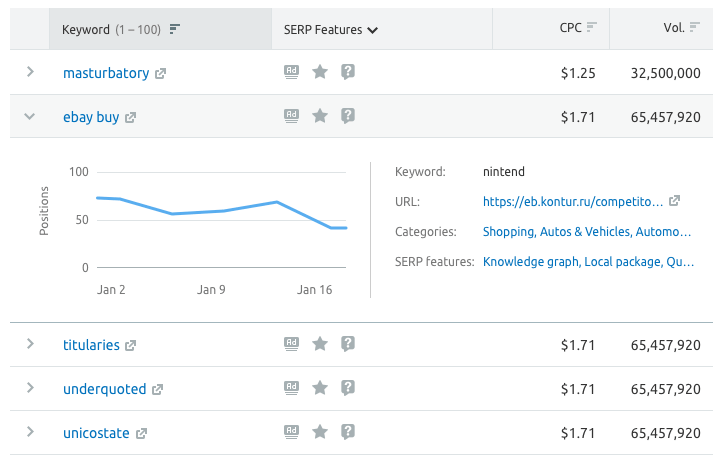
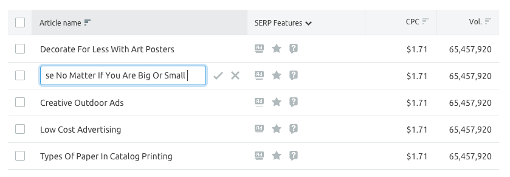
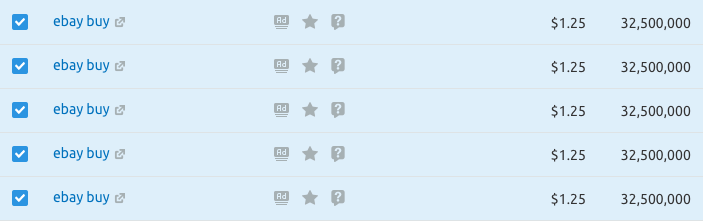

> 💡 For all the main table styles and rules, see [Table](/table-group/table/).

Here we describe all the elements and recommendations that are important when working with our tables.

> ...what exactly do users do with tables:
>
> 1. viewing data,
> 2. enter data,
> 3. search for data,
> 4. control data,
> 5. collect data.
>
> **Each item is a separate process that requires attention.**.
>
> _[Article by M. Grekov about UX tables that are used (in russian)](https://designpub.ru/ux-%D1%82%D0%B0%D0%B1%D0%BB%D0%B8%D1%86-%D1%81-%D0%BA%D0%BE%D1%82%D0%BE%D1%80%D1%8B%D0%BC%D0%B8-%D1%80%D0%B0%D0%B1%D0%BE%D1%82%D0%B0%D1%8E%D1%82-%D1%87%D0%B0%D1%81%D1%82%D1%8C-1-%D0%BF%D1%80%D0%BE%D1%81%D0%BC%D0%BE%D1%82%D1%80-%D0%B4%D0%B0%D0%BD%D0%BD%D1%8B%D1%85-5ea60df37f12)_

@## Sorting

- **If you can sort by column, it must have the `SortDesc` / `SortAsc` icon. By default, `SortDesc`.**
- If you can't sort data by column, but you need to show which column it is sorted by (this is usually necessary in secondary tables), then highlight the cell with the corresponding sorting icon in the active state.

### Click zone for sorting

If there is a simple text / icon inside the cell.

If there is a control inside the cell (for example, a select or checkbox).

### Rules for sorting

> 💡 If the data in the column should not be sorted, there should be no sorting icon.

- The sort icon should always be displayed on cells that can be sorted.
- The default sorting must be set for each column to be sorted. `SortDesc` is used by default (in descending order).
- If sorting on a column is inactive, the icon has an inactive state. **The inactive icon shows not the current state, but how the column will be sorted if sorting is activated.**
- If sorting on a column is active, the icon has the `active` (`$wall` color) state and shows the corresponding sorting direction.
- **When you switch sorting within a single column**, the icon changes its direction.
- **When you select a different column**, the icon on the selected column becomes active. Icons on other columns go to the inactive state and do not change direction.
- When you reload data in a table where data was sorted in one of the columns, the header of the sorted column remains highlighted.

> 💡 When you click on sorting in the header, the table should be reloaded and always return the user to the top of the first page.

### Sort direction

|                                                                                                                                                                                                                                  | Ascending (SortAsc)                  | Descending (SortDesc)               |
| -------------------------------------------------------------------------------------------------------------------------------------------------------------------------------------------------------------------------------- | ------------------------------------ | ----------------------------------- |
| **Icon**                                                                                                                                                                                                                         |           |        |
| **Numbers**. Values `-`, `n/a`, `0`, etc. are smaller values.                                                                                                                                                                    | From smaller to larger – 0, 1, 2 → 9 | From larger to smaller– 9, 8, 7 → 0 |
| **Texts**. If there are several languages in the table, it is recommended to divide them into groups and sort them according to the priority and user needs (it may also depend on the target audience, product specifics, etc.) | A to Z                               | Z to A                              |
| **Statuses**. At the discretion of the priority, SOFTWARE, or utility for users. We recommend using gradations of the form: good / bad, necessary / not necessary, fresh / not fresh, higher / lower, etc.                       | At the discretion of UX and PO       | At the discretion of UX and PO      |
| **Dates**                                                                                                                                                                                                                        | From a newer date to an older one    | From an older date to a newer one   |

@## Changing the size of columns

When you hover over a border in the header, the cursor changes to `col-resize`, and the border color changes to `var(--stone)`.

The area that you can grab and change the size of the column includes not only the 1px border of the cell, but also 5px to the left of the border. An example can be found in [Table](/table-group/table/table-code) 😎

> 💡 Changing the size of one column should not change the size of other columns.

@## Table row with accordion

A table row can be expanded by accordion type. Within such a row, there can be almost anything (within reasonable limits). As a rule, this is more detailed information on line data - graph, text, links, etc.

> 💡 If you have too much data inside the drop-down row, you may need to think about a separate page for them.

- The accordion row must have the `ChevronRight` icon in the leftmost column. It indicates that this line can be expanded. `ChevronRightXS` and color `$stone`.
- The line that opened additional data from must remain highlighted. The `active` state of a row has the same styles as the `hover` row.
- When the row is open, the `ChevronRight` icon should change to `ChevronDown` of the same size and color.
- The internal line with detailed information has a lower border – `border-bottom: 1px solid $stone;`. It is necessary so that when several rows are opened, they do not merge with each other, and for other complex cases of using the accordion inside the table.

### Opening an accordion from a table cell

- If a value in a table cell should reveal the table, make sure to put the `ChevronRight` icon on it.
- We place the icon to the left of the value, because it indicates that data on the accordion type will be opened here.

In the `active` state, the cell must be additionally highlighted with the color `#EDEFEF` (or `var (--stone)` with 20% transparency). And the `ChevronRight` icon rotates `90deg`.

@## Actions on rows

### Checkbox

If you need to select several rows in the table at the same time and perform actions on them, there should be a [Checkbox](/components/checkbox/) in the left part of the row.

The [Checkbox](/components/checkbox/) must have the entire cell in the table as a click zone.

### Rows highlighting and pagination

If the table has pagination and row selection using [Checkbox](/components/checkbox/), it is important to follow the following logic. When switching between pages, checkboxes should not be reset. _For example, on page 1, the user selected 3 lines, went to page 2, and selected 5 lines there. When you return to page 1, the selected rows should be saved. That is, on the 1st page there will be 3 lines, on the 2nd-5 lines._

@## The status and actions row

> 💡 We are testing this solution. We may update this pattern soon. The line must have `transition: 400ms` specified for appearing and hiding.

We recommend using the status bar when the table has multi-row selection and pagination at the same time. This is necessary so that the user understands that the table has selected rows when paginating the table. You can also show popular actions that can be performed on rows in the status bar.

- When scrolling a table, this row should be attached to the table header. In this case, it does not have a shadow, as well as a battered hat.

| Appearance                                         | Styles                                                                                                  |
| -------------------------------------------------- | ------------------------------------------------------------------------------------------------------- |
|  | `background-color: #FAFBFB;` (or `$stone` with transparency .05 ), `border-bottom: 1px solid $mercury;` |

### The actions and rules of use

- `Deselect all` deselects all selected rows (on any page).
- `Select all` is not an obvious action, so we recommend avoiding this and using the following instead.
- `Select all on page (N)` selects all rows on the current page and the row counter on the page (this action can be replaced with a king checkbox).
- `Select all on table (N)` selects all rows in the table and the row counter in the entire table.

Use no more than 3-5 actions, which are the most popular among actions on rows.

@## Editing / Adding content in a row

- When you hover over the line, you can see the edit icon.

It is always nailed to the left edge of the cell and has a `margin-left: 12px`, so that it is easier to get into it with the cursor and the content does not stick to the tiles.

- By clicking on the edit icon in place of the text, we show an input of size L.
  - The edit icon changes to the `CloseS` icon. By clicking on it, you can exit the editing mode.
  - Save the entered value by clicking on the `CheckS` icon.
  - Close input for input-click outside the input, the `ESC` key, click on the `CloseS` icon.

If there are any other clickable icons in the line, then the edit icon should always be closer to the text, that is, to the right relative to other icons.

@## Highlighting found content in the table

When searching a table, sometimes you need to highlight the found match in the data. In this case, we highlight what we find with the color `var(--light-orange)` with a transparency of 40% (the absolute color is `#FDE0BD`).

@## Main checkbox 👑

To highlight all rows, the table header must have the main [Checkbox](/components/checkbox/). When you click on the checkbox in the header, all the lines on **the first page are highlighted**.

### Keyboard shortcuts for working with rows

With `Shift` pressed, you can select multiple lines at once.

 

@## Clickable value in a cell

**The value in the cell can lead to:**

- in the internal report-use the link / button, depending on the context;
- to another site-use the gray `LinkExternalXS` icon, usually with a caption.

@## Long text in a cell

There are three solutions for displaying long text in a cell. The choice of one of them depends on the context and usage situation.

### The long text at the END is wrapped in an ellipsis (...)

- This solution is suitable for most of our tables, since data in them usually occupies a single row.
- The full text is shown in the tooltip by hovering over the text.

### The long text in the MIDDLE is wrapped with an ellipsis (...)

- This option ~hiding information~ is suitable for URLs that differ in the last characters and therefore it is more logical to wrap THEM with an ellipsis in the middle.
- The full text is also shown in the tooltip by hovering over the text.

### Long text is moved to the next line

This option is suitable for cases when the cell content can be more than one row in height. For example, if there is a `row-span`, when there are substrings in one row.

> 💡 For all the main table styles and rules, see [Table](/table-group/table/).
