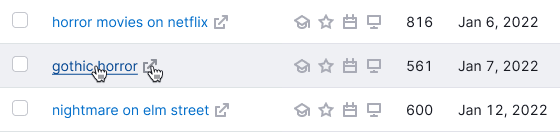
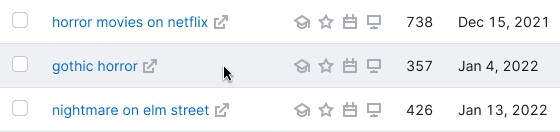
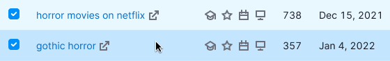
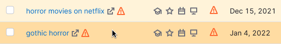
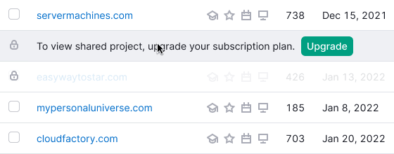
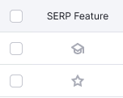
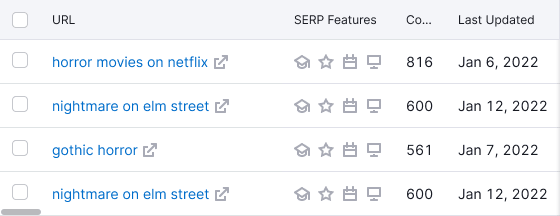

@## Description

**Table** is a complex component for providing a complex data list.

@## Appearance

### Types

There are two types of tables in our interface – [primary](../table-primary/) and [secondary](../table-secondary/). Colors of both are based on `gray` palette.

### Common styles for the table content

| Content                                | Styles                                     |
| -------------------------------------- | ------------------------------------------ |
| Text in the header                     | `font-size: 12px; color: var(--gray-800);` |
| The text in the row                    | `font-size: 14px; color: var(--gray-800);` |
| Secondary text                         | `color: var(--gray-500);`                  |
| Stand alone icon                       | `icon-size: M; color: var(--gray-300);`    |
| The icon next to the text              | `icon-size: M; color: var(--gray-300);`    |
| Checkbox in the header and in the cell | [Checkbox](/components/checkbox/), M size  |

@## Sorting

> 💡 For detailed information about sorting columns in the table, see [Working with table](/table-group/table-controls/).

@## Tooltip

The column header should not contain the `Info` icon. Show additional information about the column in the tooltip by hovering over the column title.

### Conditions for the tooltip appearance

If the text is too long, and collapsed into an ellipsis.

If the column has additional (explanatory) information.

@## Table row states

> 💡 **Hover on a row is required for all types of tables.**

Hover is needed to "highlight" information in vast volumes of data, with which you would like to perform some action (read, delete, open, etc.).

- The row changes its state to `hover` when you hover over any area of the row.
- Thus, if the pointer is positioned over an item, hover remains on the row, and also the hover of the element on which the cursor is pointed is applied.

### Hover styles for different cells

The table colors are based on `gray` palette.

If the entire row is in the `disabled` state, it should not have the `hover` state.

| State                    | Appearance                                   | Styles                                                                                                                                                                          |
| ------------------------ | -------------------------------------------- | ------------------------------------------------------------------------------------------------------------------------------------------------------------------------------- |
| Default, hover           |    | `background-color: var(--white); border-bottom: 1px solid var(--gray-100);`. When you `hover` on, background color changes to `background: color-mod(var(--gray-100) a(50%));`. |
| Unread, unread hover     |      | `background-color: var(--gray-50);`. The `hover` state is the same as `default`.                                                                                                |
| Selected, selected hover |  | `background-color: var(--blue-50);`. When you `hover` on, the absolute color `background-color: var(--blue-100);`.                                                              |
| New, new hover           |            | `background-color: var(--green-50);`. When you `hover` on, the absolute color `background-color: background-color: var(--green-100);`.                                          |
| Error, error hover       |      | `background-color: var(--red-50);`. When you `hover` on, the absolute color `background-color: var(--red-100);`.                                                                |
| Warning, warning hover   |    | `background-color: var(--orange-50);`. When you `hover` on, the absolute color `background-color: var(--orange-100);`.                                                          |
| Current, current hover   |    | The row is tagged with tag `You`. The `hover` state is the same as the `default` state.                                                                                         |
| Loading                  |    | Opacity for components inside a row .3, spin size XS.                                                                                                                           |
| Limit, limit hover       |                    | Mask for limit rows – `background-color: color-mod(var(--white) a(85%));`. The `hover` state is the same as the `default` state.                                                |

### Hover for the row-span and col-span

- When you `hover` over the parent column, all child rows are highlighted.
- When you `hover` over the child row, the parent column is highlighted.

### Cells coloring

If the cell was colored, it remains colored when you hover over it. The user should not lose information about the color of the cell when hovering over a row.

@## Text alignment inside a cell

The text inside the cells in the rows and in the header is aligned according to the following rules.

### Left-aligned

- Text
- The link (URL)
- Keyword
- Code/Number/Hash (text consisting of numbers, symbols, and letters)
- Abbreviation
- Date
- Control element
- Button
- Select
- Tag/Badge
- Icons (if several, SERP features)

### Center-aligned

- Number (if needed to compare horizontally)
- Icon (if single)
- Particular character
- Image

### Right-aligned

- Number (if needed to compare vertically)
- Fractional number
- Tag/badge (in cases where the entire row is marked)

@## Horizontal scroll

Horizontal scroll in our tables is needed in order to indicate the presence of hidden data behind the viewport in a large-width table.

In this case, it appears when:

- all table columns do not fit the viewport;
- when you add a new column to a table from the settings manager, the table data will no longer fit in the viewport;
- the screen, on which the user views the report is smaller than 992px.

> It is not a bad practice, when a large table has a horizontal scroll — this is a familiar experience for most users (see Excel). It is wrong, when adding columns to a table makes them incredibly narrow, but without the need for scrolling.
>
> Russian article — [UX tables to work with](https://designpub.ru/ux-%D1%82%D0%B0%D0%B1%D0%BB%D0%B8%D1%86-%D1%81-%D0%BA%D0%BE%D1%82%D0%BE%D1%80%D1%8B%D0%BC%D0%B8-%D1%80%D0%B0%D0%B1%D0%BE%D1%82%D0%B0%D1%8E%D1%82-%D1%87%D0%B0%D1%81%D1%82%D1%8C-1-%D0%BF%D1%80%D0%BE%D1%81%D0%BC%D0%BE%D1%82%D1%80-%D0%B4%D0%B0%D0%BD%D0%BD%D1%8B%D1%85-5ea60df37f12)

@## Pagination

See the detailed recommendations in the [Table controls](/table-group/table-controls/#acbb81) guide.

@## Table states

About table states you can read in a particular notable document [Table states](/table-group/table-states/) ✨

@page table-a11y
@page table-code
