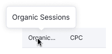
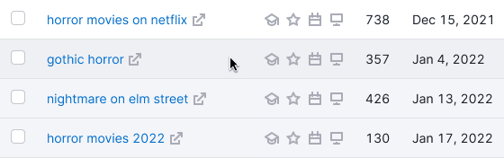
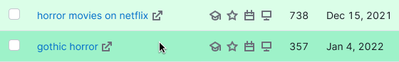
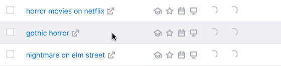
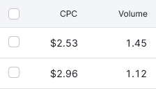

@## Description

**Table** is a complex component for providing a complex data list.

@## Appearance

### Types

There are two types of tables in our interface – [primary](/table-group/table-primary/) and [secondary](/table-group/table-secondary/). Colors of both are based on `$stone` and `$mercury` with different transparency. These colors with transparency are converted to absolute.

### Common styles for the table content

| Content                                | Styles                                       |
| -------------------------------------- | -------------------------------------------- |
| Text in the header                     | `font-size: 12px; color: $gray20;`           |
| The text in the row                    | `font-size: 14px; color: $gray20;`           |
| Secondary text                         | `color: $gray60;`                            |
| Stand alone icon                       | `icon-size: S; color: stone;`                |
| The icon next to the text              | `icon-size: XS; color: stone;`               |
| Select in the header                   | [tertiary select, size M](components/select) |
| Select in the cell                     | [tertiary select, size L](components/select) |
| Checkbox in the header and in the cell | size L                                       |

@## Sorting

> 💡 For detailed information about sorting columns in the table, see [Working with table](/table-group/table-working/).

@## Tooltip

The column header should not contain the `Info` icon. We always show additional information about the column in the tooltip by hovering over the column title.

### Conditions for the tooltip appearance

If the text is too long, and clipped with an ellipsis.

If the column has additional (explanatory) information.

@## Table row states

> 💡 **Hover on a row is required for all types of tables.**

Hover is needed to "highlight" information in vast volumes of data, over which you would like to perform some action (read, delete, open, etc.).

- The row changes its state to `hover` when you hover over any area of the row.
- Thus, if the pointer is positioned over an item, hover remains on the row, and also the hover of the element on which the cursor is pointed is applied.

### Hover styles for different cells

The table colors are based on `$stone` and `$mercury`. Rules for states are specified in [Variables](/style/variables/) for objects with a transparent background color.

If the entire row is in the `disabled` state, it should not have the `hover` state.

> Note that in the component, all the colors of different themes for cells are set as absolute colors (layouts may contain transparent colors — don't worry, since the colors are the same).

| State                    | Appearance                                                                | Styles                                                                                                                   |
| ------------------------ | ------------------------------------------------------------------------- | ------------------------------------------------------------------------------------------------------------------------ |
| Default, hover           |                                 | `border-bottom: 1px solid $mercury;`. When you `hover` on, the absolute color `background-color: #f6f7f7;`.              |
| Unread, unread hover     |                                   | `background-color: #F2F3F4;`. The `hover` state is the same as `default`.                                                |
| Selected, selected hover |                               | `background-color: #D5EAF9;`. When you `hover` on, the absolute color `background-color: #CAE4F7;`.                      |
| New, new hover           |                                         | `background-color: #E5F3E1;`. When you `hover` on, the absolute color `background-color: #DCEFD6;`.                      |
| Error, error hover       |                                   | `background-color: #FDEAEA;`. When you `hover` on, the absolute color `background-color: #FDE0E0;`.                      |
| Warning, warning hover   |                                 | `background-color: #FFECD9);`. When you `hover` on, the absolute color `background-color: #FFE5CC;`.                     |
| Current, current hover   |   | The row is tagged with `You`. The `hover` state is the same as the `default` state.                                      |
| Loading                  |   | Opacity for components inside a row .3, spin size S.                                                                     |
| Limit, limit hover       |                                                 | Mask for limit rows – `background-color: rgba(255,255,255,0.85);`. The `hover` state is the same as the `default` state. |

### Hover for the row-span and col-span

- When you `hover` over the parent column, all child rows are highlighted.
- When you `hover` over the child row, the parent column is highlighted.

### Cells coloring

If necessary, you can change the cell color using our [base color palette](/style/color/). In this case, use a color with a transparency of 5 to 15%.

Rules for the hover state of elements with transparency, see in [Variables](/style/variables/). If the cell was colored, it remains colored when you hover over it. The user should not lose information about the color of the cell when hovering over a row.

@## Text alignment inside a cell

The text inside the cells in the rows and in the header is aligned according to the following rules.

### Left-aligned

- Text
- The link (URL)
- Keyword
- Code/Number/Hash (text consisting of numbers, symbols, and letters)
- Abbreviation
- Date
- Control element
- Button
- Select
- Tag/Badge
- Icons (if several, SERP features)

### Center-aligned

- Number (if needed to compare horizontally)
- Icon (if single)
- Particular character
- Image

### Right-aligned

- Number (if needed to compare vertically)
- Fractional number
- Tag/badge (in cases where the entire row is marked)

@## Horizontal scroll

Horizontal scroll in our tables is needed in order to indicate the presence of hidden data behind the viewport in a large-width table.

In this case, it appears when:

- all table columns do not fit the viewport;
- when you add a new column to a table from the settings manager, the table data will no longer fit in the viewport;
- the screen, on which the user views the report is smaller than 992px.

> It is not a bad practice, when a large table has a horizontal scroll — this is a familiar experience for most users (see Excel). It is wrong, when adding columns to a table makes them incredibly narrow, but without the need for scrolling.
>
> Russian article — [UX tables to work with](https://designpub.ru/ux-%D1%82%D0%B0%D0%B1%D0%BB%D0%B8%D1%86-%D1%81-%D0%BA%D0%BE%D1%82%D0%BE%D1%80%D1%8B%D0%BC%D0%B8-%D1%80%D0%B0%D0%B1%D0%BE%D1%82%D0%B0%D1%8E%D1%82-%D1%87%D0%B0%D1%81%D1%82%D1%8C-1-%D0%BF%D1%80%D0%BE%D1%81%D0%BC%D0%BE%D1%82%D1%80-%D0%B4%D0%B0%D0%BD%D0%BD%D1%8B%D1%85-5ea60df37f12)

@## Pagination

If the table has more than one page, it must have [Pagination](/components/pagination/). Spacing between the table and the page numbers is 16px.

If the table contains a small amount of data, we show the pagination status for one page.

> 💡 When you navigate through the pages in the table using pagination, **you should be able to scroll the table to the first row**. Otherwise, the user have to scroll on their own, which is inconvenient.
>
> Applying filters to a table always takes the user to the first page of the table.

@## Table states

About table states you can read in a particular notable document [Table states](/table-group/table-states/) ✨

@page table-a11y
@page table-code
