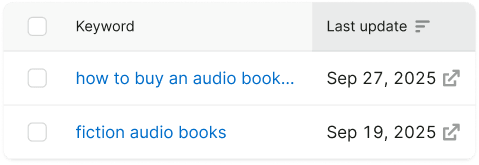
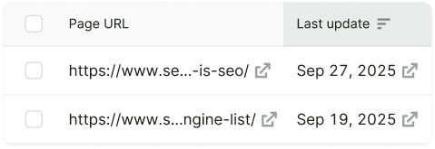
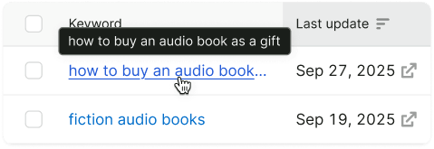
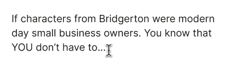
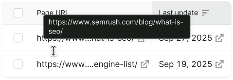
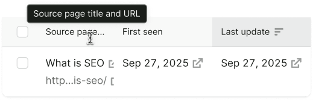

## Description

**Ellipsis** is a tool that allows to truncate a line or a paragraph of text. For a single line, a [hint](../hint/hint) with the full text appears on hover.

**Use ellipsis in the following situations:**

- You need to keep the text from wrapping to a new line.
- You need to truncate the text at a certain line.
- The text is user-entered or dynamic and it's difficult to know how much space to allocate, for example, for [InlineInput](/components/inline-input/inline-input) width.

**Avoid the following:**

- Truncating an error, a validation message, or any other type of notification.
- Hiding content when there is enough space for it.
- Using ellipsis as a punctuation mark at the end of a sentence.

## Appearance

Ellipsis can be placed in the end or in the middle of the text.

Table: Ellipsis placement

| Ellipsis placement |  Description                                                                                                                                                                                                                                                           |
| ------------------ | --------------------------------------------------------------------------------------------------------------------------------------------------------------------------------------------------------------------------------------------------------------------- |
| `end`              | Truncates the end of the text string. It's the most common case. Use an ellipsis at the end of a text string or paragraph to indicate that there is more content, or to shorten a long text string. 

 |
| `middle`           | Truncates the middle of the text string. Use when several text strings have different beginnings and/or endings but the exact same middle characters. Can also be used to shorten a phrase or text string when the end of a string can't be truncated by an ellipsis. 

 |

Ellipsis can also be placed after multiple lines of text to truncate paragraphs.

## Hint

When truncating a single line of text, a [hint](../hint/hint) with the full text appears on hover on the truncated element.

Hint is disabled when truncating paragraphs because the full text is usually too long in such cases.

## Usage in UX/UI

### Long URLs

Long URLs are common in tables and other widgets. Read more about long links in [Table controls](/table-group/table-controls/table-controls#long-links-and-text).

### Table head

To fit more data in the limited space you can truncate table column names. In this case always show a hint on hover to show the entire column name.

### Breadcrumbs

When you need to truncate Breadcrumbs items, crop them with an ellipsis at the end of each string.

### Card titles

To show more data in a limited space you can truncate the [Card](/components/card/card) title. In this case always show the full text on hover.

