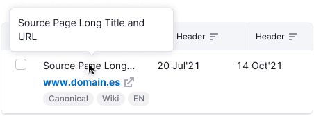

The useEllipsis hook helps determine whether the content of a referenced DOM element fits within its container.
If the content overflows, the hook can automatically apply a CSS class or inline style (e.g., text-overflow: ellipsis) to visually truncate the text.
This is useful for managing long strings in limited-width containers without manual checks.
The hook listens for changes in size and updates dynamically.

Out of the box, you can use `Text` component with ellipsis settings.

::: react-view

<script lang="tsx">
import React from 'react';
import { Text } from '@semcore/typography';
import PlaygroundGeneration from '@components/PlaygroundGeneration';

const App = PlaygroundGeneration((preview) => {
  const { radio, text } = preview('Dropdown');

  const trim = radio({
    key: 'trim',
    defaultValue: 'end',
    label: 'Trimming type',
    options: ['end', 'middle'],
  });

  const maxLine = text({
    key: 'maxLine',
    defaultValue: 1,
    label: 'Number of lines',
    disabled: trim === 'middle',
  });

  const ellipsisProps = {
    trim,
    maxLine,
  };

  return (
    <Text w={200} size={200} display="inline-block" ellipsis={ellipsisProps}>
      Intergalactic is a constantly developing system of UI components, guidelines and UX patterns.
    </Text>
  );
});
</script>

:::

**Example**: Hot to use an ellipsis hook on a custom element

```javascript
const ref = React.useRef();
const showHint = useEllipsis(ref, { trim: 'middle', maxLine: 1 }); // returns a boolean, that indicates whether the text is cropped

const text = 'Some long text to test ellipsis';

return (
    <>
        <Box ref={ref} w={'100px'}>{text}</Box>
        {showHint && <Hint triggerRef={ref}>{text}</Hint> }
    </>
);

```


## Description

**Ellipsis** is a tool that allows to truncate a single line of text or a paragraph, showing a [hint](../hint/hint) with the full text on hover.

**Use ellipsis in the following situations:**

- You need to keep the text from wrapping to a new line.
- You need to truncate the text at a certain line.
- The text is user-entered or dynamic and it's difficult to know how much space to allocate, for example, for [InlineInput](/components/inline-input/inline-input) width.

**Avoid the following:**

- Truncating an error, a validation message, or any other type of notification.
- Hiding content when there is enough space for it.
- Using ellipsis as a punctuation mark at the end of a sentence.

## Appearance

Ellipsis can be placed in the end or in the middle of the text.

Table: Ellipsis placement

| Ellipsis placement |  Description                                                                                                                                                                                                                                                           |
| ------------------ | --------------------------------------------------------------------------------------------------------------------------------------------------------------------------------------------------------------------------------------------------------------------- |
| `end`              | Truncates the end of the text string. It's the most common case. Use an ellipsis at the end of a text string or paragraph to indicate that there is more content, or to shorten a long text string. <p></p> |
| `middle`           | Truncates the middle of the text string. Use when several text strings have different beginnings and/or endings but the exact same middle characters. Can also be used to shorten a phrase or text string when the end of a string can't be truncated by an ellipsis. <p></p> |

Ellipsis can also be placed after multiple lines of text to truncate paragraphs.


## Hint

By default, ellipsis displays a [hint](../hint/hint) with the full text on hover on the truncated element.
<!-- unless you're truncating the end of a paragraph. -->



## Usage in UX/UI

### Long URLs

Usually, long URLs are most common for tables and other widgets. Read the detailed information about long links in [Table controls](/table-group/table-controls/table-controls#long-links-and-text).


### Table head

To show more data in the limited space you can truncate the text in the table head. In this case always show a tooltip on hover to show the entire text string, or phrase.


### Breadcrumbs

When you need to truncate links in Breadcrumbs, collapse them into ellipsis at the end of each string.


### Card titles

To show more data in a limited space you can truncate the [Card](/components/card/card) title. In this case always show a tooltip on hover to show the entire title.


### Paragraphs

To show more data in a limited space you can truncate paragraphs at the end. In this case, a tooltip with the full paragraph on hover is unnecessary.


