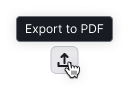
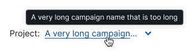
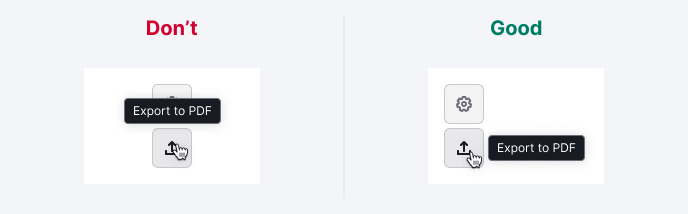
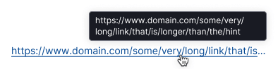

<Playground for='Hint' />

## Description

**Hint** is a more compact counterpart of [Tooltip](../../components/tooltip/tooltip) that displays element's name or text when it's hidden or cropped.

Use hint in the following cases:

1. With buttons, links, or other controls that don't have visible text.

2. With truncated text.

## Appearance

<!-- vale DevDocs.Inclusive = NO -->
By default, hint appears above the trigger, but you can choose other placement options. Try placing the hint so that it doesn't cover other UI elements.

<!-- vale DevDocs.Inclusive = YES -->

## Interaction

Hint appears on:

- mouse hover
- keyboard focus

Hint disappears when:

- mouse leaves the trigger
- trigger is no longer focused
- user presses `Esc`

When the trigger is large, hint automatically appears closer to the cursor position.

