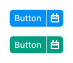
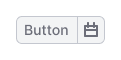

@## Description

**NeighborLocation** is a component for grouping components. It indicates where the component is in relation to its
neighbors.

> 🙃 This violates many principles of building components, but the beautiful API and the necessary functionality
> outweighed the valuations.

For example, you can group together:

- [Button](/components/button/)
- [Input](/components/input/)
- [Select](/components/select)

You may also need a `flex-box` to align the components. For more information, see
the [Flex-box and indent system](/layout/box-system/).

@## Grouped buttons

Buttons can be grouped.

If you group primary buttons, the right one will have a 1px white border.

If you group secondary buttons, the left one will hide it's right border.

> Do not group tertiary buttons this way.

@example neighbor-location

@## Grouped input and button

@example neighbor-location-input

@## Grouped input and select

@example neighbor-location-input-select

@## Grouped input, select, and button

You can group input, select, and button.

@example neighbor-location-combo

@## Adding a wrapper

By default, `<NeighborLocation/>` does not create an HTML wrapper, but you can pass the component tag you want.

> For the correct type mapping in the TC, you must also pass the interface.
> `<NeighborLocation<IFlexProps> tag={Flex} w={200}/>`

@example neighbor-location-with-tag

@## Using a custom component

You can apply <NeighborLocation/> to your components. You need to add a static field `NEIGHBOR_LOCATION_AUTO_DETECT` and
then the `neighborLocation` prop will come to your component.

@example neighbor-location-with-custom

@page neighbor-location-api
@page neighbor-location-changelog
