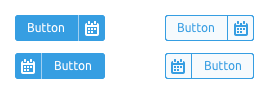
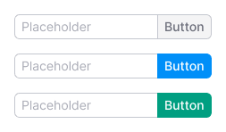
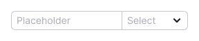
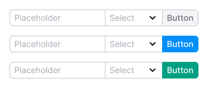

@## Description

**NeighborLocation** is a common component for grouping components. It indicates where the component is in relation to its neighbors.

> 🙃 This violates many principles of building components, but the beautiful API and the necessary functionality outweighed the valuations.

For example, we can group together:

- [Button](/components/button/)
- [Input](/components/input/)
- [Select](/components/select)

You may also need a `flex-box` to align the components. For more information, see the [Spacing system](/layout/box-system/).

@## Grouping buttons

The buttons can be adhered to each other. In this case, a 1px separator appears between them. The color of the separator matches the color of the button border if secondary buttons are adhered. If primary buttons are adhered together, the separator between them is white.

You can "adhere" a button with a text and a button with an icon only for the `primary` and `secondary` types.

@example neighbor-location

@## Grouping the input and button

You can "adhere" the input field with a button.

@example neighbor-location-input

@## Adhering the input and select

You can "adhere" the input field with a selector.

@example neighbor-location-input-select

@## Grouping the input, select, and button

You can also make a combo — "adhere" the entire input field, selector, and button. In such cases, use the primary button.

@## Adding a wrapper

By default, a `<NeighborLocation/>` does not create an HTML wrapper, but you can pass the component tag you want to it.

> For the correct type mapping in the TC, you must also pass the interface.
> `<NeighborLocation<IFlexProps> tag={Flex} w={200}/>`

@example neighbor-location-with-tag

@page neighbor-location-api
@page neighbor-location-changelog
