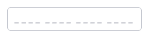
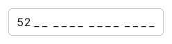
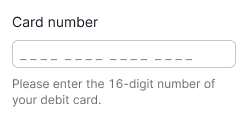
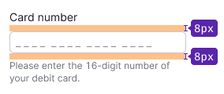
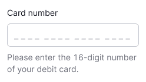
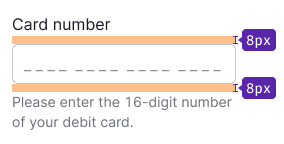
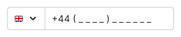
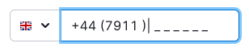
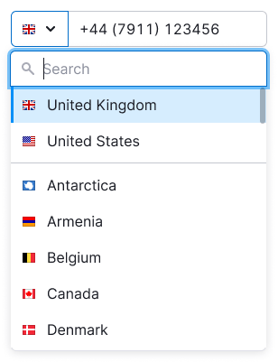

@import playground

## Description

**InputMask** is a wrapper that enables you to define the format for an input value. It provides users with guidance on the expected number and format of the data they need to enter.

::: tip
Note that InputMask shouldn't be used as a placeholder for the input field.
:::

The mask helps users prevent errors by ensuring they enter the correct number of characters and automatically formats the input value.

**Consider using InputMask in the following situations:**

- When the format for the data is known.
- When the user needs to enter a specific (usually lengthy) number of characters.

However, if you don't have precise information about the format of the data, it isn’t recommended to use InputMask.

## Appearance

The character `_` is used as a space holder for each character in the mask.

It is important to include a placeholder in the input field with the same format as the mask. The placeholder helps users navigate the form and understand which inputs are not filled in yet.

Find an example of using a mask in an input field for entering a phone number in the [Example tab](/components/input-phone/input-phone-code).

Table: InputMask's placeholder and mask appearance

|             | Appearance examples      | Tokens                                                      |
| ----------- | ------------------------ | ----------------------------------------------------------- |
| Placeholder |  | Placeholder use `--text-placeholder` as color. |
| Mask        |         | Mask use `--text-primary` as color.            |

## Hint instructions

We suggest including clear text instructions for inputs that have specific data format requirements.

Table: InputMask's hint text sizes

| Size (height in px) | Hint text size | Appearance example                  | Margins                                   |
| ------------------- | ------------------- | ----------------------------------- | ----------------------------------------- |
| M (28px)            | 12px (use `--fs-100`, `--lh-100` tokens) |  |  |
| L (40px)            | 14px (use `--fs-200`, `--lh-200` tokens) |  |  |

## Interaction

You have the ability to validate the characters that the user enters. If the user inputs an invalid character, such as `/`, the InputMask will remove it automatically.

Find an example of the mask behavior in the in an input field for entering a phone number in the [Example tab](/components/input-phone/input-phone-code).

Table: InputMask states

| Placeholder        | Focus with mask        | Filled input                                    |
| ------------------ | ---------------------- | ----------------------------------------------- |
|  |  | |

