::: react-view

:::

## Description

**Pagination** is a component that provides a set of controls to navigate through long lists of data.

Using pagination is highly recommended for tables and long lists of data that users prefer to browse page by page.

## Component composition

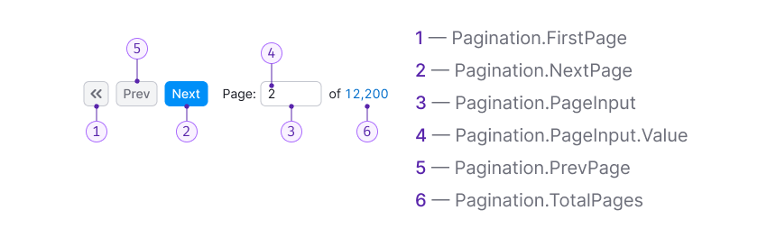

Component consists of the following:

1. `Pagination.FirstPage`
2. `Pagination.NextPage`
3. `Pagination.PageInput`
4. `Pagination.PageInput.Value`
5. `Pagination.PrevPage`
6. `Pagination.TotalPages`

## Margins

- The margins between buttons in the component are always 8px.
- The margins between different controls are 16px, such as between the buttons and the input for the - current page, and between the input for the current page and the select.

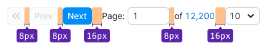

The margin from the table to the pagination is consistently 16px.

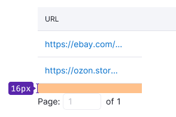

## Number of the rows

We provide some recommendations for the table size:

- Use a minimum of two user screens (± 2000 px) for the table.
- Display a maximum of 100 lines (if the lines occupy two lines, then 50 lines, etc.).

## Interaction

- The table should scroll to the beginning when the user moves between pages.
- After sorting and filtering, the pagination always returns the user to the first page.

| Appearance example                | Action          |
| --------------------------------- | --------------- |
| 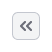  | Opens the first page                                                                                                                              |
| 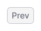 | Opens the previous page                                                                                                                           |
| 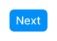     | Opens the next page                                                                                                                               |
| 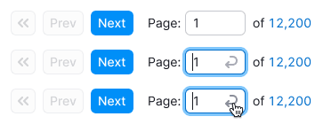              | When the input is in focus, a clickable `Return` icon with M size appears. By clicking it or pressing `Enter`, the user moves to the entered page. |

The current page should always be displayed in the input:

- When the input is unfocused, show the current page, even if the user has changed this value but hasn’t pressed `Enter` or clicked the icon inside the input.
- If the input is empty (for example, the user cleared it) or "0" is entered, then the user will move to the first page by clicking the icon inside the input or pressing `Enter`.
- This input restricts the entry of any symbols except numerical characters.

The link at the end of the pagination shows the total number of pages. The user moves to the last page by clicking it.

## States and cases

### User is on the first page

In this case, the "First page" button and the "Previous" button are `disabled`.

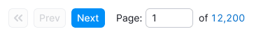

### User is on the last page

The "Next page" button becomes `disabled`, and the link to the last page appears as plain text.

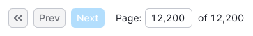

### User enters a value that exceeds the number of pages

In this case, there should be no error shown; instead, the user should be moved to the last page.

### One page only

Use this state only when there is some data, and there might be more data.

::: tip
If there is no data or the filter is applied, pagination shouldn't be displayed. Instead, the table should contain a message indicating that there is no data.
:::

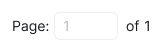

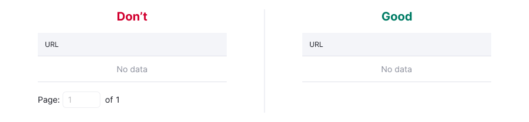

### Page loading

During loading, don’t display pagination.

## Additional states

### Select for choosing the number of rows

After the user changes the value in the select, the page should be refreshed, and the value of the table rows from the select should be applied.

Use only these values for the select: 10, 20, 50, 100.

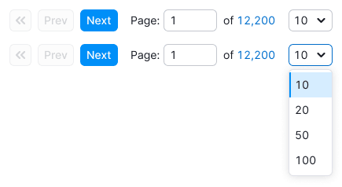

### Impossible to calculate the exact number of pages

In this case, add the `tilde (≈)` to the number of pages and change the link displaying the number of all pages to plain text.

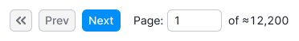

