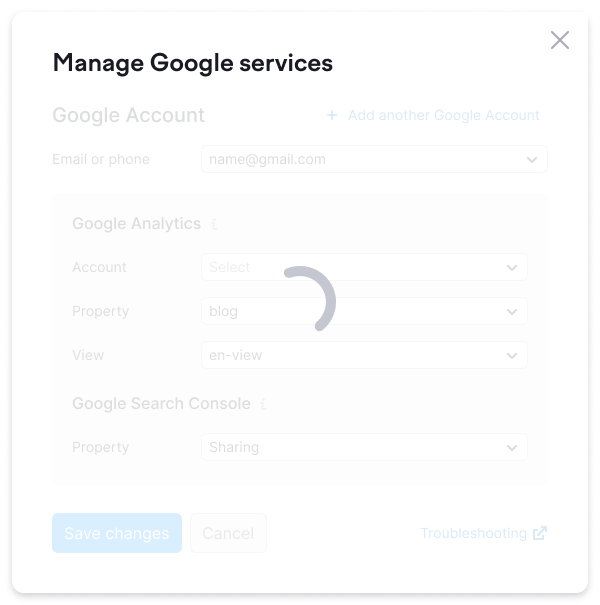

::: react-view

:::

## Description

**SpinContainer** is a component designed to display the [Spin](/components/spin/spin) around a component, widget, or page.

## Appearance

- The [Spin](/components/spin/spin) is consistently positioned in the center of the SpinContainer.
- To create an overlay under the SpinContainer, use the `--overlay-limitation-secondary token`.

