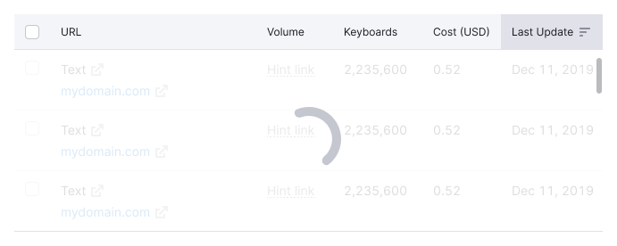

::: warning
:rotating_light: The library `@semcore/sticky` has been deprecated. Please use [`@semcore/flex-box`](/layout/box-system/) instead.
:::

## Description

**Sticky** is a component that allows you to fix a block to its parent when scrolling.

The block can either be centered in relation to the height and width of the parent block or fixed with a certain margin to the top, bottom, left, and right sides of the parent block.

::: tip
Pinned messages enable users to retain important information about loading, data collection, viewing limitations, and errors when scrolling through a page.
:::

::: sandbox

<script lang="tsx">
import React from 'react';
import styled from 'styled-components';
import { Box } from '@semcore/ui/flex-box';
import Checkbox from '@semcore/ui/checkbox';
import Link from '@semcore/ui/link';
import Table from '@semcore/ui/table';
import { Text } from '@semcore/ui/typography';
import Button from '@semcore/ui/button';
import Spin from '@semcore/ui/spin';
import ScrollArea from '@semcore/ui/scroll-area';

function shuffle(a) {
  for (let i = a.length - 1; i > 0; i--) {
    const j = Math.floor(Math.random() * (i + 1));
    [a[i], a[j]] = [a[j], a[i]];
  }
  return a;
}

let data = [
  {
    keyword: 'ebay buy',
    kd: '77.8',
    cpc: '$1.25',
    vol: '32,500,000',
  },
  {
    keyword: 'www.ebay.com',
    kd: '11.2',
    cpc: '$3.4',
    vol: '65,457,920',
  },
  {
    keyword: 'www.ebay.com',
    kd: '10',
    cpc: '$0.65',
    vol: '47,354,640',
  },
  {
    keyword: 'ebay buy',
    kd: '-',
    cpc: '$0',
    vol: 'n/a',
  },
  {
    keyword: 'ebay buy',
    kd: '75.89',
    cpc: <Spin />,
    vol: <Spin />,
  },
];

data.forEach(() => {
  data = shuffle(data.concat(data));
});

const Loader = styled.tr`
  position: absolute;
  top: 0;
  left: 0;
  right: 0;
  bottom: 0;
  display: flex;
  align-items: flex-start;
  justify-content: center;
  padding-top: 150px;
  background: hsla(0, 0%, 100%, 0.8);
`;

const Demo = () => (
  <ScrollArea h={500}>
    <Table style={{ position: 'relative' }}>
      <Table.Body>
        {data.map((row, i) => (
          <Table.Row key={i}>
            <Table.Cell>
              <Checkbox>
                <Checkbox.Value />
              </Checkbox>
            </Table.Cell>
            <Table.Cell>
              <Link>{row.keyword}</Link>
            </Table.Cell>
            <Table.Cell align='right'>{row.kd}</Table.Cell>
            <Table.Cell align='right'>{row.cpc}</Table.Cell>
            <Table.Cell align='right'>{row.vol}</Table.Cell>
          </Table.Row>
        ))}
        <Loader>
          <td>
            <Box position='sticky' top={150} style={{ textAlign: 'center' }}>
              <Text size={500} medium tag='h4' mb='16px'>
                Want to view more results?
              </Text>
              <Text size={300} tag='p' mb='24px'>
                To view more data, upgrade to a Guru or Business subscription plan.
              </Text>
              <Button use='primary' theme='success' size='l'>
                See plans and pricing
              </Button>
            </Box>
          </td>
        </Loader>
      </Table.Body>
    </Table>
  </ScrollArea>
);
</script>

:::

## Pinned header and columns in table

When scrolling through a table, the header can be affixed to remain visible. Avoid adding shadows to the fixed table header.

If there is a status bar or a table row with quick actions, affix them below the table header.


In some cases, it might be necessary to fix the first one or two columns in the table. Don't forget to add shadows to them when scrolling, so that the user can see that there is more content.

The shadow has the following styles:

```CSS
background-image: linear-gradient(to left, rgba(25, 27, 35, .1), rgba(255, 255, 255, 0));
```


## Pinned messages inside the block

Within larger blocks and widgets, you can fix messages to the vertical and horizontal center of the parent block.




## Pinned ProgressBar

You can fix the [ProgressBar](/components/progress-bar/) to the top of the page or to any other block fixed above it (for example, to the table header).


## Pinned content in blocks with limits

If a limit message appears in the block, center this message towards its parent block while scrolling.


