@import playground

## Description

**Textarea** is a multiline text field designed for capturing a large amount of data, such as comments, descriptions, or lists of links.

## Sizes

Table: Textarea sizes

Size (height in px for one row of text) | Appearance example                 |
| ------------------------------------- | ---------------------------------- |
| M (28px)                              | 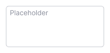 |
| L (40px)                              | 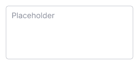 |

## Resize control

You can enable the resize control for the textarea to allow users to adjust its size. They can stretch it horizontally, vertically, or both ways.

When the textarea cannot be stretched, a scrollbar will appear after a certain number of lines. We recommended adding scrollbars when the textarea has at least 4-5 lines.

::: tip
Avoid making the textarea smaller than 160-200px in width and 3-4 lines in height. Working with large amounts of data in smaller sizes can be challenging, especially when it serves as a primary input in a form.
:::

## Counter

Textarea may include a counter displaying the number of characters entered, character limits, etc.

The counter can be positioned next to the text label or close to the textarea itself.

Table: Textarea with counter

| Size (height in px for one row of text) | Input with label       | Input without label    |
| ------------------- | ------------------------------------------ | ---------------------- |
| M (28px)            | 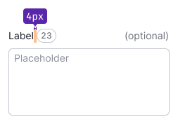 | 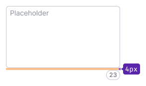 |
| L (40px)            | 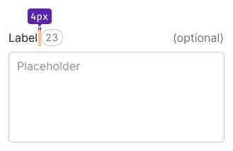 | 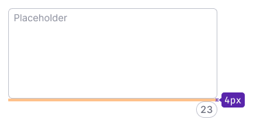 |

## Interaction

The styles of the textarea in different states correspond to those of the [Input](/components/input/) component for the same states.

Table: Textarea states

| State   | Normal          | Focus      | Disabled           | Read-only      |
| ------- | --------------- | ---------- | ------------------ | -------------- |
| Normal  |          | 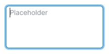   | 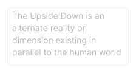 | 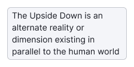 |
| Valid   | 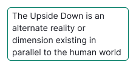     | 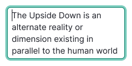       |               |            |
| Invalid | 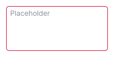 | 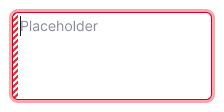 |              |         |

## Usage in UX/UI

- Use the Textarea when users need to input a substantial amount of data. For short inputs with 1-3 words, use the [Input](/components/input/) component instead.
- Provide a descriptive name for the textarea so that users understand the type of data they should enter.

