::: react-view

:::

## Description

**Tooltip** is a component used to display various tips and hints, and serves as a wrapper over the [Popper](/utils/popper/popper) component.

Differences between Tooltip and [Dropdown](/components/dropdown/dropdown):

- Tooltip appears only when hovering over the trigger.
- It includes an arrow pointing to the trigger.
- Tooltip contains only hints and additional information.

## Component composition

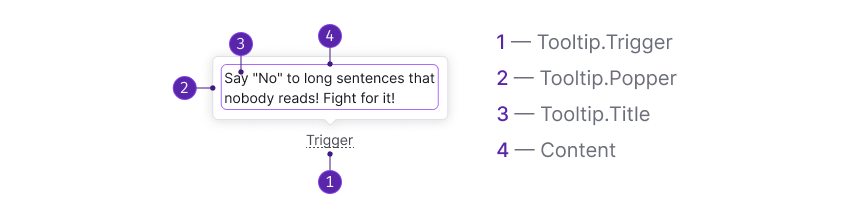

Component consists of the following:

- `Tooltip.Trigger`
- `Tooltip.Popper`
- `Tooltip.Title`

## Themes

Tooltip has three themes: `default`, `invert` for use on a dark background, and `warning` for validation messages. In all cases, the text color changes to `--text-primary-invert`, and the background color changes accordingly.

::: tip
Starting from [version 3.1.0](/components/tooltip/tooltip-changelog), you can set your own custom theme and change the background color.
:::

Table: Tooltip themes

| Theme   | Appearance example              | Styles      |
| ------- | ------------------------------- | ----------- |
| `default` | 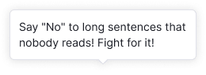 | `background-color: var(--tooltip-default)`, `border: 1px solid var(--border-secondary)`, `box-shadow: var(--box-shadow-popper)`     |
| `invert`  | 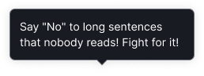   | `background-color: var(--tooltip-invert)`, `border: 1px solid var(--border-tooltip-invert)`, `box-shadow: var(--box-shadow-popper)` |
| `warning` | 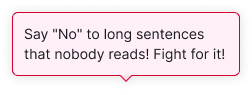     | `background-color: var(--tooltip-warning)`, `border: 1px solid var(--border-danger-active)`, `box-shadow: var(--box-shadow-popper)` |

## Maximum width and offset

By default, the Tooltip has a maximum width of 250px, but you can set a different width if needed.

### Offset and arrow placement

The distance between the trigger and the tooltip is 4px.

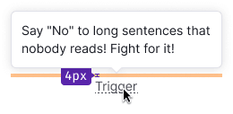

The placement of the arrow depends on the `placement` property, refer to the live examples in the [Placement](/components/tooltip/tooltip#placement) section.

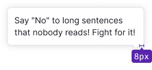

## Paddings and margins

The content area of the tooltip has a default padding of 12px.

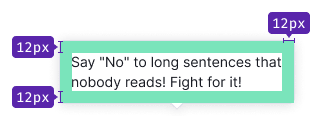

### Content margins and paddings

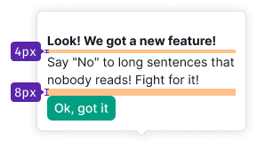

::: tip
It's recommended to use a font size of 14px (`--fs-200`, `--lh-200` tokens) for the title in non-advertising messages.
:::

The image inside the tooltip has a size of 130px * 130px.

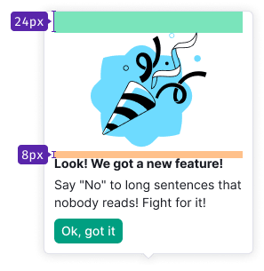

### Data margins

To improve readability, it is recommended to use specific margins between labels and values inside the tooltip. Detailed recommendations for tooltip margins can be found in [Data visualization](/data-display/d3-chart/d3-chart#tooltip) and [Summary](/patterns/summary/summary#difference_value).

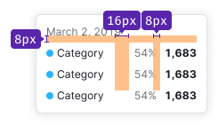

## Placement

The tooltip is built using the [Popper.js](https://popper.js.org/) library, allowing you to change its placement according to the [Popper API](/utils/popper/popper-api).

The tooltip's position shouldn't change when scrolling the page, ensuring it remains visible to the user. The default tooltip placement is `top`.

#### Placement properties

::: sandbox

:::

## Interaction

For the tooltip trigger, you can use formatted text, table headers, or interactive components like [Icon](/style/icon/icon), [Link](/components/link/link), [Button](/components/button/button), etc.

### Appearance and hiding

Table: Tooltip's appearance and hiding

| Hidden    |                                |
| --------- | ------------------------------ |
| Cursor leaves the trigger                                                  | 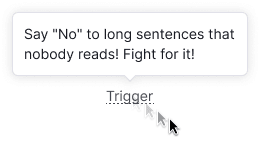 |
| Cursor leaves the trigger or the tooltip itself (for tooltip with control) | 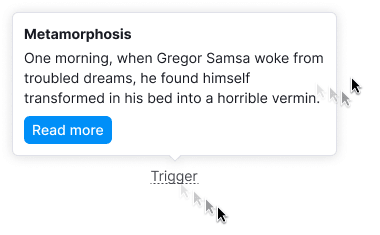 |

### Delay of appearance and hiding

Default values for tooltip appearance and hiding:

- Appearance: `100ms`
- Hiding: `50ms`

If the tooltip has interactive elements inside, the hiding time should be increased to `100ms`.

## Content

Tooltip usually contains unformatted text.

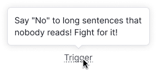

In some cases (for example, for advertising purposes), you can format the text and add other components to the tooltip:

- [Button](/components/button/button), [Link](/components/link/link), etc.
- Image
- Different background color

**Remember, the tooltip should only contain hints and tips.**

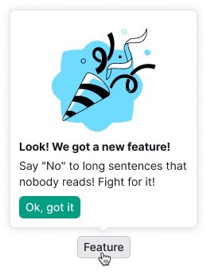

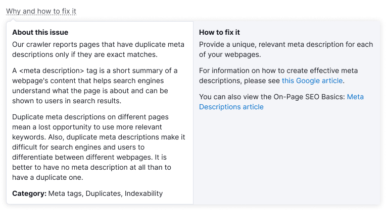

## Usage in UX/UI

Main recommendations:

- Use the tooltip to show hints and additional information, such as text, formatted text, lists, links, buttons, and small images.
- Ensure that the tooltip does not overlap important information for the user.

::: tip
For complex content and forms, use [Dropdown-menu](/components/dropdown-menu/dropdown-menu).
:::

**If the tooltip trigger conveys information about a new feature, avoid duplicating the trigger text in the tooltip title.** The title may not be necessary if the trigger text already explains the tooltip content.

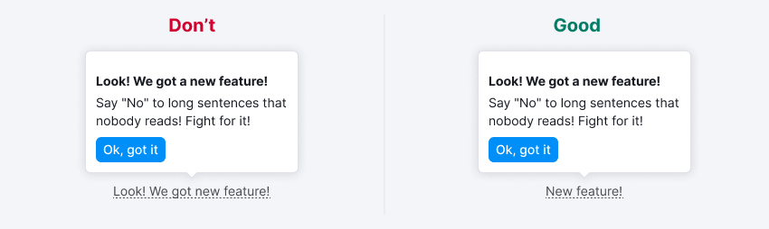

**When the trigger isn’t clear enough, add a title to the tooltip.** Additionally, include a title when the trigger doesn't adequately explain the topic of the tooltip. For example, you can describe additional conditions in the header or expand on the trigger's idea.

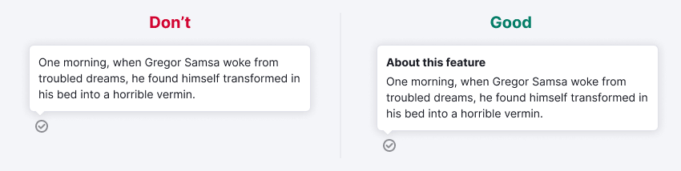

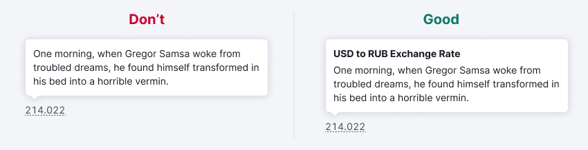

**Divide long text into paragraphs.**

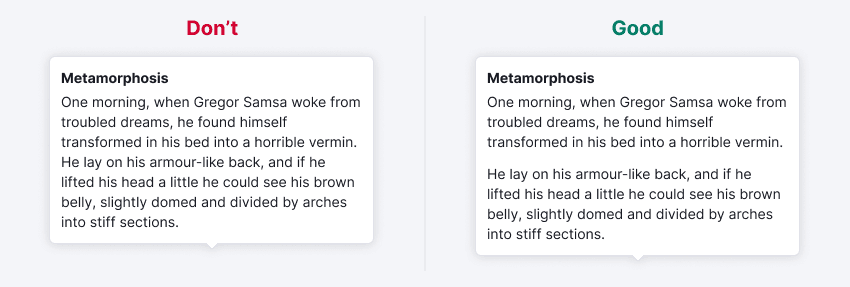

**Avoid overloading the tooltip with information.** A large amount of content can be inconvenient to view in the tooltip. If there is too much content and nothing can be removed, consider using a separate paragraph on the page or widget instead of a tooltip.

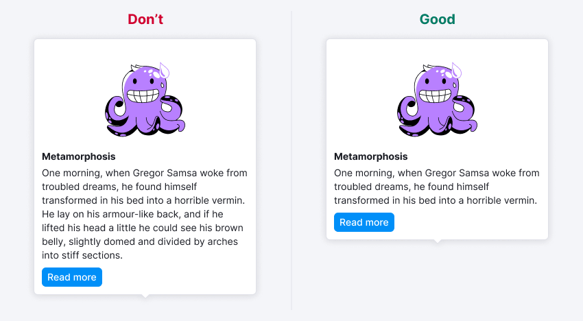

**Ensure that the tooltip does not prevent users from interacting with nearby triggers.**

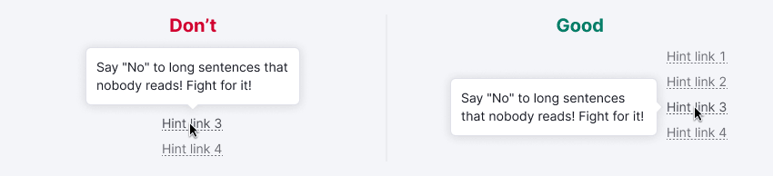

