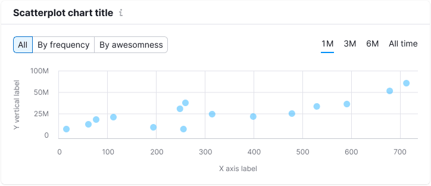
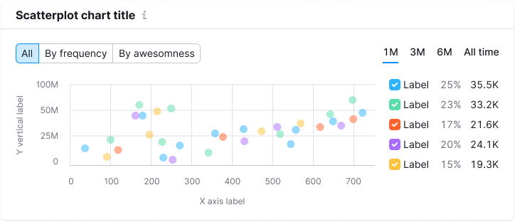
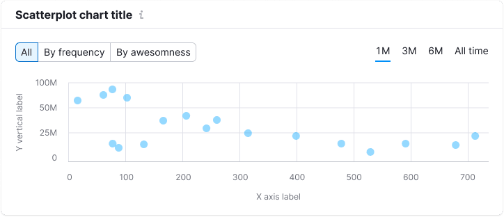
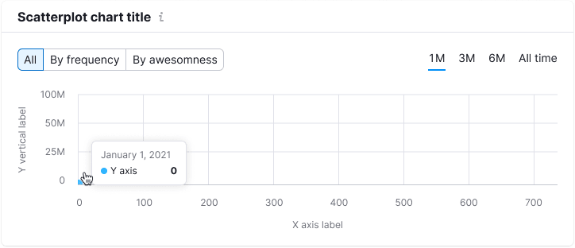
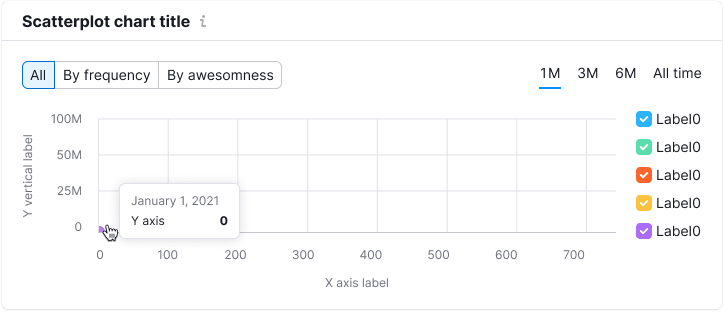
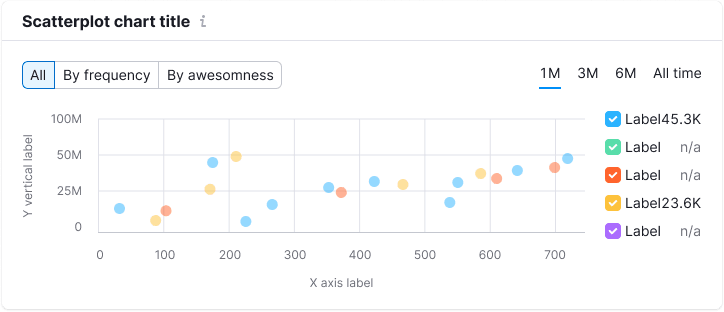
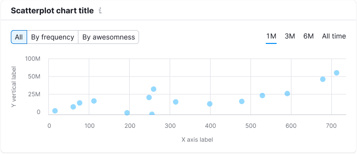
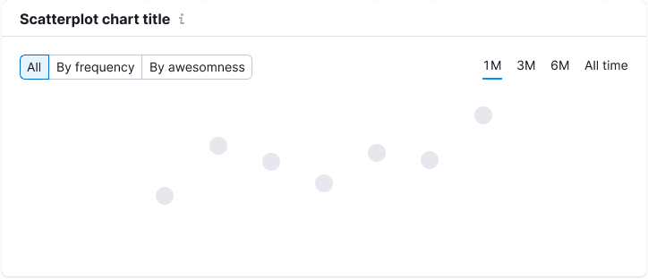
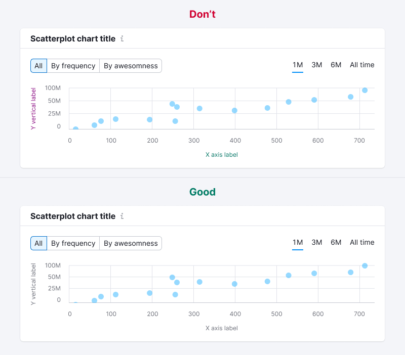
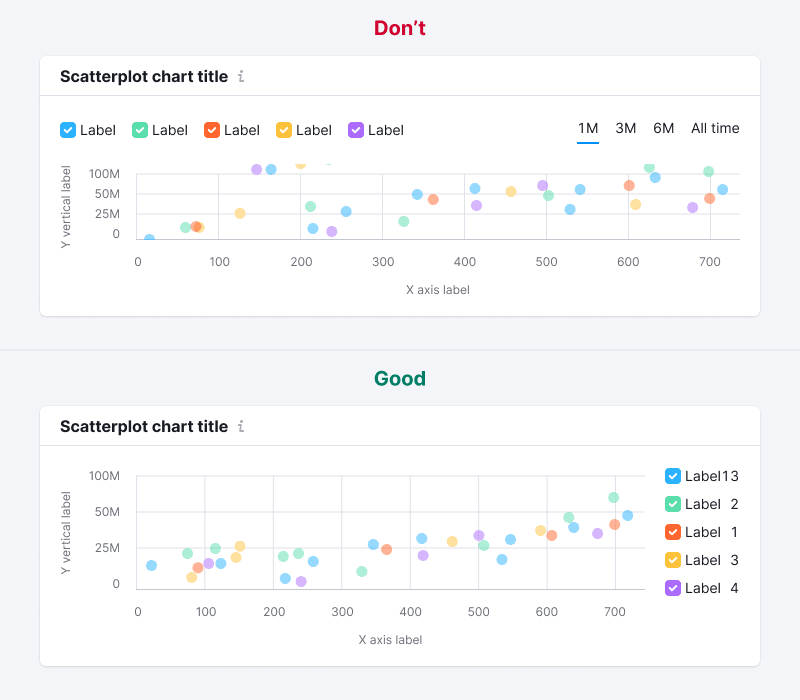

::: tip
Basic data visualization rules are described in the [Chart principles](/data-display/d3-chart/d3-chart).
:::

::: react-view

:::

## Description

A **scatterplot chart** visualizes the relationship between two variables in one or more datasets.

This chart type helps to analyze patterns between two variables.

Unlike other types of charts, a scatterplot chart can display trends, clusters, patterns, and relationships in a dataset, especially a very large one. Such charts allow to quickly understand if there is a dependency between the variables or not.

::: tip
The scatterplot is arguably the most versatile, polymorphic, and generally useful invention in the history of statistical graphics ( [Journal of the History of the Behavioral Sciences](http://onlinelibrary.wiley.com/doi/10.1002/jhbs.20078/abstract), 2005).
:::

Use a scatterplot chart when you need to show the correlation between two variables in a large dataset. Scatterplots are sometimes called correlation plots because they show how two variables are correlated.

### How to read a scatterplot chart

| Case                                                                                                                                 | Appearance example                                       |
| ------------------------------------------------------------------------------------------------------------------------------------ | -------------------------------------------------------- |
| If the points form a line that runs from bottom left to top right, there is likely a positive correlation between the two variables. |  |
| If the line runs from top left to bottom right, there is likely a negative correlation between the two variables.                    |  |
| If the overall trend doesn't form a clear straight line, there is probably no correlation.                                           |              |

::: tip
Note that correlation isn't always equal to causation. Other unnoticed variables can influence the data in the chart.
:::

## Appearance

A scatterplot chart must contain:

- vertical lines (in addition to horizontal);
- labels for the X and Y axes (don't color them, as this will complicate the "reading" of the chart);
- a legend if the dataset has different categories, each with a different color.

**Dot size – 11px * 11px.**

| Case             | Appearance example                                     | Styles                                                                                                                                                                                    |
| ---------------- | ------------------------------------------------------ | ----------------------------------------------------------------------------------------------------------------------------------------------------------------------------------------- |
| One dataset      |               | The default color for the category is `--chart-palette-order-blue` (or `--blue-300`) with 50% transparency. However, if necessary, you can select any other color from the chart palette. |
| Several datasets |  | Use colors from the chart palette.                                                                                                                                                        |

## Value inside a dot

- Dot size – 24px * 24px.
- Text size – 12px.

If the value inside the scatterplot dot is bigger than 100, show it as 99+.
For text color use the same color as the dot but pick the next shade (for example, `--blue-300` → `--blue-400`).

| Case             | Appearance example                                   |
| ---------------- | ---------------------------------------------------- |
| One dataset      |       |
| Several datasets |  |

## Legend

If the chart shows multiple datasets, show a legend. Provide values for each dataset.
We recommend using the vertical legend. It helps to "read" the categories and their meaning better.

## Interaction

### Hover

- When hovered over, a dot changes its opacity to 80%, and the tooltip displays the values for this dot.
- If by clicking on the dot you can go somewhere or open an additional report, then the cursor must change into a `pointer`.

## Tooltip

Show the following values in the tooltip for this chart type:

- the value for the point on the X-axis;
- the value for the point on the Y-axis.

**In the tooltip, focus on values rather than axis names or data categories.**

If you have several datasets on the chart, it is important to show their color in the tooltip.

| Case             | Appearance example                                  |
| ---------------- | --------------------------------------------------- |
| One dataset      |       |
| Several datasets |  |

## Edge cases

Here you will find the states for some specific cases. All other "empty states" for widgets are specified in [Error & n/a widget states](/components/widget-empty/widget-empty).

| Case                                   | Description                                                                                                                                                                                                       | Appearance example                                               |
| -------------------------------------- | ----------------------------------------------------------------------------------------------------------------------------------------------------------------------------------------------------------------- | ---------------------------------------------------------------- |
| Outliers                               | When there is a trend on the chart, but some data doesn't fit into it.                                                                                                                                           |                                |
| Data values are null                   | If all the values in the chart are zero, display them at the origin of the grid. For cases where you compare multiple datasets, show the values for each dataset in the legend. **Zero is also data. 0 ≠ N / A.** |              |
| No data for some points (n/a)          | Don't show points without data on the chart. For cases where you compare multiple datasets, show the values for each dataset in the legend.                                                                       |          |
| A point is very close to the axis/axes | Cut the bubbles next to the X and Y axes under the axes.                                                                                                                                                          |                         |
| First time loading                     | Show the skeleton state. If the chart has a title, it should be displayed while the chart is loading. The user must understand what exactly is being loaded and whether they should wait for it.                  |  |

## UI/UX use

### Axes

- Label both the X and Y axes.
- Don't color the axis labels – this makes your chart harder to read.

### Always start the Y-axis at 0

Otherwise, it can visually distort the presence of a correlation between the data along the Y and X axes.

### Number of datasets

::: tip
The more datasets you cram into your scatterplot chart, the harder it is to read.
:::

