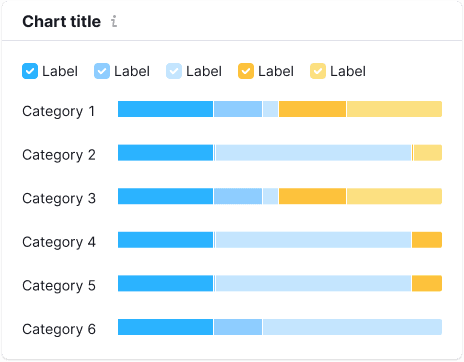

::: tip
Basic data visualization rules are described in the [Chart principles](/data-display/d3-chart/d3-chart).
:::

::: react-view

:::

## Description

**Bar chart** visualizes distribution of values by category for value comparison. A bar chart can be [vertical](/data-display/bar-chart/bar-chart) or horizontal.

::: tip
**Difference from histogram chart**

Bar chart displays distribution of datasets by quality categories.

Histogram charts are used to display distribution of datasets: how often values fall into quantitative ranges.
:::

Important points to keep in mind when presenting data as a bar chart:

- The axes should be clear to the user from the chart name. However, in cases where the chart name isn’t enough, you can denote the axes.
- Don't use too many colors to represent categories. One color or shades of one color is enough. However, you can always highlight a category if necessary.

## Usage

See detailed information in the [Horizontal bar chart guide](/data-display/bar-horizontal/bar-horizontal#ac6451).

## Margins

See detailed information in the [Horizontal bar chart guide](/data-display/bar-horizontal/bar-horizontal#abd326).

## Grid and axes

See detailed information in the [Horizontal bar chart guide](/data-display/bar-horizontal/bar-horizontal#a9e6f0).

## Labels of categories

See detailed information in the [Horizontal bar chart guide](/data-display/bar-horizontal/bar-horizontal#a05155).

## Appearance

The stacked bar chart has no margin between categories inside the bar. **Choose contrasting colors for different categories.**

## Interaction

When you hover over a column, we highlight it with `--chart-grid-bar-chart-hover`. The hover takes up half of the margin column on the top and bottom sides.

If the column is clickable, the cursor changes to `pointer`.

## Edge cases

Edge cases for stacked bar chart are pretty much the same as [Horizontal bar chart](/data-display/bar-horizontal/bar-horizontal#a54381) has.

## Data loading

See detailed information in the section about data loading in the [Horizontal bar chart guide](/data-display/bar-horizontal/bar-horizontal#ac26f2).

