## Description

**Advanced filters** is a pattern for filters which need to be combined into a group for any reason (logical relationship or related filters).

**When working with the advanced filters, the user should:**

- see the number of applied filters in the group;
- be able to quickly apply or remove applied filters.

### Combination of conditions

Advanced filters can contain a combination of the following conditions:

**By logical division:**

- containing including / excluding conditions (Include/exclude) filters;
- containing separate filters (SERP features, etc.).

**By the method of applying the selected filters:**

- triggered instantly when any filter group is selected;
- triggered by button by button.

## Dropdown or accordion?

**Implement the advanced filters in a dropdown when:**

- it is necessary to fix this filter when scrolling so the user can open it when scrolling the page and change applied filters;
- the filter has a large number of conditions, and it is advisable to hide them.

**Implement the advanced filters in an accordion when:**

- the user needs to interact with filters most of the time with the table;
- you need to see the filters applied when you switch to another report.

## Counter

The counter appears after applying the filter. It shows the number of filters applied within the advanced filters group.

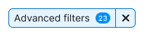

## Loading

When the filter's content or some of the filters are loading, show [Spin](/components/spin/) with the "Loading ..." text.

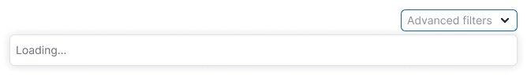

Wrap filter form into [SpinContainer](/components/spin-container/) when the user-selected data needs a time to be applied.

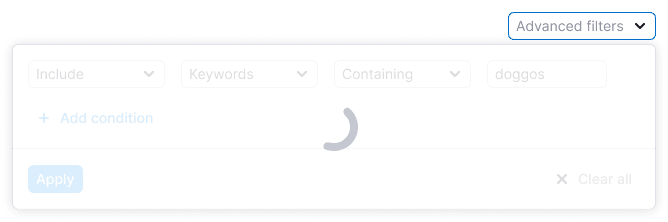

## Nothing found

Show an ["empty" state](/components/widget-empty/) with the option to update the filter.

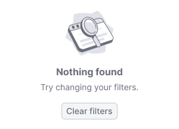

## Interaction

For the filter trigger use [Select](/components/select/) and [FilterTrigger](/components/filter-trigger/) components.

| State       | Appearance                                         |
| ----------- | -------------------------------------------------- |
| placeholder | 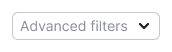        |
| Hover       | 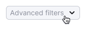            |
| Active      |  |

- Dynamic filter application (no "Apply" button) can be useful when loading data while applying the filter strongly affects the output. It is important to show the content to the user immediately when applying the filter, not to wait for confirmation from the "Apply" button.
- Filters are valid only within one report. But at the same time, they should be saved when returning to this report (within the same product) and when reloading the page.
- When changing the base, date, switching between reports, the values in advanced filters should be saved.
- Filter settings are forwarded to the URL.

## Clearing a filter group

- The delete button appears in the filter form after applying filters, and clears the entire group of filters.
- The advanced filters-dependent page content is reloaded and overrides the applied values.
- By clicking the "Clear all" button, everything applied in the group will be deleted.

## Tooltips

|                                                                                                                                   | Appearance example                                       |
| --------------------------------------------------------------------------------------------------------------------------------- | -------------------------------------------------------- |
| While hovering over the button with the Close icon in the filled filter show the tooltip with the text: "Clear advanced filters". | 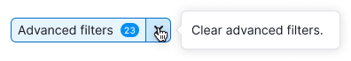                  |
| While hovering over an open select, show a tooltip with the text: "Hide advanced filters".                                        | 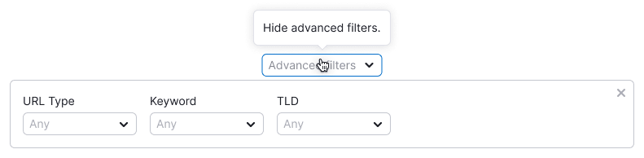 |
| If the accordion needs a Close icon, then show a tooltip with the text: 'Hide".                                                   | 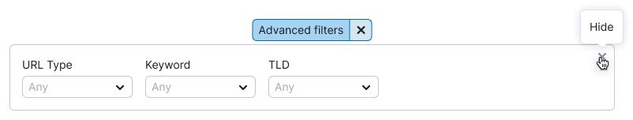                  |

## Advanced filters in the dropdown

Advanced filters implemented in the dropdown must have:

- a button for adding a new line of conditions (optional);
- buttons "Apply" and "Clear all".

**You can fix advanced filters implemented in dropdown at the top of the page while scrolling.**

### Opened filter

- The dropdown should have a fixed width.
- If the dropdown has a large number of lines with filters, then after 4 lines we recommend hiding others with scroll.
- Clicking the "Apply" button closes the dropdown, and the counter of the applied filters appears in the trigger.
- The "Clear all" button clears all entered values.
- The value entered in the input is applied by "Enter".

| Case                         | Appearance example                                           |
| ---------------------------- | ------------------------------------------------------------ |
| Separate filters             | 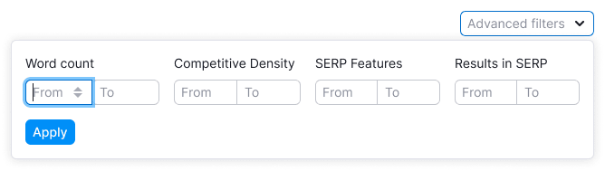  |
| Additional filter conditions | 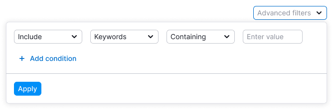 |

### Filled filter

After applying the filter:

- show the counter of applied filters in the trigger;
- the counter must be recalculated after each filter application.

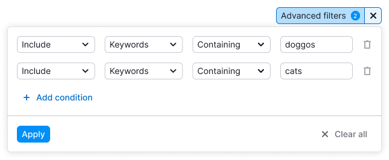

## Advanced filters in the accordion

Container in accordion has styles: `border: 1px solid var(--border-primary)`.

### Opened filter

- The filter expands in the accordion, shifting down the page content.
- The accordion should have a fixed width.
- When applying any filter in the trigger, show a counter with the number of applied filters.
- Usually this group of filters has no submit buttons like "Apply", "Clear all", "Cancel".

| Case                                  | Appearance example                                            |
| ------------------------------------- | ------------------------------------------------------------- |
| Dynamically applied filter            |  |
| Filter applied by the "Apply" button. | 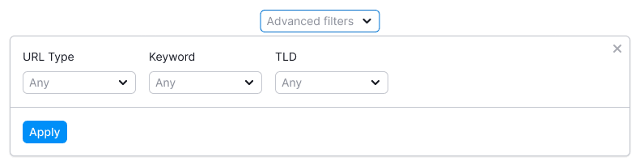     |

### Filled filter

After applying the filter:

- show the counter of applied filters in the trigger;
- the counter must be recalculated after each filter application.

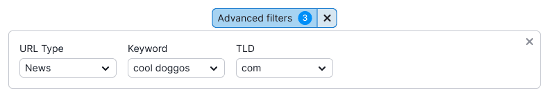

## Margins and styles recommendations

If you need to increase or decrease the margins between filters inside the form, make them multiples of 4: 8px, 12px, 24px, 32px, etc.

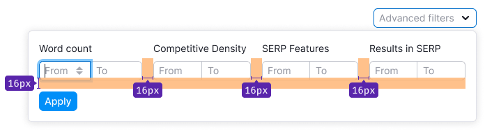

Always visually separate filter triggers from the filters themselves. For example, use `border: 1px solid var(--border-primary)`.

@page advanced-filters-code
